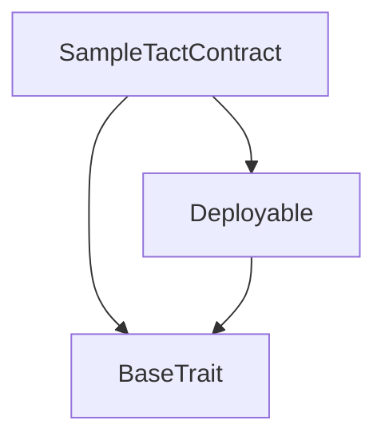

## README.md (https://github.com/tact-lang/tact/blob/main/tact-template-main/README.md)
# Tact template project

This template comes pre-configured to kickstart your new Tact project. It includes the Tact compiler, TypeScript, Jest integrated with [tact-emulator](https://github.com/tact-lang/tact-emulator), and a sample demonstrating how to run tests.

```shell
yarn test # To test contract
yarn build # To build contract
yarn lint # To find code issues in contract
yarn deploy # To deploy contract
```

## Deployment

To deploy a contract, follow these steps:

1. Define the [`contract.tact`](./sources/contract.tact) file that will be used as entry point of your contract.
2. Customize the [`contract.deploy.ts`](./sources/contract.deploy.ts) file based on your `contract.tact` to generate a deployment link. It is crucial to ensure the proper invocation of the `init()` function within the contract.

If you rename `contract.tact`, make sure to update [`tact.config.json`](./tact.config.json) correspondingly. Refer to the [Tact Documentation](https://docs.tact-lang.org/language/guides/config) for detailed information.

## Testing

You can find some examples of contract tests in [`contract.spec.ts`](./sources/contract.spec.ts). For more information about testing, see the [Tact Documentation](https://docs.tact-lang.org/language/guides/debug).

To add new test files to your contracts, you should create `*.spec.ts` files similar to the template's one and they would be automatically included in testing.

## License

MIT


## jest.config.js (https://github.com/tact-lang/tact/blob/main/tact-template-main/jest.config.js)
module.exports = {
  preset: 'ts-jest',
  testEnvironment: 'node',
  testPathIgnorePatterns: ["/node_modules/", "/dist/"],
  snapshotSerializers: ["@tact-lang/ton-jest/serializers"],
  globalSetup: './jest.setup.js',
  globalTeardown: './jest.teardown.js',
};

## jest.setup.js (https://github.com/tact-lang/tact/blob/main/tact-template-main/jest.setup.js)
module.exports = async () => { };


## jest.teardown.js (https://github.com/tact-lang/tact/blob/main/tact-template-main/jest.teardown.js)
const path = require('path');

module.exports = async () => { };


## package.json (https://github.com/tact-lang/tact/blob/main/tact-template-main/package.json)
{
  "private": true,
  "scripts": {
    "build": "tact --config ./tact.config.json",
    "lint": "yarn misti ./tact.config.json",
    "test": "jest",
    "deploy": "ts-node ./sources/contract.deploy.ts",
    "read": "ts-node ./sources/contract.read.ts"
  },
  "dependencies": {
    "@nowarp/misti": "~0.5.0",
    "@tact-lang/compiler": "~1.5.3",
    "@tact-lang/deployer": "^0.2.0",
    "@tact-lang/ton-abi": "^0.0.3",
    "@tact-lang/ton-jest": "^0.0.4",
    "@ton/core": "~0.56.3",
    "@ton/crypto": "^3.2.0",
    "@ton/sandbox": "^0.20.0",
    "@ton/test-utils": "^0.4.2",
    "@ton/ton": "^13.9.0",
    "@types/jest": "^29.2.4",
    "@types/node": "^18.11.14",
    "@types/qs": "^6.9.7",
    "base64url": "^3.0.1",
    "enquirer": "^2.3.6",
    "jest": "^29.3.1",
    "open": "^8.4.0",
    "prando": "^6.0.1",
    "prettier": "^2.5.1",
    "qs": "^6.11.0",
    "ts-jest": "^29.0.3",
    "ts-node": "^10.9.1",
    "typescript": "^4.9.4"
  }
}


## tact.config.json (https://github.com/tact-lang/tact/blob/main/tact-template-main/tact.config.json)
{
    "projects": [{
        "name": "sample",
        "path": "./sources/contract.tact",
        "output": "./sources/output",
        "mode": "full",
        "options": {
            "external": false,
            "debug": false,
            "ipfsAbiGetter": false,
            "interfacesGetter": false,
            "experimental": {
                "inline": false
            }
        }
    }]
}


## tsconfig.json (https://github.com/tact-lang/tact/blob/main/tact-template-main/tsconfig.json)
{
  "compilerOptions": {
    /* Visit https://aka.ms/tsconfig.json to read more about this file */
    /* Basic Options */
    // "incremental": true,                         /* Enable incremental compilation */
    "target": "esnext", /* Specify ECMAScript target version: 'ES3' (default), 'ES5', 'ES2015', 'ES2016', 'ES2017', 'ES2018', 'ES2019', 'ES2020', 'ES2021', or 'ESNEXT'. */
    "module": "commonjs", /* Specify module code generation: 'none', 'commonjs', 'amd', 'system', 'umd', 'es2015', 'es2020', or 'ESNext'. */
    // "lib": [],                                   /* Specify library files to be included in the compilation. */
    // "allowJs": true,                             /* Allow javascript files to be compiled. */
    // "checkJs": true,                             /* Report errors in .js files. */
    // "jsx": "preserve",                           /* Specify JSX code generation: 'preserve', 'react-native', 'react', 'react-jsx' or 'react-jsxdev'. */
    "declaration": true, /* Generates corresponding '.d.ts' file. */
    // "declarationMap": true,                      /* Generates a sourcemap for each corresponding '.d.ts' file. */
    // "sourceMap": true,                           /* Generates corresponding '.map' file. */
    // "outFile": "./",                             /* Concatenate and emit output to single file. */
    "outDir": "./dist", /* Redirect output structure to the directory. */
    // "rootDir": "./",                             /* Specify the root directory of input files. Use to control the output directory structure with --outDir. */
    // "composite": true,                           /* Enable project compilation */
    // "tsBuildInfoFile": "./",                     /* Specify file to store incremental compilation information */
    // "removeComments": true,                      /* Do not emit comments to output. */
    // "noEmit": false,                              /* Do not emit outputs. */
    // "importHelpers": true,                       /* Import emit helpers from 'tslib'. */
    "downlevelIteration": true, /* Provide full support for iterables in 'for-of', spread, and destructuring when targeting 'ES5' or 'ES3'. */
    // "isolatedModules": true,                     /* Transpile each file as a separate module (similar to 'ts.transpileModule'). */
    /* Strict Type-Checking Options */
    "strict": true, /* Enable all strict type-checking options. */
    // "noImplicitAny": true,                       /* Raise error on expressions and declarations with an implied 'any' type. */
    // "strictNullChecks": true,                    /* Enable strict null checks. */
    // "strictFunctionTypes": true,                 /* Enable strict checking of function types. */
    // "strictBindCallApply": true,                 /* Enable strict 'bind', 'call', and 'apply' methods on functions. */
    // "strictPropertyInitialization": true,        /* Enable strict checking of property initialization in classes. */
    // "noImplicitThis": true,                      /* Raise error on 'this' expressions with an implied 'any' type. */
    // "alwaysStrict": true,                        /* Parse in strict mode and emit "use strict" for each source file. */
    /* Additional Checks */
    // "noUnusedLocals": true,                      /* Report errors on unused locals. */
    // "noUnusedParameters": true,                  /* Report errors on unused parameters. */
    // "noImplicitReturns": true,                   /* Report error when not all code paths in function return a value. */
    // "noFallthroughCasesInSwitch": true,          /* Report errors for fallthrough cases in switch statement. */
    // "noUncheckedIndexedAccess": true,            /* Include 'undefined' in index signature results */
    // "noImplicitOverride": true,                  /* Ensure overriding members in derived classes are marked with an 'override' modifier. */
    // "noPropertyAccessFromIndexSignature": true,  /* Require undeclared properties from index signatures to use element accesses. */
    /* Module Resolution Options */
    // "moduleResolution": "node",                  /* Specify module resolution strategy: 'node' (Node.js) or 'classic' (TypeScript pre-1.6). */
    // "baseUrl": "./",                             /* Base directory to resolve non-absolute module names. */
    // "paths": {},                                 /* A series of entries which re-map imports to lookup locations relative to the 'baseUrl'. */
    // "rootDirs": [],                              /* List of root folders whose combined content represents the structure of the project at runtime. */
    // "typeRoots": [],                             /* List of folders to include type definitions from. */
    "types": ["jest"],                                 /* Type declaration files to be included in compilation. */
    "allowSyntheticDefaultImports": true, /* Allow default imports from modules with no default export. This does not affect code emit, just typechecking. */
    "esModuleInterop": true, /* Enables emit interoperability between CommonJS and ES Modules via creation of namespace objects for all imports. Implies 'allowSyntheticDefaultImports'. */
    // "preserveSymlinks": true,                    /* Do not resolve the real path of symlinks. */
    // "allowUmdGlobalAccess": true,                /* Allow accessing UMD globals from modules. */
    /* Source Map Options */
    // "sourceRoot": "",                            /* Specify the location where debugger should locate TypeScript files instead of source locations. */
    // "mapRoot": "",                               /* Specify the location where debugger should locate map files instead of generated locations. */
    // "inlineSourceMap": true,                     /* Emit a single file with source maps instead of having a separate file. */
    // "inlineSources": true,                       /* Emit the source alongside the sourcemaps within a single file; requires '--inlineSourceMap' or '--sourceMap' to be set. */
    /* Experimental Options */
    // "experimentalDecorators": true,              /* Enables experimental support for ES7 decorators. */
    // "emitDecoratorMetadata": true,               /* Enables experimental support for emitting type metadata for decorators. */
    /* Advanced Options */
    "skipLibCheck": true, /* Skip type checking of declaration files. */
    "forceConsistentCasingInFileNames": true /* Disallow inconsistently-cased references to the same file. */,
    "resolveJsonModule": true
  },
  "include": [
    "sources/**/*"
  ]
}


## ci.yml (https://github.com/tact-lang/tact/blob/main/tact-template-main/.github/workflows/ci.yml)
name: CI

on:
  push:
    branches: [ "main" ]
  pull_request:
    branches: [ "main" ]
  workflow_dispatch:

jobs:
  test:
    strategy:
      fail-fast: false
      matrix:
        node-version: [22]
        os: [ubuntu-latest]
    runs-on: ${{ matrix.os }}
    steps:
      - name: Checkout code
        uses: actions/checkout@v2

      # - name: Install Soufflé on Ubuntu
      #   if: matrix.os == 'ubuntu-latest'
      #   run: |
      #     sudo wget https://souffle-lang.github.io/ppa/souffle-key.public -O /usr/share/keyrings/souffle-archive-keyring.gpg
      #     echo "deb [signed-by=/usr/share/keyrings/souffle-archive-keyring.gpg] https://souffle-lang.github.io/ppa/ubuntu/ stable main" | sudo tee /etc/apt/sources.list.d/souffle.list
      #     sudo apt update
      #     sudo apt install souffle

      - name: Setup Node.js
        uses: actions/setup-node@v3
        with:
          node-version: ${{ matrix.node-version }}

      - name: Install dependencies
        run: yarn install

      - name: Build
        run: yarn build

      - name: Run Misti
        run: yarn misti --min-severity medium ./tact.config.json

      - name: Run tests
        run: yarn test


## contract.deploy.ts (https://github.com/tact-lang/tact/blob/main/tact-template-main/sources/contract.deploy.ts)
import * as fs from "fs";
import * as path from "path";
import { Address, contractAddress } from "@ton/core";
import { SampleTactContract } from "./output/sample_SampleTactContract";
import { prepareTactDeployment } from "@tact-lang/deployer";

(async () => {
    // Parameters
    let testnet = true;
    let packageName = "sample_SampleTactContract.pkg";
    let owner = Address.parse("kQBM7QssP28PhrctDOyd47_zpFfDiQvv5V9iXizNopb1d2LB");
    let init = await SampleTactContract.init(owner);

    // Load required data
    let address = contractAddress(0, init);
    let data = init.data.toBoc();
    let pkg = fs.readFileSync(path.resolve(__dirname, "output", packageName));

    // Prepareing
    console.log("Uploading package...");
    let prepare = await prepareTactDeployment({ pkg, data, testnet });

    // Deploying
    console.log("============================================================================================");
    console.log("Contract Address");
    console.log("============================================================================================");
    console.log();
    console.log(address.toString({ testOnly: testnet }));
    console.log();
    console.log("============================================================================================");
    console.log("Please, follow deployment link");
    console.log("============================================================================================");
    console.log();
    console.log(prepare);
    console.log();
    console.log("============================================================================================");
})();


## contract.read.ts (https://github.com/tact-lang/tact/blob/main/tact-template-main/sources/contract.read.ts)
import { Address, contractAddress} from "@ton/core";
import { TonClient4 } from "@ton/ton";
import { SampleTactContract } from "./output/sample_SampleTactContract";

(async () => {
    const client = new TonClient4({
        endpoint: "https://sandbox-v4.tonhubapi.com", // 🔴 Test-net API endpoint
    });

    // Parameters
    let owner = Address.parse("kQBM7QssP28PhrctDOyd47_zpFfDiQvv5V9iXizNopb1d2LB");
    let init = await SampleTactContract.init(owner);
    let contract_address = contractAddress(0, init);

    // Prepareing
    console.log("Reading Contract Info...");
    console.log(contract_address);

    // Input the contract address
    let contract = await SampleTactContract.fromAddress(contract_address);
    let contract_open = await client.open(contract);
    console.log("Counter Value: " + (await contract_open.getCounter()));
})();


## contract.spec.ts (https://github.com/tact-lang/tact/blob/main/tact-template-main/sources/contract.spec.ts)
import { toNano } from "@ton/core";
import { Blockchain } from "@ton/sandbox";
import "@ton/test-utils";
import { SampleTactContract } from "./output/sample_SampleTactContract";
import { findErrorCodeByMessage } from './utils/error';

describe("contract", () => {
    it("should deploy correctly", async () => {
        // Create Sandbox and deploy contract
        let system = await Blockchain.create();
        let owner = await system.treasury("owner");
        let nonOwner = await system.treasury("non-owner");
        let contract = system.openContract(await SampleTactContract.fromInit(owner.address));
        const deployResult = await contract.send(owner.getSender(), { value: toNano(1) }, { $$type: "Deploy", queryId: 0n });
        expect(deployResult.transactions).toHaveTransaction({
            from: owner.address,
            to: contract.address,
            deploy: true,
            success: true,
        });

        // Check counter
        expect(await contract.getCounter()).toEqual(0n);

        // Increment counter
        await contract.send(owner.getSender(), { value: toNano(1) }, "increment");

        // Check counter
        expect(await contract.getCounter()).toEqual(1n);

        // Non-owner
        const nonOwnerResult = await contract.send(nonOwner.getSender(), { value: toNano(1) }, "increment");
        const errorCodeForInvalidSender = findErrorCodeByMessage(contract.abi.errors, "Invalid sender");
        expect(nonOwnerResult.transactions).toHaveTransaction({
            from: nonOwner.address,
            to: contract.address,
            success: false,
            exitCode: errorCodeForInvalidSender!!
        });
    });
});


## contract.tact (https://github.com/tact-lang/tact/blob/main/tact-template-main/sources/contract.tact)
import "@stdlib/deploy";

message Add {
    amount: Int as uint32;
}

contract SampleTactContract with Deployable {

    owner: Address;
    counter: Int as uint32;

    init(owner: Address) {
        self.owner = owner;
        self.counter = 0;
    }

    fun add(v: Int) {
        
        // Check sender
        let ctx: Context = context();
        require(ctx.sender == self.owner, "Invalid sender");
        
        // Update counter
        self.counter += v;
    }

    receive(msg: Add) {
        self.add(msg.amount);
    }

    receive("increment") {
        self.add(1);
        self.reply("incremented".asComment());
    }

    get fun counter(): Int {
        return self.counter;
    }
}


## sample_SampleTactContract.abi (https://github.com/tact-lang/tact/blob/main/tact-template-main/sources/output/sample_SampleTactContract.abi)
{"name":"SampleTactContract","types":[{"name":"StateInit","header":null,"fields":[{"name":"code","type":{"kind":"simple","type":"cell","optional":false}},{"name":"data","type":{"kind":"simple","type":"cell","optional":false}}]},{"name":"StdAddress","header":null,"fields":[{"name":"workchain","type":{"kind":"simple","type":"int","optional":false,"format":8}},{"name":"address","type":{"kind":"simple","type":"uint","optional":false,"format":256}}]},{"name":"VarAddress","header":null,"fields":[{"name":"workchain","type":{"kind":"simple","type":"int","optional":false,"format":32}},{"name":"address","type":{"kind":"simple","type":"slice","optional":false}}]},{"name":"Context","header":null,"fields":[{"name":"bounced","type":{"kind":"simple","type":"bool","optional":false}},{"name":"sender","type":{"kind":"simple","type":"address","optional":false}},{"name":"value","type":{"kind":"simple","type":"int","optional":false,"format":257}},{"name":"raw","type":{"kind":"simple","type":"slice","optional":false}}]},{"name":"SendParameters","header":null,"fields":[{"name":"bounce","type":{"kind":"simple","type":"bool","optional":false}},{"name":"to","type":{"kind":"simple","type":"address","optional":false}},{"name":"value","type":{"kind":"simple","type":"int","optional":false,"format":257}},{"name":"mode","type":{"kind":"simple","type":"int","optional":false,"format":257}},{"name":"body","type":{"kind":"simple","type":"cell","optional":true}},{"name":"code","type":{"kind":"simple","type":"cell","optional":true}},{"name":"data","type":{"kind":"simple","type":"cell","optional":true}}]},{"name":"Deploy","header":2490013878,"fields":[{"name":"queryId","type":{"kind":"simple","type":"uint","optional":false,"format":64}}]},{"name":"DeployOk","header":2952335191,"fields":[{"name":"queryId","type":{"kind":"simple","type":"uint","optional":false,"format":64}}]},{"name":"FactoryDeploy","header":1829761339,"fields":[{"name":"queryId","type":{"kind":"simple","type":"uint","optional":false,"format":64}},{"name":"cashback","type":{"kind":"simple","type":"address","optional":false}}]},{"name":"Add","header":2278832834,"fields":[{"name":"amount","type":{"kind":"simple","type":"uint","optional":false,"format":32}}]},{"name":"SampleTactContract$Data","header":null,"fields":[{"name":"owner","type":{"kind":"simple","type":"address","optional":false}},{"name":"counter","type":{"kind":"simple","type":"uint","optional":false,"format":32}}]}],"receivers":[{"receiver":"internal","message":{"kind":"typed","type":"Add"}},{"receiver":"internal","message":{"kind":"text","text":"increment"}},{"receiver":"internal","message":{"kind":"typed","type":"Deploy"}}],"getters":[{"name":"counter","arguments":[],"returnType":{"kind":"simple","type":"int","optional":false,"format":257}}],"errors":{"2":{"message":"Stack underflow"},"3":{"message":"Stack overflow"},"4":{"message":"Integer overflow"},"5":{"message":"Integer out of expected range"},"6":{"message":"Invalid opcode"},"7":{"message":"Type check error"},"8":{"message":"Cell overflow"},"9":{"message":"Cell underflow"},"10":{"message":"Dictionary error"},"11":{"message":"'Unknown' error"},"12":{"message":"Fatal error"},"13":{"message":"Out of gas error"},"14":{"message":"Virtualization error"},"32":{"message":"Action list is invalid"},"33":{"message":"Action list is too long"},"34":{"message":"Action is invalid or not supported"},"35":{"message":"Invalid source address in outbound message"},"36":{"message":"Invalid destination address in outbound message"},"37":{"message":"Not enough TON"},"38":{"message":"Not enough extra-currencies"},"39":{"message":"Outbound message does not fit into a cell after rewriting"},"40":{"message":"Cannot process a message"},"41":{"message":"Library reference is null"},"42":{"message":"Library change action error"},"43":{"message":"Exceeded maximum number of cells in the library or the maximum depth of the Merkle tree"},"50":{"message":"Account state size exceeded limits"},"128":{"message":"Null reference exception"},"129":{"message":"Invalid serialization prefix"},"130":{"message":"Invalid incoming message"},"131":{"message":"Constraints error"},"132":{"message":"Access denied"},"133":{"message":"Contract stopped"},"134":{"message":"Invalid argument"},"135":{"message":"Code of a contract was not found"},"136":{"message":"Invalid address"},"137":{"message":"Masterchain support is not enabled for this contract"},"4429":{"message":"Invalid sender"}},"interfaces":["org.ton.introspection.v0","org.ton.abi.ipfs.v0","org.ton.deploy.lazy.v0","org.ton.chain.workchain.v0"]}

## sample_SampleTactContract.code.boc.html (https://github.com/tact-lang/tact/blob/main/tact-template-main/sources/output/sample_SampleTactContract.code.boc.html)
<html>
    <head>
        <style>
            pre {
                display: flex;
                flex-direction: column;
            }
            .padding {
                color: #ccc;
            }
            .line-covered {
                background-color: #DDFFDD;
            }
            .line-uncovered {
                background-color: #fffcdd;
            }
            .count {
                display: inline-flex;
                width: 30px;
                justify-content: center;
                color: #10620d;
            }
            .gas {
                display: inline-flex;
                width: 30px;
                justify-content: center;
                color: #e60f0f;
            }
        </style>
    </head>
    <body>
        <h1>Code coverage</h1>
        <pre>
                        <span class="line"><span class="count"></span><span class="gas"></span><span class="padding"></span>PROGRAM{</span>
            <span class="line"><span class="count"></span><span class="gas"></span><span class="padding">..</span>DECLPROC recv_internal;</span>
            <span class="line"><span class="count"></span><span class="gas"></span><span class="padding">..</span>DECLPROC ?fun_104984;</span>
            <span class="line"><span class="count"></span><span class="gas"></span><span class="padding">..</span>DECLPROC lazy_deployment_completed;</span>
            <span class="line"><span class="count"></span><span class="gas"></span><span class="padding">..</span>DECLPROC ?fun_ref_37b4a5cc4a83a127;</span>
            <span class="line"><span class="count"></span><span class="gas"></span><span class="padding">..</span>DECLPROC ?fun_ref_40d98146a47dbe3b;</span>
            <span class="line"><span class="count"></span><span class="gas"></span><span class="padding">..</span>DECLPROC ?fun_ref_644ef5250652bdfa;</span>
            <span class="line"><span class="count"></span><span class="gas"></span><span class="padding">..</span>DECLPROC ?fun_ref_a3e5c9ea5e718fff;</span>
            <span class="line"><span class="count"></span><span class="gas"></span><span class="padding">..</span>DECLPROC ?fun_ref_ad8b8ae3080855e5;</span>
            <span class="line"><span class="count"></span><span class="gas"></span><span class="padding">..</span>DECLPROC ?fun_ref_b93b9862cda1783c;</span>
            <span class="line"><span class="count"></span><span class="gas"></span><span class="padding">..</span>DECLPROC ?fun_ref_e31d986f279fa0fb;</span>
            <span class="line-covered"><span class="gas"></span><span class="count">x3</span><span class="padding">..</span><span class="opcode">recv_internal PROC:<{</span></span>
            <span class="line-covered"><span class="gas">18</span><span class="count">x3</span><span class="padding">....</span><span class="opcode">s0 s1 XCHG</span></span>
            <span class="line-covered"><span class="gas">118</span><span class="count">x3</span><span class="padding">....</span><span class="opcode">CTOS</span></span>
            <span class="line-covered"><span class="gas">26</span><span class="count">x3</span><span class="padding">....</span><span class="opcode">4 LDU</span></span>
            <span class="line-covered"><span class="gas">18</span><span class="count">x3</span><span class="padding">....</span><span class="opcode">s0 s1 XCHG</span></span>
            <span class="line-covered"><span class="gas">18</span><span class="count">x3</span><span class="padding">....</span><span class="opcode">1 PUSHINT</span></span>
            <span class="line-covered"><span class="gas">18</span><span class="count">x3</span><span class="padding">....</span><span class="opcode">AND</span></span>
            <span class="line-covered"><span class="gas">18</span><span class="count">x3</span><span class="padding">....</span><span class="opcode">-1 MULCONST</span></span>
            <span class="line-covered"><span class="gas">18</span><span class="count">x3</span><span class="padding">....</span><span class="opcode">s0 s1 XCHG</span></span>
            <span class="line-covered"><span class="gas">26</span><span class="count">x3</span><span class="padding">....</span><span class="opcode">LDMSGADDR</span></span>
            <span class="line-covered"><span class="gas">18</span><span class="count">x3</span><span class="padding">....</span><span class="opcode">s0 s1 XCHG</span></span>
            <span class="line-covered"><span class="gas">18</span><span class="count">x3</span><span class="padding">....</span><span class="opcode">s0 PUSH</span></span>
            <span class="line-covered"><span class="gas">26</span><span class="count">x3</span><span class="padding">....</span><span class="opcode">SBITS</span></span>
            <span class="line-covered"><span class="gas">34</span><span class="count">x3</span><span class="padding">....</span><span class="opcode">267 PUSHINT</span></span>
            <span class="line-covered"><span class="gas">18</span><span class="count">x3</span><span class="padding">....</span><span class="opcode">EQUAL</span></span>
            <span class="line-covered"><span class="gas">34</span><span class="count">x3</span><span class="padding">....</span><span class="opcode">136 THROWIFNOT</span></span>
            <span class="line-covered"><span class="gas">18</span><span class="count">x3</span><span class="padding">....</span><span class="opcode">s0 PUSH</span></span>
            <span class="line-covered"><span class="gas">34</span><span class="count">x3</span><span class="padding">....</span><span class="opcode">11 PLDU</span></span>
            <span class="line-covered"><span class="gas">18</span><span class="count">x3</span><span class="padding">....</span><span class="opcode">s0 PUSH</span></span>
            <span class="line-covered"><span class="gas">34</span><span class="count">x3</span><span class="padding">....</span><span class="opcode">1279 PUSHINT</span></span>
            <span class="line-covered"><span class="gas">18</span><span class="count">x3</span><span class="padding">....</span><span class="opcode">EQUAL</span></span>
            <span class="line-covered"><span class="gas">34</span><span class="count">x3</span><span class="padding">....</span><span class="opcode">137 THROWIF</span></span>
            <span class="line-covered"><span class="gas">26</span><span class="count">x3</span><span class="padding">....</span><span class="opcode">10 PUSHPOW2</span></span>
            <span class="line-covered"><span class="gas">18</span><span class="count">x3</span><span class="padding">....</span><span class="opcode">EQUAL</span></span>
            <span class="line-covered"><span class="gas">34</span><span class="count">x3</span><span class="padding">....</span><span class="opcode">136 THROWIFNOT</span></span>
            <span class="line-covered"><span class="gas">34</span><span class="count">x3</span><span class="padding">....</span><span class="opcode">s0 s6 s4 PUXCPU</span></span>
            <span class="line-covered"><span class="gas">18</span><span class="count">x3</span><span class="padding">....</span><span class="opcode">s0 s3 XCHG</span></span>
            <span class="line-covered"><span class="gas">30</span><span class="count">x3</span><span class="padding">....</span><span class="opcode">4 TUPLE</span></span>
            <span class="line-covered"><span class="gas">28</span><span class="count">x3</span><span class="padding">....</span><span class="opcode">1 SETGLOBVAR</span></span>
            <span class="line-covered"><span class="gas">18</span><span class="count">x3</span><span class="padding">....</span><span class="opcode">s0 s2 XCHG</span></span>
            <span class="line-covered"><span class="gas">29</span><span class="count">x3</span><span class="padding">....</span><span class="opcode">2 SETGLOBVAR</span></span>
            <span class="line-covered"><span class="gas">126</span><span class="count">x3</span><span class="padding">....</span><span class="opcode">?fun_ref_ad8b8ae3080855e5 INLINECALLDICT</span></span>
            <span class="line-covered"><span class="gas">18</span><span class="count">x3</span><span class="padding">....</span><span class="opcode">SWAP2</span></span>
            <span class="line-covered"><span class="gas">126</span><span class="count">x3</span><span class="padding">....</span><span class="opcode">?fun_ref_37b4a5cc4a83a127 INLINECALLDICT</span></span>
            <span class="line-covered"><span class="gas">34</span><span class="count">x2</span><span class="padding">....</span><span class="opcode">130 THROWIFNOT</span></span>
            <span class="line-covered"><span class="gas">18</span><span class="count">x2</span><span class="padding">....</span><span class="opcode">NEWC</span></span>
            <span class="line-covered"><span class="gas">26</span><span class="count">x2</span><span class="padding">....</span><span class="opcode">3 GETGLOBVAR</span></span>
            <span class="line-covered"><span class="gas">18</span><span class="count">x2</span><span class="padding">....</span><span class="opcode">s0 s1 XCHG</span></span>
            <span class="line-covered"><span class="gas">18</span><span class="count">x2</span><span class="padding">....</span><span class="opcode">STREF</span></span>
            <span class="line-covered"><span class="gas">18</span><span class="count">x2</span><span class="padding">....</span><span class="opcode">-1 PUSHINT</span></span>
            <span class="line-covered"><span class="gas">18</span><span class="count">x2</span><span class="padding">....</span><span class="opcode">s0 s1 XCHG</span></span>
            <span class="line-covered"><span class="gas">26</span><span class="count">x2</span><span class="padding">....</span><span class="opcode">1 STI</span></span>
            <span class="line-covered"><span class="gas">18</span><span class="count">x2</span><span class="padding">....</span><span class="opcode">ROTREV</span></span>
            <span class="line-covered"><span class="gas">18</span><span class="count">x2</span><span class="padding">....</span><span class="opcode">ROTREV</span></span>
            <span class="line-covered"><span class="gas">18</span><span class="count">x2</span><span class="padding">....</span><span class="opcode">s0 PUSH</span></span>
            <span class="line-covered"><span class="gas">26</span><span class="count">x2</span><span class="padding">....</span><span class="opcode">SBITS</span></span>
            <span class="line-covered"><span class="gas">34</span><span class="count">x2</span><span class="padding">....</span><span class="opcode">267 PUSHINT</span></span>
            <span class="line-covered"><span class="gas">18</span><span class="count">x2</span><span class="padding">....</span><span class="opcode">EQUAL</span></span>
            <span class="line-covered"><span class="gas">34</span><span class="count">x2</span><span class="padding">....</span><span class="opcode">136 THROWIFNOT</span></span>
            <span class="line-covered"><span class="gas">18</span><span class="count">x2</span><span class="padding">....</span><span class="opcode">s0 PUSH</span></span>
            <span class="line-covered"><span class="gas">34</span><span class="count">x2</span><span class="padding">....</span><span class="opcode">11 PLDU</span></span>
            <span class="line-covered"><span class="gas">18</span><span class="count">x2</span><span class="padding">....</span><span class="opcode">s0 PUSH</span></span>
            <span class="line-covered"><span class="gas">34</span><span class="count">x2</span><span class="padding">....</span><span class="opcode">1279 PUSHINT</span></span>
            <span class="line-covered"><span class="gas">18</span><span class="count">x2</span><span class="padding">....</span><span class="opcode">EQUAL</span></span>
            <span class="line-covered"><span class="gas">34</span><span class="count">x2</span><span class="padding">....</span><span class="opcode">137 THROWIF</span></span>
            <span class="line-covered"><span class="gas">26</span><span class="count">x2</span><span class="padding">....</span><span class="opcode">10 PUSHPOW2</span></span>
            <span class="line-covered"><span class="gas">18</span><span class="count">x2</span><span class="padding">....</span><span class="opcode">EQUAL</span></span>
            <span class="line-covered"><span class="gas">34</span><span class="count">x2</span><span class="padding">....</span><span class="opcode">136 THROWIFNOT</span></span>
            <span class="line-covered"><span class="gas">26</span><span class="count">x2</span><span class="padding">....</span><span class="opcode">STSLICER</span></span>
            <span class="line-covered"><span class="gas">26</span><span class="count">x2</span><span class="padding">....</span><span class="opcode">32 STU</span></span>
            <span class="line-covered"><span class="gas">518</span><span class="count">x2</span><span class="padding">....</span><span class="opcode">ENDC</span></span>
            <span class="line-covered"><span class="gas">26</span><span class="count">x2</span><span class="padding">....</span><span class="opcode">c4 POP</span></span>
            <span class="line-covered"><span class="gas"></span><span class="count">x3</span><span class="padding">..</span><span class="opcode">}></span></span>
            <span class="line-covered"><span class="gas"></span><span class="count">x2</span><span class="padding">..</span><span class="opcode">?fun_104984 PROC:<{</span></span>
            <span class="line-covered"><span class="gas">126</span><span class="count">x2</span><span class="padding">....</span><span class="opcode">?fun_ref_ad8b8ae3080855e5 INLINECALLDICT</span></span>
            <span class="line-covered"><span class="gas">126</span><span class="count">x2</span><span class="padding">....</span><span class="opcode">?fun_ref_40d98146a47dbe3b INLINECALLDICT</span></span>
            <span class="line-covered"><span class="gas">26</span><span class="count">x2</span><span class="padding">....</span><span class="opcode">2 1 BLKDROP2</span></span>
            <span class="line-covered"><span class="gas"></span><span class="count">x2</span><span class="padding">..</span><span class="opcode">}></span></span>
            <span class="line-uncovered"><span class="gas"></span><span class="count"></span><span class="padding">..</span><span class="opcode">lazy_deployment_completed PROC:<{</span></span>
            <span class="line-uncovered"><span class="gas"></span><span class="count"></span><span class="padding">....</span><span class="opcode">c4 PUSH</span></span>
            <span class="line-uncovered"><span class="gas"></span><span class="count"></span><span class="padding">....</span><span class="opcode">CTOS</span></span>
            <span class="line-uncovered"><span class="gas"></span><span class="count"></span><span class="padding">....</span><span class="opcode">1 LDI</span></span>
            <span class="line-uncovered"><span class="gas"></span><span class="count"></span><span class="padding">....</span><span class="opcode">s0 s1 XCHG</span></span>
            <span class="line-uncovered"><span class="gas"></span><span class="count"></span><span class="padding">..</span><span class="opcode">}></span></span>
            <span class="line-covered"><span class="gas"></span><span class="count">x3</span><span class="padding">..</span><span class="opcode">?fun_ref_37b4a5cc4a83a127 PROCREF:<{</span></span>
            <span class="line-covered"><span class="gas">26</span><span class="count">x3</span><span class="padding">....</span><span class="opcode">2 SAVE</span></span>
            <span class="line-covered"><span class="gas">26</span><span class="count">x3</span><span class="padding">....</span><span class="opcode">SAMEALTSAVE</span></span>
            <span class="line-covered"><span class="gas">18</span><span class="count">x3</span><span class="padding">....</span><span class="opcode">s0 s1 XCHG</span></span>
            <span class="line-covered"><span class="gas">18</span><span class="count">x3</span><span class="padding">....</span><span class="opcode"><{</span></span>
            <span class="line-uncovered"><span class="gas"></span><span class="count"></span><span class="padding">......</span><span class="opcode">s0 POP</span></span>
            <span class="line-uncovered"><span class="gas"></span><span class="count"></span><span class="padding">......</span><span class="opcode">-1 PUSHINT</span></span>
            <span class="line-covered"><span class="gas">18</span><span class="count">x3</span><span class="padding">....</span><span class="opcode">}> PUSHCONT</span></span>
            <span class="line-covered"><span class="gas">18</span><span class="count">x3</span><span class="padding">....</span><span class="opcode">IFJMP</span></span>
            <span class="line-covered"><span class="gas">18</span><span class="count">x3</span><span class="padding">....</span><span class="opcode">0 PUSHINT</span></span>
            <span class="line-covered"><span class="gas">18</span><span class="count">x3</span><span class="padding">....</span><span class="opcode">s1 PUSH</span></span>
            <span class="line-covered"><span class="gas">26</span><span class="count">x3</span><span class="padding">....</span><span class="opcode">SBITS</span></span>
            <span class="line-covered"><span class="gas">26</span><span class="count">x3</span><span class="padding">....</span><span class="opcode">31 GTINT</span></span>
            <span class="line-covered"><span class="gas">18</span><span class="count">x3</span><span class="padding">....</span><span class="opcode"><{</span></span>
            <span class="line-covered"><span class="gas">18</span><span class="count">x3</span><span class="padding">......</span><span class="opcode">s0 POP</span></span>
            <span class="line-covered"><span class="gas">18</span><span class="count">x3</span><span class="padding">......</span><span class="opcode">s0 PUSH</span></span>
            <span class="line-covered"><span class="gas">34</span><span class="count">x3</span><span class="padding">......</span><span class="opcode">32 PLDU</span></span>
            <span class="line-covered"><span class="gas">18</span><span class="count">x3</span><span class="padding">....</span><span class="opcode">}> PUSHCONT</span></span>
            <span class="line-covered"><span class="gas">18</span><span class="count">x3</span><span class="padding">....</span><span class="opcode">IF</span></span>
            <span class="line-covered"><span class="gas">18</span><span class="count">x3</span><span class="padding">....</span><span class="opcode">s0 PUSH</span></span>
            <span class="line-covered"><span class="gas">23</span><span class="count">x3</span><span class="padding">....</span><span class="opcode">2278832834 PUSHINT</span></span>
            <span class="line-covered"><span class="gas">18</span><span class="count">x3</span><span class="padding">....</span><span class="opcode">EQUAL</span></span>
            <span class="line-covered"><span class="gas">26</span><span class="count">x3</span><span class="padding">....</span><span class="opcode"><{</span></span>
            <span class="line-uncovered"><span class="gas"></span><span class="count"></span><span class="padding">......</span><span class="opcode">s0 POP</span></span>
            <span class="line-uncovered"><span class="gas"></span><span class="count"></span><span class="padding">......</span><span class="opcode">32 LDU</span></span>
            <span class="line-uncovered"><span class="gas"></span><span class="count"></span><span class="padding">......</span><span class="opcode">s0 s1 XCHG</span></span>
            <span class="line-uncovered"><span class="gas"></span><span class="count"></span><span class="padding">......</span><span class="opcode">2278832834 PUSHINT</span></span>
            <span class="line-uncovered"><span class="gas"></span><span class="count"></span><span class="padding">......</span><span class="opcode">EQUAL</span></span>
            <span class="line-uncovered"><span class="gas"></span><span class="count"></span><span class="padding">......</span><span class="opcode">129 THROWIFNOT</span></span>
            <span class="line-uncovered"><span class="gas"></span><span class="count"></span><span class="padding">......</span><span class="opcode">32 LDU</span></span>
            <span class="line-uncovered"><span class="gas"></span><span class="count"></span><span class="padding">......</span><span class="opcode">s0 s1 XCHG</span></span>
            <span class="line-uncovered"><span class="gas"></span><span class="count"></span><span class="padding">......</span><span class="opcode">s1 POP</span></span>
            <span class="line-uncovered"><span class="gas"></span><span class="count"></span><span class="padding">......</span><span class="opcode">?fun_ref_a3e5c9ea5e718fff INLINECALLDICT</span></span>
            <span class="line-uncovered"><span class="gas"></span><span class="count"></span><span class="padding">......</span><span class="opcode">-1 PUSHINT</span></span>
            <span class="line-covered"><span class="gas">26</span><span class="count">x3</span><span class="padding">....</span><span class="opcode">}> PUSHCONT</span></span>
            <span class="line-covered"><span class="gas">18</span><span class="count">x3</span><span class="padding">....</span><span class="opcode">IFJMP</span></span>
            <span class="line-covered"><span class="gas">18</span><span class="count">x3</span><span class="padding">....</span><span class="opcode">s0 PUSH</span></span>
            <span class="line-covered"><span class="gas">23</span><span class="count">x3</span><span class="padding">....</span><span class="opcode">2490013878 PUSHINT</span></span>
            <span class="line-covered"><span class="gas">18</span><span class="count">x3</span><span class="padding">....</span><span class="opcode">EQUAL</span></span>
            <span class="line-covered"><span class="gas">26</span><span class="count">x3</span><span class="padding">....</span><span class="opcode"><{</span></span>
            <span class="line-covered"><span class="gas">18</span><span class="count">x1</span><span class="padding">......</span><span class="opcode">s0 POP</span></span>
            <span class="line-covered"><span class="gas">26</span><span class="count">x1</span><span class="padding">......</span><span class="opcode">32 LDU</span></span>
            <span class="line-covered"><span class="gas">18</span><span class="count">x1</span><span class="padding">......</span><span class="opcode">s0 s1 XCHG</span></span>
            <span class="line-covered"><span class="gas">23</span><span class="count">x1</span><span class="padding">......</span><span class="opcode">2490013878 PUSHINT</span></span>
            <span class="line-covered"><span class="gas">18</span><span class="count">x1</span><span class="padding">......</span><span class="opcode">EQUAL</span></span>
            <span class="line-covered"><span class="gas">34</span><span class="count">x1</span><span class="padding">......</span><span class="opcode">129 THROWIFNOT</span></span>
            <span class="line-covered"><span class="gas">26</span><span class="count">x1</span><span class="padding">......</span><span class="opcode">64 LDU</span></span>
            <span class="line-covered"><span class="gas">18</span><span class="count">x1</span><span class="padding">......</span><span class="opcode">s0 s1 XCHG</span></span>
            <span class="line-covered"><span class="gas">18</span><span class="count">x1</span><span class="padding">......</span><span class="opcode">s1 POP</span></span>
            <span class="line-covered"><span class="gas">18</span><span class="count">x1</span><span class="padding">......</span><span class="opcode">NEWC</span></span>
            <span class="line-covered"><span class="gas">18</span><span class="count">x1</span><span class="padding">......</span><span class="opcode">s0 s1 XCHG</span></span>
            <span class="line-covered"><span class="gas">23</span><span class="count">x1</span><span class="padding">......</span><span class="opcode">2952335191 PUSHINT</span></span>
            <span class="line-covered"><span class="gas">18</span><span class="count">x1</span><span class="padding">......</span><span class="opcode">ROT</span></span>
            <span class="line-covered"><span class="gas">26</span><span class="count">x1</span><span class="padding">......</span><span class="opcode">32 STU</span></span>
            <span class="line-covered"><span class="gas">26</span><span class="count">x1</span><span class="padding">......</span><span class="opcode">64 STU</span></span>
            <span class="line-covered"><span class="gas">518</span><span class="count">x1</span><span class="padding">......</span><span class="opcode">ENDC</span></span>
            <span class="line-covered"><span class="gas">26</span><span class="count">x1</span><span class="padding">......</span><span class="opcode">2 GETGLOBVAR</span></span>
            <span class="line-covered"><span class="gas">18</span><span class="count">x1</span><span class="padding">......</span><span class="opcode">s0 s1 XCHG</span></span>
            <span class="line-covered"><span class="gas">18</span><span class="count">x1</span><span class="padding">......</span><span class="opcode">0 PUSHINT</span></span>
            <span class="line-covered"><span class="gas">18</span><span class="count">x1</span><span class="padding">......</span><span class="opcode">NULL</span></span>
            <span class="line-covered"><span class="gas">126</span><span class="count">x1</span><span class="padding">......</span><span class="opcode">?fun_ref_e31d986f279fa0fb INLINECALLDICT</span></span>
            <span class="line-covered"><span class="gas">18</span><span class="count">x1</span><span class="padding">......</span><span class="opcode">-1 PUSHINT</span></span>
            <span class="line-covered"><span class="gas">26</span><span class="count">x3</span><span class="padding">....</span><span class="opcode">}> PUSHCONT</span></span>
            <span class="line-covered"><span class="gas">18</span><span class="count">x3</span><span class="padding">....</span><span class="opcode">IFJMP</span></span>
            <span class="line-covered"><span class="gas">26</span><span class="count">x2</span><span class="padding">....</span><span class="opcode">0 EQINT</span></span>
            <span class="line-covered"><span class="gas">18</span><span class="count">x2</span><span class="padding">....</span><span class="opcode"><{</span></span>
            <span class="line-uncovered"><span class="gas"></span><span class="count"></span><span class="padding">......</span><span class="opcode">s0 POP</span></span>
            <span class="line-covered"><span class="gas">18</span><span class="count">x2</span><span class="padding">....</span><span class="opcode">}> PUSHCONT</span></span>
            <span class="line-covered"><span class="gas">126</span><span class="count">x2</span><span class="padding">....</span><span class="opcode"><{</span></span>
            <span class="line-covered"><span class="gas">526</span><span class="count">x2</span><span class="padding">......</span><span class="opcode">HASHSU</span></span>
            <span class="line-covered"><span class="gas">23</span><span class="count">x2</span><span class="padding">......</span><span class="opcode">89092981215441470209245890604563109773385607357076622359718516871332286001838 PUSHINT</span></span>
            <span class="line-covered"><span class="gas">18</span><span class="count">x2</span><span class="padding">......</span><span class="opcode">EQUAL</span></span>
            <span class="line-covered"><span class="gas">26</span><span class="count">x2</span><span class="padding">......</span><span class="opcode"><{</span></span>
            <span class="line-covered"><span class="gas">18</span><span class="count">x2</span><span class="padding">........</span><span class="opcode">1 PUSHINT</span></span>
            <span class="line-covered"><span class="gas">126</span><span class="count">x2</span><span class="padding">........</span><span class="opcode">?fun_ref_a3e5c9ea5e718fff INLINECALLDICT</span></span>
            <span class="line-covered"><span class="gas">18</span><span class="count">x1</span><span class="padding">........</span><span class="opcode">x{00000000696E6372656D656E746564} PUSHREF</span></span>
            <span class="line-covered"><span class="gas">26</span><span class="count">x1</span><span class="padding">........</span><span class="opcode">2 GETGLOBVAR</span></span>
            <span class="line-covered"><span class="gas">18</span><span class="count">x1</span><span class="padding">........</span><span class="opcode">s0 s1 XCHG</span></span>
            <span class="line-covered"><span class="gas">18</span><span class="count">x1</span><span class="padding">........</span><span class="opcode">-1 PUSHINT</span></span>
            <span class="line-covered"><span class="gas">18</span><span class="count">x1</span><span class="padding">........</span><span class="opcode">NULL</span></span>
            <span class="line-covered"><span class="gas">126</span><span class="count">x1</span><span class="padding">........</span><span class="opcode">?fun_ref_e31d986f279fa0fb INLINECALLDICT</span></span>
            <span class="line-covered"><span class="gas">18</span><span class="count">x1</span><span class="padding">........</span><span class="opcode">-1 PUSHINT</span></span>
            <span class="line-covered"><span class="gas">26</span><span class="count">x1</span><span class="padding">........</span><span class="opcode">RETFALSE</span></span>
            <span class="line-covered"><span class="gas">26</span><span class="count">x2</span><span class="padding">......</span><span class="opcode">}> PUSHCONT</span></span>
            <span class="line-covered"><span class="gas">18</span><span class="count">x2</span><span class="padding">......</span><span class="opcode">IFJMP</span></span>
            <span class="line-covered"><span class="gas">126</span><span class="count">x2</span><span class="padding">....</span><span class="opcode">}> IFREFELSE</span></span>
            <span class="line-uncovered"><span class="gas"></span><span class="count"></span><span class="padding">....</span><span class="opcode">0 PUSHINT</span></span>
            <span class="line-covered"><span class="gas"></span><span class="count">x3</span><span class="padding">..</span><span class="opcode">}></span></span>
            <span class="line-covered"><span class="gas"></span><span class="count">x2</span><span class="padding">..</span><span class="opcode">?fun_ref_40d98146a47dbe3b PROCREF:<{</span></span>
            <span class="line-covered"><span class="gas">18</span><span class="count">x2</span><span class="padding">....</span><span class="opcode">s0 PUSH</span></span>
            <span class="line-covered"><span class="gas"></span><span class="count">x2</span><span class="padding">..</span><span class="opcode">}></span></span>
            <span class="line-covered"><span class="gas"></span><span class="count">x1</span><span class="padding">..</span><span class="opcode">?fun_ref_644ef5250652bdfa PROCREF:<{</span></span>
            <span class="line-covered"><span class="gas">18</span><span class="count">x1</span><span class="padding">....</span><span class="opcode">0 PUSHINT</span></span>
            <span class="line-covered"><span class="gas"></span><span class="count">x1</span><span class="padding">..</span><span class="opcode">}></span></span>
            <span class="line-covered"><span class="gas"></span><span class="count">x2</span><span class="padding">..</span><span class="opcode">?fun_ref_a3e5c9ea5e718fff PROCREF:<{</span></span>
            <span class="line-covered"><span class="gas">26</span><span class="count">x2</span><span class="padding">....</span><span class="opcode">1 GETGLOBVAR</span></span>
            <span class="line-covered"><span class="gas">30</span><span class="count">x2</span><span class="padding">....</span><span class="opcode">4 UNTUPLE</span></span>
            <span class="line-covered"><span class="gas">26</span><span class="count">x2</span><span class="padding">....</span><span class="opcode">s2 s3 XCHG</span></span>
            <span class="line-covered"><span class="gas">26</span><span class="count">x2</span><span class="padding">....</span><span class="opcode">3 BLKDROP</span></span>
            <span class="line-covered"><span class="gas">18</span><span class="count">x2</span><span class="padding">....</span><span class="opcode">s3 PUSH</span></span>
            <span class="line-covered"><span class="gas">34</span><span class="count">x2</span><span class="padding">....</span><span class="opcode">4429 PUSHINT</span></span>
            <span class="line-covered"><span class="gas">18</span><span class="count">x2</span><span class="padding">....</span><span class="opcode">s0 s2 XCHG</span></span>
            <span class="line-covered"><span class="gas">26</span><span class="count">x2</span><span class="padding">....</span><span class="opcode">SDEQ</span></span>
            <span class="line-covered"><span class="gas">76</span><span class="count">x2</span><span class="padding">....</span><span class="opcode">THROWANYIFNOT</span></span>
            <span class="line-covered"><span class="gas">18</span><span class="count">x1</span><span class="padding">....</span><span class="opcode">ADD</span></span>
            <span class="line-covered"><span class="gas"></span><span class="count">x2</span><span class="padding">..</span><span class="opcode">}></span></span>
            <span class="line-covered"><span class="gas"></span><span class="count">x5</span><span class="padding">..</span><span class="opcode">?fun_ref_ad8b8ae3080855e5 PROCREF:<{</span></span>
            <span class="line-covered"><span class="gas">26</span><span class="count">x5</span><span class="padding">....</span><span class="opcode">c4 PUSH</span></span>
            <span class="line-covered"><span class="gas">118</span><span class="count">x5</span><span class="padding">....</span><span class="opcode">CTOS</span></span>
            <span class="line-covered"><span class="gas">18</span><span class="count">x5</span><span class="padding">....</span><span class="opcode">LDREF</span></span>
            <span class="line-covered"><span class="gas">18</span><span class="count">x5</span><span class="padding">....</span><span class="opcode">s0 s1 XCHG</span></span>
            <span class="line-covered"><span class="gas">30</span><span class="count">x5</span><span class="padding">....</span><span class="opcode">3 SETGLOBVAR</span></span>
            <span class="line-covered"><span class="gas">26</span><span class="count">x5</span><span class="padding">....</span><span class="opcode">1 LDI</span></span>
            <span class="line-covered"><span class="gas">18</span><span class="count">x5</span><span class="padding">....</span><span class="opcode">s0 s1 XCHG</span></span>
            <span class="line-covered"><span class="gas">26</span><span class="count">x5</span><span class="padding">....</span><span class="opcode"><{</span></span>
            <span class="line-covered"><span class="gas">26</span><span class="count">x4</span><span class="padding">......</span><span class="opcode">LDMSGADDR</span></span>
            <span class="line-covered"><span class="gas">18</span><span class="count">x4</span><span class="padding">......</span><span class="opcode">s0 s1 XCHG</span></span>
            <span class="line-covered"><span class="gas">18</span><span class="count">x4</span><span class="padding">......</span><span class="opcode">s0 PUSH</span></span>
            <span class="line-covered"><span class="gas">26</span><span class="count">x4</span><span class="padding">......</span><span class="opcode">SBITS</span></span>
            <span class="line-covered"><span class="gas">34</span><span class="count">x4</span><span class="padding">......</span><span class="opcode">267 PUSHINT</span></span>
            <span class="line-covered"><span class="gas">18</span><span class="count">x4</span><span class="padding">......</span><span class="opcode">EQUAL</span></span>
            <span class="line-covered"><span class="gas">34</span><span class="count">x4</span><span class="padding">......</span><span class="opcode">136 THROWIFNOT</span></span>
            <span class="line-covered"><span class="gas">18</span><span class="count">x4</span><span class="padding">......</span><span class="opcode">s0 PUSH</span></span>
            <span class="line-covered"><span class="gas">34</span><span class="count">x4</span><span class="padding">......</span><span class="opcode">11 PLDU</span></span>
            <span class="line-covered"><span class="gas">18</span><span class="count">x4</span><span class="padding">......</span><span class="opcode">s0 PUSH</span></span>
            <span class="line-covered"><span class="gas">34</span><span class="count">x4</span><span class="padding">......</span><span class="opcode">1279 PUSHINT</span></span>
            <span class="line-covered"><span class="gas">18</span><span class="count">x4</span><span class="padding">......</span><span class="opcode">EQUAL</span></span>
            <span class="line-covered"><span class="gas">34</span><span class="count">x4</span><span class="padding">......</span><span class="opcode">137 THROWIF</span></span>
            <span class="line-covered"><span class="gas">26</span><span class="count">x4</span><span class="padding">......</span><span class="opcode">10 PUSHPOW2</span></span>
            <span class="line-covered"><span class="gas">18</span><span class="count">x4</span><span class="padding">......</span><span class="opcode">EQUAL</span></span>
            <span class="line-covered"><span class="gas">34</span><span class="count">x4</span><span class="padding">......</span><span class="opcode">136 THROWIFNOT</span></span>
            <span class="line-covered"><span class="gas">18</span><span class="count">x4</span><span class="padding">......</span><span class="opcode">s0 s1 XCHG</span></span>
            <span class="line-covered"><span class="gas">26</span><span class="count">x4</span><span class="padding">......</span><span class="opcode">32 LDU</span></span>
            <span class="line-covered"><span class="gas">18</span><span class="count">x4</span><span class="padding">......</span><span class="opcode">ROTREV</span></span>
            <span class="line-covered"><span class="gas">26</span><span class="count">x4</span><span class="padding">......</span><span class="opcode">1 2 BLKDROP2</span></span>
            <span class="line-covered"><span class="gas">26</span><span class="count">x5</span><span class="padding">....</span><span class="opcode">}> PUSHCONT</span></span>
            <span class="line-covered"><span class="gas">18</span><span class="count">x5</span><span class="padding">....</span><span class="opcode">IFJMP</span></span>
            <span class="line-covered"><span class="gas">26</span><span class="count">x1</span><span class="padding">....</span><span class="opcode">MYADDR</span></span>
            <span class="line-covered"><span class="gas">34</span><span class="count">x1</span><span class="padding">....</span><span class="opcode">11 PLDU</span></span>
            <span class="line-covered"><span class="gas">26</span><span class="count">x1</span><span class="padding">....</span><span class="opcode">10 PUSHPOW2</span></span>
            <span class="line-covered"><span class="gas">18</span><span class="count">x1</span><span class="padding">....</span><span class="opcode">EQUAL</span></span>
            <span class="line-covered"><span class="gas">34</span><span class="count">x1</span><span class="padding">....</span><span class="opcode">137 THROWIFNOT</span></span>
            <span class="line-covered"><span class="gas">26</span><span class="count">x1</span><span class="padding">....</span><span class="opcode">LDMSGADDR</span></span>
            <span class="line-covered"><span class="gas">18</span><span class="count">x1</span><span class="padding">....</span><span class="opcode">s0 s1 XCHG</span></span>
            <span class="line-covered"><span class="gas">18</span><span class="count">x1</span><span class="padding">....</span><span class="opcode">s0 PUSH</span></span>
            <span class="line-covered"><span class="gas">26</span><span class="count">x1</span><span class="padding">....</span><span class="opcode">SBITS</span></span>
            <span class="line-covered"><span class="gas">34</span><span class="count">x1</span><span class="padding">....</span><span class="opcode">267 PUSHINT</span></span>
            <span class="line-covered"><span class="gas">18</span><span class="count">x1</span><span class="padding">....</span><span class="opcode">EQUAL</span></span>
            <span class="line-covered"><span class="gas">34</span><span class="count">x1</span><span class="padding">....</span><span class="opcode">136 THROWIFNOT</span></span>
            <span class="line-covered"><span class="gas">18</span><span class="count">x1</span><span class="padding">....</span><span class="opcode">s0 PUSH</span></span>
            <span class="line-covered"><span class="gas">34</span><span class="count">x1</span><span class="padding">....</span><span class="opcode">11 PLDU</span></span>
            <span class="line-covered"><span class="gas">18</span><span class="count">x1</span><span class="padding">....</span><span class="opcode">s0 PUSH</span></span>
            <span class="line-covered"><span class="gas">34</span><span class="count">x1</span><span class="padding">....</span><span class="opcode">1279 PUSHINT</span></span>
            <span class="line-covered"><span class="gas">18</span><span class="count">x1</span><span class="padding">....</span><span class="opcode">EQUAL</span></span>
            <span class="line-covered"><span class="gas">34</span><span class="count">x1</span><span class="padding">....</span><span class="opcode">137 THROWIF</span></span>
            <span class="line-covered"><span class="gas">26</span><span class="count">x1</span><span class="padding">....</span><span class="opcode">10 PUSHPOW2</span></span>
            <span class="line-covered"><span class="gas">18</span><span class="count">x1</span><span class="padding">....</span><span class="opcode">EQUAL</span></span>
            <span class="line-covered"><span class="gas">34</span><span class="count">x1</span><span class="padding">....</span><span class="opcode">136 THROWIFNOT</span></span>
            <span class="line-covered"><span class="gas">18</span><span class="count">x1</span><span class="padding">....</span><span class="opcode">s0 s1 XCHG</span></span>
            <span class="line-covered"><span class="gas">18</span><span class="count">x1</span><span class="padding">....</span><span class="opcode">ENDS</span></span>
            <span class="line-covered"><span class="gas">126</span><span class="count">x1</span><span class="padding">....</span><span class="opcode">?fun_ref_644ef5250652bdfa INLINECALLDICT</span></span>
            <span class="line-covered"><span class="gas"></span><span class="count">x5</span><span class="padding">..</span><span class="opcode">}></span></span>
            <span class="line-covered"><span class="gas"></span><span class="count">x2</span><span class="padding">..</span><span class="opcode">?fun_ref_b93b9862cda1783c PROCREF:<{</span></span>
            <span class="line-covered"><span class="gas">18</span><span class="count">x2</span><span class="padding">....</span><span class="opcode">NEWC</span></span>
            <span class="line-covered"><span class="gas">18</span><span class="count">x2</span><span class="padding">....</span><span class="opcode">1 PUSHINT</span></span>
            <span class="line-covered"><span class="gas">18</span><span class="count">x2</span><span class="padding">....</span><span class="opcode">s0 s1 XCHG</span></span>
            <span class="line-covered"><span class="gas">26</span><span class="count">x2</span><span class="padding">....</span><span class="opcode">2 STI</span></span>
            <span class="line-covered"><span class="gas">26</span><span class="count">x2</span><span class="padding">....</span><span class="opcode">s0 s7 XCHG2</span></span>
            <span class="line-covered"><span class="gas">18</span><span class="count">x2</span><span class="padding">....</span><span class="opcode">s0 s1 XCHG</span></span>
            <span class="line-covered"><span class="gas">26</span><span class="count">x2</span><span class="padding">....</span><span class="opcode">1 STI</span></span>
            <span class="line-covered"><span class="gas">18</span><span class="count">x2</span><span class="padding">....</span><span class="opcode">0 PUSHINT</span></span>
            <span class="line-covered"><span class="gas">18</span><span class="count">x2</span><span class="padding">....</span><span class="opcode">s0 s1 XCHG</span></span>
            <span class="line-covered"><span class="gas">26</span><span class="count">x2</span><span class="padding">....</span><span class="opcode">3 STI</span></span>
            <span class="line-covered"><span class="gas">26</span><span class="count">x2</span><span class="padding">....</span><span class="opcode">s0 s5 XCHG2</span></span>
            <span class="line-covered"><span class="gas">18</span><span class="count">x2</span><span class="padding">....</span><span class="opcode">s0 PUSH</span></span>
            <span class="line-covered"><span class="gas">26</span><span class="count">x2</span><span class="padding">....</span><span class="opcode">SBITS</span></span>
            <span class="line-covered"><span class="gas">34</span><span class="count">x2</span><span class="padding">....</span><span class="opcode">267 PUSHINT</span></span>
            <span class="line-covered"><span class="gas">18</span><span class="count">x2</span><span class="padding">....</span><span class="opcode">EQUAL</span></span>
            <span class="line-covered"><span class="gas">34</span><span class="count">x2</span><span class="padding">....</span><span class="opcode">136 THROWIFNOT</span></span>
            <span class="line-covered"><span class="gas">18</span><span class="count">x2</span><span class="padding">....</span><span class="opcode">s0 PUSH</span></span>
            <span class="line-covered"><span class="gas">34</span><span class="count">x2</span><span class="padding">....</span><span class="opcode">11 PLDU</span></span>
            <span class="line-covered"><span class="gas">18</span><span class="count">x2</span><span class="padding">....</span><span class="opcode">s0 PUSH</span></span>
            <span class="line-covered"><span class="gas">34</span><span class="count">x2</span><span class="padding">....</span><span class="opcode">1279 PUSHINT</span></span>
            <span class="line-covered"><span class="gas">18</span><span class="count">x2</span><span class="padding">....</span><span class="opcode">EQUAL</span></span>
            <span class="line-covered"><span class="gas">34</span><span class="count">x2</span><span class="padding">....</span><span class="opcode">137 THROWIF</span></span>
            <span class="line-covered"><span class="gas">26</span><span class="count">x2</span><span class="padding">....</span><span class="opcode">10 PUSHPOW2</span></span>
            <span class="line-covered"><span class="gas">18</span><span class="count">x2</span><span class="padding">....</span><span class="opcode">EQUAL</span></span>
            <span class="line-covered"><span class="gas">34</span><span class="count">x2</span><span class="padding">....</span><span class="opcode">136 THROWIFNOT</span></span>
            <span class="line-covered"><span class="gas">26</span><span class="count">x2</span><span class="padding">....</span><span class="opcode">STSLICER</span></span>
            <span class="line-covered"><span class="gas">26</span><span class="count">x2</span><span class="padding">....</span><span class="opcode">s0 s3 XCHG2</span></span>
            <span class="line-covered"><span class="gas">26</span><span class="count">x2</span><span class="padding">....</span><span class="opcode">STGRAMS</span></span>
            <span class="line-covered"><span class="gas">18</span><span class="count">x2</span><span class="padding">....</span><span class="opcode">0 PUSHINT</span></span>
            <span class="line-covered"><span class="gas">18</span><span class="count">x2</span><span class="padding">....</span><span class="opcode">s0 s1 XCHG</span></span>
            <span class="line-covered"><span class="gas">26</span><span class="count">x2</span><span class="padding">....</span><span class="opcode">105 STI</span></span>
            <span class="line-covered"><span class="gas">18</span><span class="count">x2</span><span class="padding">....</span><span class="opcode">s3 PUSH</span></span>
            <span class="line-covered"><span class="gas">18</span><span class="count">x2</span><span class="padding">....</span><span class="opcode">ISNULL</span></span>
            <span class="line-covered"><span class="gas">18</span><span class="count">x2</span><span class="padding">....</span><span class="opcode">NOT</span></span>
            <span class="line-covered"><span class="gas">18</span><span class="count">x2</span><span class="padding">....</span><span class="opcode"><{</span></span>
            <span class="line-uncovered"><span class="gas"></span><span class="count"></span><span class="padding">......</span><span class="opcode">-1 PUSHINT</span></span>
            <span class="line-covered"><span class="gas">18</span><span class="count">x2</span><span class="padding">....</span><span class="opcode">}> PUSHCONT</span></span>
            <span class="line-covered"><span class="gas">18</span><span class="count">x2</span><span class="padding">....</span><span class="opcode"><{</span></span>
            <span class="line-covered"><span class="gas">18</span><span class="count">x2</span><span class="padding">......</span><span class="opcode">s4 PUSH</span></span>
            <span class="line-covered"><span class="gas">18</span><span class="count">x2</span><span class="padding">......</span><span class="opcode">ISNULL</span></span>
            <span class="line-covered"><span class="gas">18</span><span class="count">x2</span><span class="padding">......</span><span class="opcode">NOT</span></span>
            <span class="line-covered"><span class="gas">18</span><span class="count">x2</span><span class="padding">....</span><span class="opcode">}> PUSHCONT</span></span>
            <span class="line-covered"><span class="gas">18</span><span class="count">x2</span><span class="padding">....</span><span class="opcode">IFELSE</span></span>
            <span class="line-covered"><span class="gas">18</span><span class="count">x2</span><span class="padding">....</span><span class="opcode"><{</span></span>
            <span class="line-covered"><span class="gas">18</span><span class="count">x2</span><span class="padding">......</span><span class="opcode">s3 POP</span></span>
            <span class="line-covered"><span class="gas">18</span><span class="count">x2</span><span class="padding">......</span><span class="opcode">s3 POP</span></span>
            <span class="line-covered"><span class="gas">18</span><span class="count">x2</span><span class="padding">......</span><span class="opcode">s0 s1 XCHG</span></span>
            <span class="line-covered"><span class="gas">18</span><span class="count">x2</span><span class="padding">......</span><span class="opcode">0 PUSHINT</span></span>
            <span class="line-covered"><span class="gas">18</span><span class="count">x2</span><span class="padding">......</span><span class="opcode">s0 s1 XCHG</span></span>
            <span class="line-covered"><span class="gas">26</span><span class="count">x2</span><span class="padding">......</span><span class="opcode">1 STI</span></span>
            <span class="line-covered"><span class="gas">18</span><span class="count">x2</span><span class="padding">....</span><span class="opcode">}> PUSHCONT</span></span>
            <span class="line-covered"><span class="gas">26</span><span class="count">x2</span><span class="padding">....</span><span class="opcode"><{</span></span>
            <span class="line-uncovered"><span class="gas"></span><span class="count"></span><span class="padding">......</span><span class="opcode">-1 PUSHINT</span></span>
            <span class="line-uncovered"><span class="gas"></span><span class="count"></span><span class="padding">......</span><span class="opcode">s0 s1 XCHG</span></span>
            <span class="line-uncovered"><span class="gas"></span><span class="count"></span><span class="padding">......</span><span class="opcode">1 STI</span></span>
            <span class="line-uncovered"><span class="gas"></span><span class="count"></span><span class="padding">......</span><span class="opcode">NEWC</span></span>
            <span class="line-uncovered"><span class="gas"></span><span class="count"></span><span class="padding">......</span><span class="opcode">0 PUSHINT</span></span>
            <span class="line-uncovered"><span class="gas"></span><span class="count"></span><span class="padding">......</span><span class="opcode">s0 s1 XCHG</span></span>
            <span class="line-uncovered"><span class="gas"></span><span class="count"></span><span class="padding">......</span><span class="opcode">1 STI</span></span>
            <span class="line-uncovered"><span class="gas"></span><span class="count"></span><span class="padding">......</span><span class="opcode">0 PUSHINT</span></span>
            <span class="line-uncovered"><span class="gas"></span><span class="count"></span><span class="padding">......</span><span class="opcode">s0 s1 XCHG</span></span>
            <span class="line-uncovered"><span class="gas"></span><span class="count"></span><span class="padding">......</span><span class="opcode">1 STI</span></span>
            <span class="line-uncovered"><span class="gas"></span><span class="count"></span><span class="padding">......</span><span class="opcode">s4 PUSH</span></span>
            <span class="line-uncovered"><span class="gas"></span><span class="count"></span><span class="padding">......</span><span class="opcode">ISNULL</span></span>
            <span class="line-uncovered"><span class="gas"></span><span class="count"></span><span class="padding">......</span><span class="opcode">NOT</span></span>
            <span class="line-uncovered"><span class="gas"></span><span class="count"></span><span class="padding">......</span><span class="opcode"><{</span></span>
            <span class="line-uncovered"><span class="gas"></span><span class="count"></span><span class="padding">........</span><span class="opcode">-1 PUSHINT</span></span>
            <span class="line-uncovered"><span class="gas"></span><span class="count"></span><span class="padding">........</span><span class="opcode">s0 s1 XCHG</span></span>
            <span class="line-uncovered"><span class="gas"></span><span class="count"></span><span class="padding">........</span><span class="opcode">1 STI</span></span>
            <span class="line-uncovered"><span class="gas"></span><span class="count"></span><span class="padding">........</span><span class="opcode">s0 s4 XCHG</span></span>
            <span class="line-uncovered"><span class="gas"></span><span class="count"></span><span class="padding">........</span><span class="opcode">s0 PUSH</span></span>
            <span class="line-uncovered"><span class="gas"></span><span class="count"></span><span class="padding">........</span><span class="opcode">ISNULL</span></span>
            <span class="line-uncovered"><span class="gas"></span><span class="count"></span><span class="padding">........</span><span class="opcode">128 THROWIF</span></span>
            <span class="line-uncovered"><span class="gas"></span><span class="count"></span><span class="padding">........</span><span class="opcode">s0 s4 XCHG2</span></span>
            <span class="line-uncovered"><span class="gas"></span><span class="count"></span><span class="padding">........</span><span class="opcode">STREF</span></span>
            <span class="line-uncovered"><span class="gas"></span><span class="count"></span><span class="padding">......</span><span class="opcode">}> PUSHCONT</span></span>
            <span class="line-uncovered"><span class="gas"></span><span class="count"></span><span class="padding">......</span><span class="opcode"><{</span></span>
            <span class="line-uncovered"><span class="gas"></span><span class="count"></span><span class="padding">........</span><span class="opcode">s4 POP</span></span>
            <span class="line-uncovered"><span class="gas"></span><span class="count"></span><span class="padding">........</span><span class="opcode">s0 s3 XCHG</span></span>
            <span class="line-uncovered"><span class="gas"></span><span class="count"></span><span class="padding">........</span><span class="opcode">0 PUSHINT</span></span>
            <span class="line-uncovered"><span class="gas"></span><span class="count"></span><span class="padding">........</span><span class="opcode">s0 s1 XCHG</span></span>
            <span class="line-uncovered"><span class="gas"></span><span class="count"></span><span class="padding">........</span><span class="opcode">1 STI</span></span>
            <span class="line-uncovered"><span class="gas"></span><span class="count"></span><span class="padding">......</span><span class="opcode">}> PUSHCONT</span></span>
            <span class="line-uncovered"><span class="gas"></span><span class="count"></span><span class="padding">......</span><span class="opcode">IFELSE</span></span>
            <span class="line-uncovered"><span class="gas"></span><span class="count"></span><span class="padding">......</span><span class="opcode">s4 PUSH</span></span>
            <span class="line-uncovered"><span class="gas"></span><span class="count"></span><span class="padding">......</span><span class="opcode">ISNULL</span></span>
            <span class="line-uncovered"><span class="gas"></span><span class="count"></span><span class="padding">......</span><span class="opcode">NOT</span></span>
            <span class="line-uncovered"><span class="gas"></span><span class="count"></span><span class="padding">......</span><span class="opcode"><{</span></span>
            <span class="line-uncovered"><span class="gas"></span><span class="count"></span><span class="padding">........</span><span class="opcode">-1 PUSHINT</span></span>
            <span class="line-uncovered"><span class="gas"></span><span class="count"></span><span class="padding">........</span><span class="opcode">s0 s1 XCHG</span></span>
            <span class="line-uncovered"><span class="gas"></span><span class="count"></span><span class="padding">........</span><span class="opcode">1 STI</span></span>
            <span class="line-uncovered"><span class="gas"></span><span class="count"></span><span class="padding">........</span><span class="opcode">s0 s4 XCHG</span></span>
            <span class="line-uncovered"><span class="gas"></span><span class="count"></span><span class="padding">........</span><span class="opcode">s0 PUSH</span></span>
            <span class="line-uncovered"><span class="gas"></span><span class="count"></span><span class="padding">........</span><span class="opcode">ISNULL</span></span>
            <span class="line-uncovered"><span class="gas"></span><span class="count"></span><span class="padding">........</span><span class="opcode">128 THROWIF</span></span>
            <span class="line-uncovered"><span class="gas"></span><span class="count"></span><span class="padding">........</span><span class="opcode">s0 s4 XCHG2</span></span>
            <span class="line-uncovered"><span class="gas"></span><span class="count"></span><span class="padding">........</span><span class="opcode">STREF</span></span>
            <span class="line-uncovered"><span class="gas"></span><span class="count"></span><span class="padding">......</span><span class="opcode">}> PUSHCONT</span></span>
            <span class="line-uncovered"><span class="gas"></span><span class="count"></span><span class="padding">......</span><span class="opcode"><{</span></span>
            <span class="line-uncovered"><span class="gas"></span><span class="count"></span><span class="padding">........</span><span class="opcode">s4 POP</span></span>
            <span class="line-uncovered"><span class="gas"></span><span class="count"></span><span class="padding">........</span><span class="opcode">s0 s3 XCHG</span></span>
            <span class="line-uncovered"><span class="gas"></span><span class="count"></span><span class="padding">........</span><span class="opcode">0 PUSHINT</span></span>
            <span class="line-uncovered"><span class="gas"></span><span class="count"></span><span class="padding">........</span><span class="opcode">s0 s1 XCHG</span></span>
            <span class="line-uncovered"><span class="gas"></span><span class="count"></span><span class="padding">........</span><span class="opcode">1 STI</span></span>
            <span class="line-uncovered"><span class="gas"></span><span class="count"></span><span class="padding">......</span><span class="opcode">}> PUSHCONT</span></span>
            <span class="line-uncovered"><span class="gas"></span><span class="count"></span><span class="padding">......</span><span class="opcode">IFELSE</span></span>
            <span class="line-uncovered"><span class="gas"></span><span class="count"></span><span class="padding">......</span><span class="opcode">0 PUSHINT</span></span>
            <span class="line-uncovered"><span class="gas"></span><span class="count"></span><span class="padding">......</span><span class="opcode">s0 s1 XCHG</span></span>
            <span class="line-uncovered"><span class="gas"></span><span class="count"></span><span class="padding">......</span><span class="opcode">1 STI</span></span>
            <span class="line-uncovered"><span class="gas"></span><span class="count"></span><span class="padding">......</span><span class="opcode">s0 s2 XCHG</span></span>
            <span class="line-uncovered"><span class="gas"></span><span class="count"></span><span class="padding">......</span><span class="opcode">-1 PUSHINT</span></span>
            <span class="line-uncovered"><span class="gas"></span><span class="count"></span><span class="padding">......</span><span class="opcode">s0 s1 XCHG</span></span>
            <span class="line-uncovered"><span class="gas"></span><span class="count"></span><span class="padding">......</span><span class="opcode">1 STI</span></span>
            <span class="line-uncovered"><span class="gas"></span><span class="count"></span><span class="padding">......</span><span class="opcode">s0 s2 XCHG</span></span>
            <span class="line-uncovered"><span class="gas"></span><span class="count"></span><span class="padding">......</span><span class="opcode">ENDC</span></span>
            <span class="line-uncovered"><span class="gas"></span><span class="count"></span><span class="padding">......</span><span class="opcode">ROT</span></span>
            <span class="line-uncovered"><span class="gas"></span><span class="count"></span><span class="padding">......</span><span class="opcode">STREF</span></span>
            <span class="line-covered"><span class="gas">26</span><span class="count">x2</span><span class="padding">....</span><span class="opcode">}> IFREFELSE</span></span>
            <span class="line-covered"><span class="gas">18</span><span class="count">x2</span><span class="padding">....</span><span class="opcode">s1 PUSH</span></span>
            <span class="line-covered"><span class="gas">18</span><span class="count">x2</span><span class="padding">....</span><span class="opcode">ISNULL</span></span>
            <span class="line-covered"><span class="gas">18</span><span class="count">x2</span><span class="padding">....</span><span class="opcode">NOT</span></span>
            <span class="line-covered"><span class="gas">18</span><span class="count">x2</span><span class="padding">....</span><span class="opcode"><{</span></span>
            <span class="line-covered"><span class="gas">18</span><span class="count">x2</span><span class="padding">......</span><span class="opcode">-1 PUSHINT</span></span>
            <span class="line-covered"><span class="gas">18</span><span class="count">x2</span><span class="padding">......</span><span class="opcode">s0 s1 XCHG</span></span>
            <span class="line-covered"><span class="gas">26</span><span class="count">x2</span><span class="padding">......</span><span class="opcode">1 STI</span></span>
            <span class="line-covered"><span class="gas">18</span><span class="count">x2</span><span class="padding">......</span><span class="opcode">s0 s1 XCHG</span></span>
            <span class="line-covered"><span class="gas">18</span><span class="count">x2</span><span class="padding">......</span><span class="opcode">s0 PUSH</span></span>
            <span class="line-covered"><span class="gas">18</span><span class="count">x2</span><span class="padding">......</span><span class="opcode">ISNULL</span></span>
            <span class="line-covered"><span class="gas">34</span><span class="count">x2</span><span class="padding">......</span><span class="opcode">128 THROWIF</span></span>
            <span class="line-covered"><span class="gas">18</span><span class="count">x2</span><span class="padding">......</span><span class="opcode">s0 s1 XCHG</span></span>
            <span class="line-covered"><span class="gas">18</span><span class="count">x2</span><span class="padding">......</span><span class="opcode">STREF</span></span>
            <span class="line-covered"><span class="gas">18</span><span class="count">x2</span><span class="padding">....</span><span class="opcode">}> PUSHCONT</span></span>
            <span class="line-covered"><span class="gas">18</span><span class="count">x2</span><span class="padding">....</span><span class="opcode"><{</span></span>
            <span class="line-uncovered"><span class="gas"></span><span class="count"></span><span class="padding">......</span><span class="opcode">s1 POP</span></span>
            <span class="line-uncovered"><span class="gas"></span><span class="count"></span><span class="padding">......</span><span class="opcode">0 PUSHINT</span></span>
            <span class="line-uncovered"><span class="gas"></span><span class="count"></span><span class="padding">......</span><span class="opcode">s0 s1 XCHG</span></span>
            <span class="line-uncovered"><span class="gas"></span><span class="count"></span><span class="padding">......</span><span class="opcode">1 STI</span></span>
            <span class="line-covered"><span class="gas">18</span><span class="count">x2</span><span class="padding">....</span><span class="opcode">}> PUSHCONT</span></span>
            <span class="line-covered"><span class="gas">18</span><span class="count">x2</span><span class="padding">....</span><span class="opcode">IFELSE</span></span>
            <span class="line-covered"><span class="gas">518</span><span class="count">x2</span><span class="padding">....</span><span class="opcode">ENDC</span></span>
            <span class="line-covered"><span class="gas">18</span><span class="count">x2</span><span class="padding">....</span><span class="opcode">s0 s1 XCHG</span></span>
            <span class="line-covered"><span class="gas">526</span><span class="count">x2</span><span class="padding">....</span><span class="opcode">SENDRAWMSG</span></span>
            <span class="line-covered"><span class="gas"></span><span class="count">x2</span><span class="padding">..</span><span class="opcode">}></span></span>
            <span class="line-covered"><span class="gas"></span><span class="count">x2</span><span class="padding">..</span><span class="opcode">?fun_ref_e31d986f279fa0fb PROCREF:<{</span></span>
            <span class="line-covered"><span class="gas">18</span><span class="count">x2</span><span class="padding">....</span><span class="opcode">NULL</span></span>
            <span class="line-covered"><span class="gas">18</span><span class="count">x2</span><span class="padding">....</span><span class="opcode">NULL</span></span>
            <span class="line-covered"><span class="gas">18</span><span class="count">x2</span><span class="padding">....</span><span class="opcode">s2 PUSH</span></span>
            <span class="line-covered"><span class="gas">18</span><span class="count">x2</span><span class="padding">....</span><span class="opcode">ISNULL</span></span>
            <span class="line-covered"><span class="gas">18</span><span class="count">x2</span><span class="padding">....</span><span class="opcode">NOT</span></span>
            <span class="line-covered"><span class="gas">18</span><span class="count">x2</span><span class="padding">....</span><span class="opcode"><{</span></span>
            <span class="line-uncovered"><span class="gas"></span><span class="count"></span><span class="padding">......</span><span class="opcode">DROP2</span></span>
            <span class="line-uncovered"><span class="gas"></span><span class="count"></span><span class="padding">......</span><span class="opcode">s0 PUSH</span></span>
            <span class="line-uncovered"><span class="gas"></span><span class="count"></span><span class="padding">......</span><span class="opcode">ISNULL</span></span>
            <span class="line-uncovered"><span class="gas"></span><span class="count"></span><span class="padding">......</span><span class="opcode">128 THROWIF</span></span>
            <span class="line-uncovered"><span class="gas"></span><span class="count"></span><span class="padding">......</span><span class="opcode">2 UNTUPLE</span></span>
            <span class="line-uncovered"><span class="gas"></span><span class="count"></span><span class="padding">......</span><span class="opcode">s0 s1 XCHG</span></span>
            <span class="line-covered"><span class="gas">18</span><span class="count">x2</span><span class="padding">....</span><span class="opcode">}> PUSHCONT</span></span>
            <span class="line-covered"><span class="gas">18</span><span class="count">x2</span><span class="padding">....</span><span class="opcode"><{</span></span>
            <span class="line-covered"><span class="gas">18</span><span class="count">x2</span><span class="padding">......</span><span class="opcode">s2 POP</span></span>
            <span class="line-covered"><span class="gas">18</span><span class="count">x2</span><span class="padding">....</span><span class="opcode">}> PUSHCONT</span></span>
            <span class="line-covered"><span class="gas">18</span><span class="count">x2</span><span class="padding">....</span><span class="opcode">IFELSE</span></span>
            <span class="line-covered"><span class="gas">26</span><span class="count">x2</span><span class="padding">....</span><span class="opcode">s2 s4 XCHG</span></span>
            <span class="line-covered"><span class="gas">18</span><span class="count">x2</span><span class="padding">....</span><span class="opcode">0 PUSHINT</span></span>
            <span class="line-covered"><span class="gas">18</span><span class="count">x2</span><span class="padding">....</span><span class="opcode">s0 s3 XCHG</span></span>
            <span class="line-covered"><span class="gas">18</span><span class="count">x2</span><span class="padding">....</span><span class="opcode">s0 s4 XCHG</span></span>
            <span class="line-covered"><span class="gas">26</span><span class="count">x2</span><span class="padding">....</span><span class="opcode">66 PUSHINT</span></span>
            <span class="line-covered"><span class="gas">26</span><span class="count">x2</span><span class="padding">....</span><span class="opcode">s2 s3 XCHG2</span></span>
            <span class="line-covered"><span class="gas">126</span><span class="count">x2</span><span class="padding">....</span><span class="opcode">?fun_ref_b93b9862cda1783c INLINECALLDICT</span></span>
            <span class="line-covered"><span class="gas"></span><span class="count">x2</span><span class="padding">..</span><span class="opcode">}></span></span>
            <span class="line"><span class="count"></span><span class="gas"></span><span class="padding"></span>}END>c</span>
        </pre>
    <body>
</html>

## sample_SampleTactContract.code.fc (https://github.com/tact-lang/tact/blob/main/tact-template-main/sources/output/sample_SampleTactContract.code.fc)
#pragma version =0.4.4;
#pragma allow-post-modification;
#pragma compute-asm-ltr;

#include "sample_SampleTactContract.headers.fc";
#include "sample_SampleTactContract.stdlib.fc";
#include "sample_SampleTactContract.constants.fc";
#include "sample_SampleTactContract.storage.fc";

;;
;; Contract SampleTactContract functions
;;

(slice, int) $SampleTactContract$_contract_init(slice $owner) impure inline_ref {
    var (($self'owner, $self'counter)) = (null(), null());
    $self'owner = $owner;
    $self'counter = 0;
    return ($self'owner, $self'counter);
}

((slice, int), ()) $SampleTactContract$_fun_add((slice, int) $self, int $v) impure inline_ref {
    var (($self'owner, $self'counter)) = $self;
    var ($ctx'bounced, $ctx'sender, $ctx'value, $ctx'raw) = __tact_context_get();
    throw_unless(4429, ( __tact_slice_eq_bits($self'owner, $ctx'sender) ));
    $self'counter = $self'counter + $v;
    return (($self'owner, $self'counter), ());
}

((slice, int), int) $SampleTactContract$_fun_counter((slice, int) $self) impure inline_ref {
    var (($self'owner, $self'counter)) = $self;
    var $fresh$ret_0 = $self'counter;
    return (($self'owner, $self'counter), $fresh$ret_0);
}

;;
;; Receivers of a Contract SampleTactContract
;;

(((slice, int)), ()) $SampleTactContract$_internal_binary_Add((slice, int) $self, (int) $msg) impure inline {
    var ($self'owner, $self'counter) = $self;
    var ($msg'amount) = $msg;
    ($self'owner, $self'counter)~$SampleTactContract$_fun_add($msg'amount);
    return (($self'owner, $self'counter), ());
}

((slice, int), ()) $SampleTactContract$_internal_text_c4f8d72312edfdef5b7bec7833bdbb162d1511bd78a912aed0f2637af65572ae((slice, int) $self) impure inline {
    var ($self'owner, $self'counter) = $self;
    ($self'owner, $self'counter)~$SampleTactContract$_fun_add(1);
    ($self'owner, $self'counter)~$SampleTactContract$_fun_reply(__gen_cell_comment_3e96a74bf6f672d7e00d5d9c31c1437327e624b173365dc10e024c6410eff184());
    return (($self'owner, $self'counter), ());
}

(((slice, int)), ()) $SampleTactContract$_internal_binary_Deploy((slice, int) $self, (int) $deploy) impure inline {
    var ($self'owner, $self'counter) = $self;
    var ($deploy'queryId) = $deploy;
    ($self'owner, $self'counter)~$SampleTactContract$_fun_notify($DeployOk$_store_cell($DeployOk$_constructor_queryId($deploy'queryId)));
    return (($self'owner, $self'counter), ());
}

;;
;; Get methods of a Contract SampleTactContract
;;

_ %counter() method_id(104984) {
    var self = $SampleTactContract$_contract_load();
    var res = self~$SampleTactContract$_fun_counter();
    return res;
}

_ lazy_deployment_completed() method_id {
    return get_data().begin_parse().load_int(1);
}

;;
;; Routing of a Contract SampleTactContract
;;

((slice, int), int) $SampleTactContract$_contract_router_internal((slice, int) self, int msg_bounced, slice in_msg) impure inline_ref {
    ;; Handle bounced messages
    if (msg_bounced) {
        return (self, true);
    }
    
    ;; Parse incoming message
    int op = 0;
    if (slice_bits(in_msg) >= 32) {
        op = in_msg.preload_uint(32);
    }
    
    
    ;; Receive Add message
    if (op == 2278832834) {
        var msg = in_msg~$Add$_load();
        self~$SampleTactContract$_internal_binary_Add(msg);
        return (self, true);
    }
    
    ;; Receive Deploy message
    if (op == 2490013878) {
        var msg = in_msg~$Deploy$_load();
        self~$SampleTactContract$_internal_binary_Deploy(msg);
        return (self, true);
    }
    
    ;; Text Receivers
    if (op == 0) {
        var text_op = slice_hash(in_msg);
        
        ;; Receive "increment" message
        if (text_op == 0xc4f8d72312edfdef5b7bec7833bdbb162d1511bd78a912aed0f2637af65572ae) {
            self~$SampleTactContract$_internal_text_c4f8d72312edfdef5b7bec7833bdbb162d1511bd78a912aed0f2637af65572ae();
            return (self, true);
        }
    }
    
    return (self, false);
}

() recv_internal(int msg_value, cell in_msg_cell, slice in_msg) impure {
    
    ;; Context
    var cs = in_msg_cell.begin_parse();
    var msg_flags = cs~load_uint(4);
    var msg_bounced = -(msg_flags & 1);
    slice msg_sender_addr = __tact_verify_address(cs~load_msg_addr());
    __tact_context = (msg_bounced, msg_sender_addr, msg_value, cs);
    __tact_context_sender = msg_sender_addr;
    
    ;; Load contract data
    var self = $SampleTactContract$_contract_load();
    
    ;; Handle operation
    int handled = self~$SampleTactContract$_contract_router_internal(msg_bounced, in_msg);
    
    ;; Throw if not handled
    throw_unless(130, handled);
    
    ;; Persist state
    $SampleTactContract$_contract_store(self);
}


## sample_SampleTactContract.code.fif (https://github.com/tact-lang/tact/blob/main/tact-template-main/sources/output/sample_SampleTactContract.code.fif)
PROGRAM{
  DECLPROC __tact_verify_address
  DECLPROC __tact_load_address
  DECLPROC __tact_store_address
  DECLPROC __tact_not_null
  DECLPROC __tact_context_get
  DECLPROC __tact_context_get_sender
  DECLPROC __tact_store_bool
  DECLPROC __tact_slice_eq_bits
  DECLPROC $Deploy$_load
  DECLPROC $DeployOk$_store
  DECLPROC $DeployOk$_store_cell
  DECLPROC $Add$_load
  DECLPROC $SampleTactContract$_store
  DECLPROC $SampleTactContract$_load
  DECLPROC $StateInit$_not_null
  DECLPROC $SampleTactContract$init$_load
  DECLPROC $SampleTactContract$_contract_init
  DECLPROC $SampleTactContract$_contract_load
  DECLPROC $SampleTactContract$_contract_store
  DECLPROC $global_send
  DECLPROC $SampleTactContract$_fun_add
  DECLPROC $SampleTactContract$_fun_counter
  DECLPROC $SendParameters$_constructor_bounce_to_value_mode_body_code_data
  DECLPROC $SampleTactContract$_fun_forward
  DECLPROC $SampleTactContract$_fun_reply
  DECLPROC $SampleTactContract$_fun_notify
  DECLPROC $DeployOk$_constructor_queryId
  DECLPROC $SampleTactContract$_internal_binary_Add
  DECLPROC $SampleTactContract$_internal_text_c4f8d72312edfdef5b7bec7833bdbb162d1511bd78a912aed0f2637af65572ae
  DECLPROC $SampleTactContract$_internal_binary_Deploy
  104984 DECLMETHOD %counter
  115390 DECLMETHOD lazy_deployment_completed
  DECLPROC $SampleTactContract$_contract_router_internal
  DECLPROC recv_internal
  DECLGLOBVAR __tact_context
  DECLGLOBVAR __tact_context_sender
  DECLGLOBVAR __tact_context_sys
  DECLGLOBVAR __tact_randomized
  __tact_verify_address PROCINLINE:<{
    DUP
    SBITS
    267 PUSHINT
    EQUAL
    136 THROWIFNOT
    DUP
    11 PLDU
    DUP
    1279 PUSHINT
    EQUAL
    137 THROWIF
    10 PUSHPOW2
    EQUAL
    136 THROWIFNOT
  }>
  __tact_load_address PROCINLINE:<{
    LDMSGADDR
    SWAP
    __tact_verify_address INLINECALLDICT
  }>
  __tact_store_address PROCINLINE:<{
    __tact_verify_address INLINECALLDICT
    STSLICER
  }>
  __tact_not_null PROCINLINE:<{
    DUP
    ISNULL
    128 THROWIF
  }>
  __tact_context_get PROCINLINE:<{
    __tact_context GETGLOB
    4 UNTUPLE
  }>
  __tact_context_get_sender PROCINLINE:<{
    __tact_context_sender GETGLOB
  }>
  __tact_store_bool PROCINLINE:<{
    SWAP
    1 STI
  }>
  __tact_slice_eq_bits PROCINLINE:<{
    SDEQ
  }>
  $Deploy$_load PROCINLINE:<{
    32 LDU
    SWAP
    2490013878 PUSHINT
    EQUAL
    129 THROWIFNOT
    64 LDU
    SWAP
  }>
  $DeployOk$_store PROCINLINE:<{
    2952335191 PUSHINT
    ROT
    32 STU
    64 STU
  }>
  $DeployOk$_store_cell PROCINLINE:<{
    NEWC
    SWAP
    $DeployOk$_store INLINECALLDICT
    ENDC
  }>
  $Add$_load PROCINLINE:<{
    32 LDU
    SWAP
    2278832834 PUSHINT
    EQUAL
    129 THROWIFNOT
    32 LDU
    SWAP
  }>
  $SampleTactContract$_store PROCINLINE:<{
    -ROT
    __tact_store_address INLINECALLDICT
    32 STU
  }>
  $SampleTactContract$_load PROCINLINE:<{
    __tact_load_address INLINECALLDICT
    SWAP
    32 LDU
    -ROT
  }>
  $StateInit$_not_null PROCINLINE:<{
    DUP
    ISNULL
    128 THROWIF
        2 UNTUPLE
  }>
  $SampleTactContract$init$_load PROCINLINE:<{
    __tact_load_address INLINECALLDICT
  }>
  $SampleTactContract$_contract_init PROCREF:<{
    0 PUSHINT
  }>
  $SampleTactContract$_contract_load PROCREF:<{
    c4 PUSH
    CTOS
    LDREF
    SWAP
    __tact_context_sys SETGLOB
    1 LDI
    SWAP
    IFJMP:<{
      $SampleTactContract$_load INLINECALLDICT
      1 2 BLKDROP2
    }>
    MYADDR
    11 PLDU
    10 PUSHPOW2
    EQUAL
    137 THROWIFNOT
    $SampleTactContract$init$_load INLINECALLDICT
    SWAP
    ENDS
    $SampleTactContract$_contract_init INLINECALLDICT
  }>
  $SampleTactContract$_contract_store PROCINLINE:<{
    NEWC
    __tact_context_sys GETGLOB
    SWAP
    STREF
    TRUE
    SWAP
    1 STI
    -ROT
    $SampleTactContract$_store INLINECALLDICT
    ENDC
    c4 POP
  }>
  $global_send PROCREF:<{
        NEWC
    1 PUSHINT
    SWAP
    2 STI
    s0 s7 XCHG2
    __tact_store_bool INLINECALLDICT
    0 PUSHINT
    SWAP
    3 STI
    s0 s5 XCHG2
    __tact_store_address INLINECALLDICT
    s0 s3 XCHG2
        STVARUINT16
    0 PUSHINT
    SWAP
    105 STI
    s3 PUSH
    ISNULL
    NOT
    IF:<{
      TRUE
    }>ELSE<{
      s4 PUSH
      ISNULL
      NOT
    }>
    IF:<{
      TRUE
      __tact_store_bool INLINECALLDICT
          NEWC
      FALSE
      __tact_store_bool INLINECALLDICT
      FALSE
      __tact_store_bool INLINECALLDICT
      s4 PUSH
      ISNULL
      NOT
      IF:<{
        TRUE
        __tact_store_bool INLINECALLDICT
        s0 s4 XCHG
        __tact_not_null INLINECALLDICT
        s0 s4 XCHG2
            STREF
      }>ELSE<{
        s4 POP
        s0 s3 XCHG
        FALSE
        __tact_store_bool INLINECALLDICT
      }>
      s4 PUSH
      ISNULL
      NOT
      IF:<{
        TRUE
        __tact_store_bool INLINECALLDICT
        s0 s4 XCHG
        __tact_not_null INLINECALLDICT
        s0 s4 XCHG2
            STREF
      }>ELSE<{
        s4 POP
        s0 s3 XCHG
        FALSE
        __tact_store_bool INLINECALLDICT
      }>
      FALSE
      __tact_store_bool INLINECALLDICT
      s0 s2 XCHG
      TRUE
      __tact_store_bool INLINECALLDICT
      s0 s2 XCHG
          ENDC
      ROT
          STREF
    }>ELSE<{
      s3 POP
      s3 POP
      SWAP
      FALSE
      __tact_store_bool INLINECALLDICT
    }>
    OVER
    ISNULL
    NOT
    IF:<{
      TRUE
      __tact_store_bool INLINECALLDICT
      SWAP
      __tact_not_null INLINECALLDICT
      SWAP
          STREF
    }>ELSE<{
      NIP
      FALSE
      __tact_store_bool INLINECALLDICT
    }>
        ENDC
    SWAP
        SENDMSG
  }>
  $SampleTactContract$_fun_add PROCREF:<{
    __tact_context_get INLINECALLDICT
    s2 s3 XCHG
    3 BLKDROP
    s3 PUSH
    4429 PUSHINT
    s0 s2 XCHG
    __tact_slice_eq_bits INLINECALLDICT
    THROWANYIFNOT
    ADD
  }>
  $SampleTactContract$_fun_counter PROCREF:<{
    DUP
  }>
  $SendParameters$_constructor_bounce_to_value_mode_body_code_data PROCINLINE:<{
  }>
  $SampleTactContract$_fun_forward PROCREF:<{
    PUSHNULL
    PUSHNULL
    s2 PUSH
    ISNULL
    NOT
    IF:<{
      2DROP
      $StateInit$_not_null INLINECALLDICT
      SWAP
    }>ELSE<{
      s2 POP
    }>
    s2 s4 XCHG
    0 PUSHINT
    s0 s3 XCHG
    s0 s4 XCHG
    66 PUSHINT
    s2 s3 XCHG2
    $SendParameters$_constructor_bounce_to_value_mode_body_code_data INLINECALLDICT
    $global_send INLINECALLDICT
    DROP
  }>
  $SampleTactContract$_fun_reply PROCINLINE:<{
    __tact_context_get_sender INLINECALLDICT
    SWAP
    TRUE
    PUSHNULL
    $SampleTactContract$_fun_forward INLINECALLDICT
  }>
  $SampleTactContract$_fun_notify PROCINLINE:<{
    __tact_context_get_sender INLINECALLDICT
    SWAP
    FALSE
    PUSHNULL
    $SampleTactContract$_fun_forward INLINECALLDICT
  }>
  $DeployOk$_constructor_queryId PROCINLINE:<{
  }>
  $SampleTactContract$_internal_binary_Add PROCINLINE:<{
    $SampleTactContract$_fun_add INLINECALLDICT
  }>
  $SampleTactContract$_internal_text_c4f8d72312edfdef5b7bec7833bdbb162d1511bd78a912aed0f2637af65572ae PROCINLINE:<{
    1 PUSHINT
    $SampleTactContract$_fun_add INLINECALLDICT
        B{b5ee9c7241010101001100001e00000000696e6372656d656e7465648430bf20} B>boc PUSHREF
    $SampleTactContract$_fun_reply INLINECALLDICT
  }>
  $SampleTactContract$_internal_binary_Deploy PROCINLINE:<{
    $DeployOk$_constructor_queryId INLINECALLDICT
    $DeployOk$_store_cell INLINECALLDICT
    $SampleTactContract$_fun_notify INLINECALLDICT
  }>
  %counter PROC:<{
    $SampleTactContract$_contract_load INLINECALLDICT
    $SampleTactContract$_fun_counter INLINECALLDICT
    2 1 BLKDROP2
  }>
  lazy_deployment_completed PROC:<{
    c4 PUSH
    CTOS
    1 LDI
    SWAP
  }>
  $SampleTactContract$_contract_router_internal PROCREF:<{
    c2 SAVE
    SAMEALTSAVE
    SWAP
    IFJMP:<{
      DROP
      TRUE
    }>
    0 PUSHINT
    OVER
    SBITS
    31 GTINT
    IF:<{
      DROP
      DUP
      32 PLDU
    }>
    DUP
    2278832834 PUSHINT
    EQUAL
    IFJMP:<{
      DROP
      $Add$_load INLINECALLDICT
      NIP
      $SampleTactContract$_internal_binary_Add INLINECALLDICT
      TRUE
    }>
    DUP
    2490013878 PUSHINT
    EQUAL
    IFJMP:<{
      DROP
      $Deploy$_load INLINECALLDICT
      NIP
      $SampleTactContract$_internal_binary_Deploy INLINECALLDICT
      TRUE
    }>
    0 EQINT
    IF:<{
      HASHSU
      89092981215441470209245890604563109773385607357076622359718516871332286001838 PUSHINT
      EQUAL
      IFJMP:<{
        $SampleTactContract$_internal_text_c4f8d72312edfdef5b7bec7833bdbb162d1511bd78a912aed0f2637af65572ae INLINECALLDICT
        TRUE
        RETALT
      }>
    }>ELSE<{
      DROP
    }>
    FALSE
  }>
  recv_internal PROC:<{
    SWAP
    CTOS
    4 LDU
    SWAP
    1 PUSHINT
    AND
    NEGATE
    SWAP
    LDMSGADDR
    SWAP
    __tact_verify_address INLINECALLDICT
    s0 s4 s2 PUXCPU
    s0 s3 XCHG
    4 TUPLE
    __tact_context SETGLOB
    s0 s2 XCHG
    __tact_context_sender SETGLOB
    $SampleTactContract$_contract_load INLINECALLDICT
    2SWAP
    $SampleTactContract$_contract_router_internal INLINECALLDICT
    130 THROWIFNOT
    $SampleTactContract$_contract_store INLINECALLDICT
  }>
}END>c


## sample_SampleTactContract.code.rev.fif (https://github.com/tact-lang/tact/blob/main/tact-template-main/sources/output/sample_SampleTactContract.code.rev.fif)
PROGRAM{
  DECLPROC recv_internal;
  DECLPROC ?fun_104984;
  DECLPROC supported_interfaces;
  DECLPROC lazy_deployment_completed;
  DECLPROC get_abi_ipfs;
  DECLPROC ?fun_ref_37b4a5cc4a83a127;
  DECLPROC ?fun_ref_40d98146a47dbe3b;
  DECLPROC ?fun_ref_644ef5250652bdfa;
  DECLPROC ?fun_ref_a3e5c9ea5e718fff;
  DECLPROC ?fun_ref_ad8b8ae3080855e5;
  DECLPROC ?fun_ref_b93b9862cda1783c;
  DECLPROC ?fun_ref_e31d986f279fa0fb;
  recv_internal PROC:<{
    s0 s1 XCHG
    CTOS
    4 LDU
    s0 s1 XCHG
    1 PUSHINT
    AND
    -1 MULCONST
    s0 s1 XCHG
    LDMSGADDR
    s0 s1 XCHG
    s0 PUSH
    SBITS
    267 PUSHINT
    EQUAL
    136 THROWIFNOT
    s0 PUSH
    11 PLDU
    s0 PUSH
    1279 PUSHINT
    EQUAL
    137 THROWIF
    10 PUSHPOW2
    EQUAL
    136 THROWIFNOT
    s0 s6 s4 PUXCPU
    s0 s3 XCHG
    4 TUPLE
    1 SETGLOBVAR
    s0 s2 XCHG
    2 SETGLOBVAR
    ?fun_ref_ad8b8ae3080855e5 INLINECALLDICT
    SWAP2
    ?fun_ref_37b4a5cc4a83a127 INLINECALLDICT
    130 THROWIFNOT
    NEWC
    3 GETGLOBVAR
    s0 s1 XCHG
    STREF
    -1 PUSHINT
    s0 s1 XCHG
    1 STI
    ROTREV
    ROTREV
    s0 PUSH
    SBITS
    267 PUSHINT
    EQUAL
    136 THROWIFNOT
    s0 PUSH
    11 PLDU
    s0 PUSH
    1279 PUSHINT
    EQUAL
    137 THROWIF
    10 PUSHPOW2
    EQUAL
    136 THROWIFNOT
    STSLICER
    32 STU
    ENDC
    c4 POP
  }>
  ?fun_104984 PROC:<{
    ?fun_ref_ad8b8ae3080855e5 INLINECALLDICT
    ?fun_ref_40d98146a47dbe3b INLINECALLDICT
    2 1 BLKDROP2
  }>
  supported_interfaces PROC:<{
    123515602279859691144772641439386770278 PUSHINT
    209801025412363888721030803524359905849 PUSHINT
    42980537499636128163026532310500881091 PUSHINT
    209474421377847335869795010607481022628 PUSHINT
  }>
  lazy_deployment_completed PROC:<{
    c4 PUSH
    CTOS
    1 LDI
    s0 s1 XCHG
  }>
  get_abi_ipfs PROC:<{
    x{697066733A2F2F516D597A51484E326E3644317A4542754A79426E4A726E6D6851577A675A5768614E70706D7773414657346B4E6982_} PUSHSLICE
  }>
  ?fun_ref_37b4a5cc4a83a127 PROCREF:<{
    2 SAVE
    SAMEALTSAVE
    s0 s1 XCHG
    <{
      s0 POP
      -1 PUSHINT
    }> PUSHCONT
    IFJMP
    0 PUSHINT
    s1 PUSH
    SBITS
    31 GTINT
    <{
      s0 POP
      s0 PUSH
      32 PLDU
    }> PUSHCONT
    IF
    s0 PUSH
    2278832834 PUSHINT
    EQUAL
    <{
      s0 POP
      32 LDU
      s0 s1 XCHG
      2278832834 PUSHINT
      EQUAL
      129 THROWIFNOT
      32 LDU
      s0 s1 XCHG
      s1 POP
      ?fun_ref_a3e5c9ea5e718fff INLINECALLDICT
      -1 PUSHINT
    }> PUSHCONT
    IFJMP
    s0 PUSH
    2490013878 PUSHINT
    EQUAL
    <{
      s0 POP
      32 LDU
      s0 s1 XCHG
      2490013878 PUSHINT
      EQUAL
      129 THROWIFNOT
      64 LDU
      s0 s1 XCHG
      s1 POP
      NEWC
      s0 s1 XCHG
      2952335191 PUSHINT
      ROT
      32 STU
      64 STU
      ENDC
      2 GETGLOBVAR
      s0 s1 XCHG
      0 PUSHINT
      NULL
      ?fun_ref_e31d986f279fa0fb INLINECALLDICT
      -1 PUSHINT
    }> PUSHCONT
    IFJMP
    0 EQINT
    <{
      s0 POP
    }> PUSHCONT
    <{
      HASHSU
      89092981215441470209245890604563109773385607357076622359718516871332286001838 PUSHINT
      EQUAL
      <{
        1 PUSHINT
        ?fun_ref_a3e5c9ea5e718fff INLINECALLDICT
        x{00000000696E6372656D656E746564} PUSHREF
        2 GETGLOBVAR
        s0 s1 XCHG
        -1 PUSHINT
        NULL
        ?fun_ref_e31d986f279fa0fb INLINECALLDICT
        -1 PUSHINT
        RETFALSE
      }> PUSHCONT
      IFJMP
    }> IFREFELSE
    0 PUSHINT
  }>
  ?fun_ref_40d98146a47dbe3b PROCREF:<{
    s0 PUSH
  }>
  ?fun_ref_644ef5250652bdfa PROCREF:<{
    0 PUSHINT
  }>
  ?fun_ref_a3e5c9ea5e718fff PROCREF:<{
    1 GETGLOBVAR
    4 UNTUPLE
    s2 s3 XCHG
    3 BLKDROP
    s3 PUSH
    4429 PUSHINT
    s0 s2 XCHG
    SDEQ
    THROWANYIFNOT
    ADD
  }>
  ?fun_ref_ad8b8ae3080855e5 PROCREF:<{
    c4 PUSH
    CTOS
    LDREF
    s0 s1 XCHG
    3 SETGLOBVAR
    1 LDI
    s0 s1 XCHG
    <{
      LDMSGADDR
      s0 s1 XCHG
      s0 PUSH
      SBITS
      267 PUSHINT
      EQUAL
      136 THROWIFNOT
      s0 PUSH
      11 PLDU
      s0 PUSH
      1279 PUSHINT
      EQUAL
      137 THROWIF
      10 PUSHPOW2
      EQUAL
      136 THROWIFNOT
      s0 s1 XCHG
      32 LDU
      ROTREV
      1 2 BLKDROP2
    }> PUSHCONT
    IFJMP
    MYADDR
    11 PLDU
    10 PUSHPOW2
    EQUAL
    137 THROWIFNOT
    LDMSGADDR
    s0 s1 XCHG
    s0 PUSH
    SBITS
    267 PUSHINT
    EQUAL
    136 THROWIFNOT
    s0 PUSH
    11 PLDU
    s0 PUSH
    1279 PUSHINT
    EQUAL
    137 THROWIF
    10 PUSHPOW2
    EQUAL
    136 THROWIFNOT
    s0 s1 XCHG
    ENDS
    ?fun_ref_644ef5250652bdfa INLINECALLDICT
  }>
  ?fun_ref_b93b9862cda1783c PROCREF:<{
    NEWC
    1 PUSHINT
    s0 s1 XCHG
    2 STI
    s0 s7 XCHG2
    s0 s1 XCHG
    1 STI
    0 PUSHINT
    s0 s1 XCHG
    3 STI
    s0 s5 XCHG2
    s0 PUSH
    SBITS
    267 PUSHINT
    EQUAL
    136 THROWIFNOT
    s0 PUSH
    11 PLDU
    s0 PUSH
    1279 PUSHINT
    EQUAL
    137 THROWIF
    10 PUSHPOW2
    EQUAL
    136 THROWIFNOT
    STSLICER
    s0 s3 XCHG2
    STGRAMS
    0 PUSHINT
    s0 s1 XCHG
    105 STI
    s3 PUSH
    ISNULL
    NOT
    <{
      -1 PUSHINT
    }> PUSHCONT
    <{
      s4 PUSH
      ISNULL
      NOT
    }> PUSHCONT
    IFELSE
    <{
      s3 POP
      s3 POP
      s0 s1 XCHG
      0 PUSHINT
      s0 s1 XCHG
      1 STI
    }> PUSHCONT
    <{
      -1 PUSHINT
      s0 s1 XCHG
      1 STI
      NEWC
      0 PUSHINT
      s0 s1 XCHG
      1 STI
      0 PUSHINT
      s0 s1 XCHG
      1 STI
      s4 PUSH
      ISNULL
      NOT
      <{
        -1 PUSHINT
        s0 s1 XCHG
        1 STI
        s0 s4 XCHG
        s0 PUSH
        ISNULL
        128 THROWIF
        s0 s4 XCHG2
        STREF
      }> PUSHCONT
      <{
        s4 POP
        s0 s3 XCHG
        0 PUSHINT
        s0 s1 XCHG
        1 STI
      }> PUSHCONT
      IFELSE
      s4 PUSH
      ISNULL
      NOT
      <{
        -1 PUSHINT
        s0 s1 XCHG
        1 STI
        s0 s4 XCHG
        s0 PUSH
        ISNULL
        128 THROWIF
        s0 s4 XCHG2
        STREF
      }> PUSHCONT
      <{
        s4 POP
        s0 s3 XCHG
        0 PUSHINT
        s0 s1 XCHG
        1 STI
      }> PUSHCONT
      IFELSE
      0 PUSHINT
      s0 s1 XCHG
      1 STI
      s0 s2 XCHG
      -1 PUSHINT
      s0 s1 XCHG
      1 STI
      s0 s2 XCHG
      ENDC
      ROT
      STREF
    }> IFREFELSE
    s1 PUSH
    ISNULL
    NOT
    <{
      -1 PUSHINT
      s0 s1 XCHG
      1 STI
      s0 s1 XCHG
      s0 PUSH
      ISNULL
      128 THROWIF
      s0 s1 XCHG
      STREF
    }> PUSHCONT
    <{
      s1 POP
      0 PUSHINT
      s0 s1 XCHG
      1 STI
    }> PUSHCONT
    IFELSE
    ENDC
    s0 s1 XCHG
    SENDRAWMSG
  }>
  ?fun_ref_e31d986f279fa0fb PROCREF:<{
    NULL
    NULL
    s2 PUSH
    ISNULL
    NOT
    <{
      DROP2
      s0 PUSH
      ISNULL
      128 THROWIF
      2 UNTUPLE
      s0 s1 XCHG
    }> PUSHCONT
    <{
      s2 POP
    }> PUSHCONT
    IFELSE
    s2 s4 XCHG
    0 PUSHINT
    s0 s3 XCHG
    s0 s4 XCHG
    66 PUSHINT
    s2 s3 XCHG2
    ?fun_ref_b93b9862cda1783c INLINECALLDICT
  }>
}END>c

## sample_SampleTactContract.constants.fc (https://github.com/tact-lang/tact/blob/main/tact-template-main/sources/output/sample_SampleTactContract.constants.fc)
;; Comment "incremented"
cell __gen_cell_comment_3e96a74bf6f672d7e00d5d9c31c1437327e624b173365dc10e024c6410eff184() asm """
    B{b5ee9c7241010101001100001e00000000696e6372656d656e7465648430bf20} B>boc PUSHREF
""";

## sample_SampleTactContract.headers.fc (https://github.com/tact-lang/tact/blob/main/tact-template-main/sources/output/sample_SampleTactContract.headers.fc)
;;
;; Header files for SampleTactContract
;; NOTE: declarations are sorted for optimal order
;;

;; __tact_verify_address
slice __tact_verify_address(slice address) impure inline;

;; __tact_load_address
(slice, slice) __tact_load_address(slice cs) inline;

;; __tact_store_address
builder __tact_store_address(builder b, slice address) inline;

;; __tact_not_null
forall X -> X __tact_not_null(X x) impure inline;

;; __tact_context_get
(int, slice, int, slice) __tact_context_get() inline;

;; __tact_context_get_sender
slice __tact_context_get_sender() inline;

;; __tact_store_bool
builder __tact_store_bool(builder b, int v) inline;

;; __tact_slice_eq_bits
int __tact_slice_eq_bits(slice a, slice b) inline;

;; $Deploy$_load
(slice, ((int))) $Deploy$_load(slice sc_0) inline;

;; $DeployOk$_store
builder $DeployOk$_store(builder build_0, (int) v) inline;

;; $DeployOk$_store_cell
cell $DeployOk$_store_cell((int) v) inline;

;; $Add$_load
(slice, ((int))) $Add$_load(slice sc_0) inline;

;; $SampleTactContract$_store
builder $SampleTactContract$_store(builder build_0, (slice, int) v) inline;

;; $SampleTactContract$_load
(slice, ((slice, int))) $SampleTactContract$_load(slice sc_0) inline;

;; $StateInit$_not_null
((cell, cell)) $StateInit$_not_null(tuple v) inline;

;; $SampleTactContract$init$_load
(slice, ((slice))) $SampleTactContract$init$_load(slice sc_0) inline;

;; $SampleTactContract$_contract_init
(slice, int) $SampleTactContract$_contract_init(slice $owner) impure inline_ref;

;; $SampleTactContract$_contract_load
(slice, int) $SampleTactContract$_contract_load() impure inline_ref;

;; $SampleTactContract$_contract_store
() $SampleTactContract$_contract_store((slice, int) v) impure inline;

;; $global_send
int $global_send((int, slice, int, int, cell, cell, cell) $params) impure inline_ref;

;; $SampleTactContract$_fun_add
((slice, int), ()) $SampleTactContract$_fun_add((slice, int) $self, int $v) impure inline_ref;

;; $SampleTactContract$_fun_counter
((slice, int), int) $SampleTactContract$_fun_counter((slice, int) $self) impure inline_ref;

;; $SendParameters$_constructor_bounce_to_value_mode_body_code_data
((int, slice, int, int, cell, cell, cell)) $SendParameters$_constructor_bounce_to_value_mode_body_code_data(int $bounce, slice $to, int $value, int $mode, cell $body, cell $code, cell $data) inline;

;; $SampleTactContract$_fun_forward
((slice, int), ()) $SampleTactContract$_fun_forward((slice, int) $self, slice $to, cell $body, int $bounce, tuple $init) impure inline_ref;

;; $SampleTactContract$_fun_reply
((slice, int), ()) $SampleTactContract$_fun_reply((slice, int) $self, cell $body) impure inline;

;; $SampleTactContract$_fun_notify
((slice, int), ()) $SampleTactContract$_fun_notify((slice, int) $self, cell $body) impure inline;

;; $DeployOk$_constructor_queryId
((int)) $DeployOk$_constructor_queryId(int $queryId) inline;


## sample_SampleTactContract.md (https://github.com/tact-lang/tact/blob/main/tact-template-main/sources/output/sample_SampleTactContract.md)
# TACT Compilation Report
Contract: SampleTactContract
BOC Size: 702 bytes

# Types
Total Types: 10

## StateInit
TLB: `_ code:^cell data:^cell = StateInit`
Signature: `StateInit{code:^cell,data:^cell}`

## StdAddress
TLB: `_ workchain:int8 address:uint256 = StdAddress`
Signature: `StdAddress{workchain:int8,address:uint256}`

## VarAddress
TLB: `_ workchain:int32 address:^slice = VarAddress`
Signature: `VarAddress{workchain:int32,address:^slice}`

## Context
TLB: `_ bounced:bool sender:address value:int257 raw:^slice = Context`
Signature: `Context{bounced:bool,sender:address,value:int257,raw:^slice}`

## SendParameters
TLB: `_ bounce:bool to:address value:int257 mode:int257 body:Maybe ^cell code:Maybe ^cell data:Maybe ^cell = SendParameters`
Signature: `SendParameters{bounce:bool,to:address,value:int257,mode:int257,body:Maybe ^cell,code:Maybe ^cell,data:Maybe ^cell}`

## Deploy
TLB: `deploy#946a98b6 queryId:uint64 = Deploy`
Signature: `Deploy{queryId:uint64}`

## DeployOk
TLB: `deploy_ok#aff90f57 queryId:uint64 = DeployOk`
Signature: `DeployOk{queryId:uint64}`

## FactoryDeploy
TLB: `factory_deploy#6d0ff13b queryId:uint64 cashback:address = FactoryDeploy`
Signature: `FactoryDeploy{queryId:uint64,cashback:address}`

## Add
TLB: `add#87d43ac2 amount:uint32 = Add`
Signature: `Add{amount:uint32}`

## SampleTactContract$Data
TLB: `null`
Signature: `null`

# Get Methods
Total Get Methods: 1

## counter

# Error Codes
2: Stack underflow
3: Stack overflow
4: Integer overflow
5: Integer out of expected range
6: Invalid opcode
7: Type check error
8: Cell overflow
9: Cell underflow
10: Dictionary error
11: 'Unknown' error
12: Fatal error
13: Out of gas error
14: Virtualization error
32: Action list is invalid
33: Action list is too long
34: Action is invalid or not supported
35: Invalid source address in outbound message
36: Invalid destination address in outbound message
37: Not enough TON
38: Not enough extra-currencies
39: Outbound message does not fit into a cell after rewriting
40: Cannot process a message
41: Library reference is null
42: Library change action error
43: Exceeded maximum number of cells in the library or the maximum depth of the Merkle tree
50: Account state size exceeded limits
128: Null reference exception
129: Invalid serialization prefix
130: Invalid incoming message
131: Constraints error
132: Access denied
133: Contract stopped
134: Invalid argument
135: Code of a contract was not found
136: Invalid address
137: Masterchain support is not enabled for this contract
4429: Invalid sender

# Trait Inheritance Diagram



# Contract Dependency Diagram


## sample_SampleTactContract.stdlib.fc (https://github.com/tact-lang/tact/blob/main/tact-template-main/sources/output/sample_SampleTactContract.stdlib.fc)
global (int, slice, int, slice) __tact_context;
global slice __tact_context_sender;
global cell __tact_context_sys;
global int __tact_randomized;

slice __tact_verify_address(slice address) impure inline {
    throw_unless(136, address.slice_bits() == 267);
    var h = address.preload_uint(11);
    throw_if(137, h == 1279);
    throw_unless(136, h == 1024);
    return address;
}

(slice, slice) __tact_load_address(slice cs) inline {
    slice raw = cs~load_msg_addr();
    return (cs, __tact_verify_address(raw));
}

builder __tact_store_address(builder b, slice address) inline {
    return b.store_slice(__tact_verify_address(address));
}

forall X -> X __tact_not_null(X x) impure inline {
    throw_if(128, null?(x)); return x;
}

(int, slice, int, slice) __tact_context_get() inline {
    return __tact_context;
}

slice __tact_context_get_sender() inline {
    return __tact_context_sender;
}

builder __tact_store_bool(builder b, int v) inline {
    return b.store_int(v, 1);
}

int __tact_slice_eq_bits(slice a, slice b) inline {
    return equal_slices_bits(a, b);
}

forall X0, X1 -> (X0, X1) __tact_tuple_destroy_2(tuple v) asm """
    2 UNTUPLE
""";

builder $global_beginCell() impure asm """
    NEWC
""";

int $global_myBalance() impure asm """
    BALANCE FIRST
""";

() $global_nativeReserve(int $amount, int $mode) impure asm """
    RAWRESERVE
""";

int $global_nativeSendMessageReturnForwardFee(cell $msg, int $mode) impure asm """
    SENDMSG
""";

builder $Builder$_fun_storeCoins(builder $self, int $value) impure asm """
    STVARUINT16
""";

builder $Builder$_fun_storeRef(builder $self, cell $cell) impure asm($cell $self) """
    STREF
""";

cell $Builder$_fun_endCell(builder $self) impure asm """
    ENDC
""";

int $global_send((int, slice, int, int, cell, cell, cell) $params) impure inline_ref {
    var (($params'bounce, $params'to, $params'value, $params'mode, $params'body, $params'code, $params'data)) = $params;
    builder $b = $global_beginCell();
    $b = store_int($b, 1, 2);
    $b = __tact_store_bool($b, $params'bounce);
    $b = store_int($b, 0, 3);
    $b = __tact_store_address($b, $params'to);
    $b = $Builder$_fun_storeCoins($b, $params'value);
    $b = store_int($b, 0, 105);
    if (( ((~ null?($params'code))) ? (true) : ((~ null?($params'data))) )) {
        $b = __tact_store_bool($b, true);
        builder $bc = $global_beginCell();
        $bc = __tact_store_bool($bc, false);
        $bc = __tact_store_bool($bc, false);
        if ((~ null?($params'code))) {
            $bc = __tact_store_bool($bc, true);
            $bc = $Builder$_fun_storeRef($bc, __tact_not_null($params'code));
        } else {
            $bc = __tact_store_bool($bc, false);
        }
        if ((~ null?($params'data))) {
            $bc = __tact_store_bool($bc, true);
            $bc = $Builder$_fun_storeRef($bc, __tact_not_null($params'data));
        } else {
            $bc = __tact_store_bool($bc, false);
        }
        $bc = __tact_store_bool($bc, false);
        $b = __tact_store_bool($b, true);
        $b = $Builder$_fun_storeRef($b, $Builder$_fun_endCell($bc));
    } else {
        $b = __tact_store_bool($b, false);
    }
    cell $body = $params'body;
    if ((~ null?($body))) {
        $b = __tact_store_bool($b, true);
        $b = $Builder$_fun_storeRef($b, __tact_not_null($body));
    } else {
        $b = __tact_store_bool($b, false);
    }
    cell $c = $Builder$_fun_endCell($b);
    return $global_nativeSendMessageReturnForwardFee($c, $params'mode);
}

((slice, int), ()) $SampleTactContract$_fun_forward((slice, int) $self, slice $to, cell $body, int $bounce, tuple $init) impure inline_ref {
    var (($self'owner, $self'counter)) = $self;
    var ($init) = $init;
    cell $code = null();
    cell $data = null();
    if ((~ null?($init))) {
        var ($init2'code, $init2'data) = $StateInit$_not_null($init);
        $code = $init2'code;
        $data = $init2'data;
    }
    if (false) {
        var ($ctx'bounced, $ctx'sender, $ctx'value, $ctx'raw) = __tact_context_get();
        int $balance = $global_myBalance();
        int $balanceBeforeMessage = ($balance - $ctx'value);
        if (($balanceBeforeMessage < 0)) {
            $global_nativeReserve(0, 0);
            $global_send($SendParameters$_constructor_bounce_to_value_mode_body_code_data($bounce, $to, 0, 130, $body, $code, $data));
            return (($self'owner, $self'counter), ());
        }
    }
    $global_send($SendParameters$_constructor_bounce_to_value_mode_body_code_data($bounce, $to, 0, 66, $body, $code, $data));
    return (($self'owner, $self'counter), ());
}

((slice, int), ()) $SampleTactContract$_fun_reply((slice, int) $self, cell $body) impure inline {
    var (($self'owner, $self'counter)) = $self;
    ($self'owner, $self'counter)~$SampleTactContract$_fun_forward(__tact_context_get_sender(), $body, true, null());
    return (($self'owner, $self'counter), ());
}

((slice, int), ()) $SampleTactContract$_fun_notify((slice, int) $self, cell $body) impure inline {
    var (($self'owner, $self'counter)) = $self;
    ($self'owner, $self'counter)~$SampleTactContract$_fun_forward(__tact_context_get_sender(), $body, false, null());
    return (($self'owner, $self'counter), ());
}

## sample_SampleTactContract.storage.fc (https://github.com/tact-lang/tact/blob/main/tact-template-main/sources/output/sample_SampleTactContract.storage.fc)
;;
;; Type: StateInit
;; TLB: _ code:^cell data:^cell = StateInit
;;

((cell, cell)) $StateInit$_not_null(tuple v) inline {
    throw_if(128, null?(v));
    var (cell vvv'code, cell vvv'data) = __tact_tuple_destroy_2(v);
    return (vvv'code, vvv'data);
}

;;
;; Type: SendParameters
;; TLB: _ bounce:bool to:address value:int257 mode:int257 body:Maybe ^cell code:Maybe ^cell data:Maybe ^cell = SendParameters
;;

((int, slice, int, int, cell, cell, cell)) $SendParameters$_constructor_bounce_to_value_mode_body_code_data(int $bounce, slice $to, int $value, int $mode, cell $body, cell $code, cell $data) inline {
    return ($bounce, $to, $value, $mode, $body, $code, $data);
}

;;
;; Type: Deploy
;; Header: 0x946a98b6
;; TLB: deploy#946a98b6 queryId:uint64 = Deploy
;;

(slice, ((int))) $Deploy$_load(slice sc_0) inline {
    throw_unless(129, sc_0~load_uint(32) == 2490013878);
    var v'queryId = sc_0~load_uint(64);
    return (sc_0, (v'queryId));
}

;;
;; Type: DeployOk
;; Header: 0xaff90f57
;; TLB: deploy_ok#aff90f57 queryId:uint64 = DeployOk
;;

builder $DeployOk$_store(builder build_0, (int) v) inline {
    var (v'queryId) = v;
    build_0 = store_uint(build_0, 2952335191, 32);
    build_0 = build_0.store_uint(v'queryId, 64);
    return build_0;
}

cell $DeployOk$_store_cell((int) v) inline {
    return $DeployOk$_store(begin_cell(), v).end_cell();
}

((int)) $DeployOk$_constructor_queryId(int $queryId) inline {
    return ($queryId);
}

;;
;; Type: Add
;; Header: 0x87d43ac2
;; TLB: add#87d43ac2 amount:uint32 = Add
;;

(slice, ((int))) $Add$_load(slice sc_0) inline {
    throw_unless(129, sc_0~load_uint(32) == 2278832834);
    var v'amount = sc_0~load_uint(32);
    return (sc_0, (v'amount));
}

;;
;; Type: SampleTactContract
;;

builder $SampleTactContract$_store(builder build_0, (slice, int) v) inline {
    var (v'owner, v'counter) = v;
    build_0 = __tact_store_address(build_0, v'owner);
    build_0 = build_0.store_uint(v'counter, 32);
    return build_0;
}

(slice, ((slice, int))) $SampleTactContract$_load(slice sc_0) inline {
    var v'owner = sc_0~__tact_load_address();
    var v'counter = sc_0~load_uint(32);
    return (sc_0, (v'owner, v'counter));
}

(slice, ((slice))) $SampleTactContract$init$_load(slice sc_0) inline {
    var v'owner = sc_0~__tact_load_address();
    return (sc_0, (v'owner));
}

(slice, int) $SampleTactContract$_contract_load() impure inline_ref {
    slice $sc = get_data().begin_parse();
    __tact_context_sys = $sc~load_ref();
    int $loaded = $sc~load_int(1);
    if ($loaded) {
        return $sc~$SampleTactContract$_load();
    } else {
        ;; Allow only workchain deployments
        throw_unless(137, my_address().preload_uint(11) == 1024);
        (slice $owner) = $sc~$SampleTactContract$init$_load();
        $sc.end_parse();
        return $SampleTactContract$_contract_init($owner);
    }
}

() $SampleTactContract$_contract_store((slice, int) v) impure inline {
    builder b = begin_cell();
    b = b.store_ref(__tact_context_sys);
    b = b.store_int(true, 1);
    b = $SampleTactContract$_store(b, v);
    set_data(b.end_cell());
}

## sample_SampleTactContract.ts (https://github.com/tact-lang/tact/blob/main/tact-template-main/sources/output/sample_SampleTactContract.ts)
import { 
    Cell,
    Slice, 
    Address, 
    Builder, 
    beginCell, 
    ComputeError, 
    TupleItem, 
    TupleReader, 
    Dictionary, 
    contractAddress, 
    ContractProvider, 
    Sender, 
    Contract, 
    ContractABI, 
    ABIType,
    ABIGetter,
    ABIReceiver,
    TupleBuilder,
    DictionaryValue
} from '@ton/core';

export type StateInit = {
    $$type: 'StateInit';
    code: Cell;
    data: Cell;
}

export function storeStateInit(src: StateInit) {
    return (builder: Builder) => {
        let b_0 = builder;
        b_0.storeRef(src.code);
        b_0.storeRef(src.data);
    };
}

export function loadStateInit(slice: Slice) {
    let sc_0 = slice;
    let _code = sc_0.loadRef();
    let _data = sc_0.loadRef();
    return { $$type: 'StateInit' as const, code: _code, data: _data };
}

function loadTupleStateInit(source: TupleReader) {
    let _code = source.readCell();
    let _data = source.readCell();
    return { $$type: 'StateInit' as const, code: _code, data: _data };
}

function loadGetterTupleStateInit(source: TupleReader) {
    let _code = source.readCell();
    let _data = source.readCell();
    return { $$type: 'StateInit' as const, code: _code, data: _data };
}

function storeTupleStateInit(source: StateInit) {
    let builder = new TupleBuilder();
    builder.writeCell(source.code);
    builder.writeCell(source.data);
    return builder.build();
}

function dictValueParserStateInit(): DictionaryValue<StateInit> {
    return {
        serialize: (src, builder) => {
            builder.storeRef(beginCell().store(storeStateInit(src)).endCell());
        },
        parse: (src) => {
            return loadStateInit(src.loadRef().beginParse());
        }
    }
}

export type StdAddress = {
    $$type: 'StdAddress';
    workchain: bigint;
    address: bigint;
}

export function storeStdAddress(src: StdAddress) {
    return (builder: Builder) => {
        let b_0 = builder;
        b_0.storeInt(src.workchain, 8);
        b_0.storeUint(src.address, 256);
    };
}

export function loadStdAddress(slice: Slice) {
    let sc_0 = slice;
    let _workchain = sc_0.loadIntBig(8);
    let _address = sc_0.loadUintBig(256);
    return { $$type: 'StdAddress' as const, workchain: _workchain, address: _address };
}

function loadTupleStdAddress(source: TupleReader) {
    let _workchain = source.readBigNumber();
    let _address = source.readBigNumber();
    return { $$type: 'StdAddress' as const, workchain: _workchain, address: _address };
}

function loadGetterTupleStdAddress(source: TupleReader) {
    let _workchain = source.readBigNumber();
    let _address = source.readBigNumber();
    return { $$type: 'StdAddress' as const, workchain: _workchain, address: _address };
}

function storeTupleStdAddress(source: StdAddress) {
    let builder = new TupleBuilder();
    builder.writeNumber(source.workchain);
    builder.writeNumber(source.address);
    return builder.build();
}

function dictValueParserStdAddress(): DictionaryValue<StdAddress> {
    return {
        serialize: (src, builder) => {
            builder.storeRef(beginCell().store(storeStdAddress(src)).endCell());
        },
        parse: (src) => {
            return loadStdAddress(src.loadRef().beginParse());
        }
    }
}

export type VarAddress = {
    $$type: 'VarAddress';
    workchain: bigint;
    address: Slice;
}

export function storeVarAddress(src: VarAddress) {
    return (builder: Builder) => {
        let b_0 = builder;
        b_0.storeInt(src.workchain, 32);
        b_0.storeRef(src.address.asCell());
    };
}

export function loadVarAddress(slice: Slice) {
    let sc_0 = slice;
    let _workchain = sc_0.loadIntBig(32);
    let _address = sc_0.loadRef().asSlice();
    return { $$type: 'VarAddress' as const, workchain: _workchain, address: _address };
}

function loadTupleVarAddress(source: TupleReader) {
    let _workchain = source.readBigNumber();
    let _address = source.readCell().asSlice();
    return { $$type: 'VarAddress' as const, workchain: _workchain, address: _address };
}

function loadGetterTupleVarAddress(source: TupleReader) {
    let _workchain = source.readBigNumber();
    let _address = source.readCell().asSlice();
    return { $$type: 'VarAddress' as const, workchain: _workchain, address: _address };
}

function storeTupleVarAddress(source: VarAddress) {
    let builder = new TupleBuilder();
    builder.writeNumber(source.workchain);
    builder.writeSlice(source.address.asCell());
    return builder.build();
}

function dictValueParserVarAddress(): DictionaryValue<VarAddress> {
    return {
        serialize: (src, builder) => {
            builder.storeRef(beginCell().store(storeVarAddress(src)).endCell());
        },
        parse: (src) => {
            return loadVarAddress(src.loadRef().beginParse());
        }
    }
}

export type Context = {
    $$type: 'Context';
    bounced: boolean;
    sender: Address;
    value: bigint;
    raw: Slice;
}

export function storeContext(src: Context) {
    return (builder: Builder) => {
        let b_0 = builder;
        b_0.storeBit(src.bounced);
        b_0.storeAddress(src.sender);
        b_0.storeInt(src.value, 257);
        b_0.storeRef(src.raw.asCell());
    };
}

export function loadContext(slice: Slice) {
    let sc_0 = slice;
    let _bounced = sc_0.loadBit();
    let _sender = sc_0.loadAddress();
    let _value = sc_0.loadIntBig(257);
    let _raw = sc_0.loadRef().asSlice();
    return { $$type: 'Context' as const, bounced: _bounced, sender: _sender, value: _value, raw: _raw };
}

function loadTupleContext(source: TupleReader) {
    let _bounced = source.readBoolean();
    let _sender = source.readAddress();
    let _value = source.readBigNumber();
    let _raw = source.readCell().asSlice();
    return { $$type: 'Context' as const, bounced: _bounced, sender: _sender, value: _value, raw: _raw };
}

function loadGetterTupleContext(source: TupleReader) {
    let _bounced = source.readBoolean();
    let _sender = source.readAddress();
    let _value = source.readBigNumber();
    let _raw = source.readCell().asSlice();
    return { $$type: 'Context' as const, bounced: _bounced, sender: _sender, value: _value, raw: _raw };
}

function storeTupleContext(source: Context) {
    let builder = new TupleBuilder();
    builder.writeBoolean(source.bounced);
    builder.writeAddress(source.sender);
    builder.writeNumber(source.value);
    builder.writeSlice(source.raw.asCell());
    return builder.build();
}

function dictValueParserContext(): DictionaryValue<Context> {
    return {
        serialize: (src, builder) => {
            builder.storeRef(beginCell().store(storeContext(src)).endCell());
        },
        parse: (src) => {
            return loadContext(src.loadRef().beginParse());
        }
    }
}

export type SendParameters = {
    $$type: 'SendParameters';
    bounce: boolean;
    to: Address;
    value: bigint;
    mode: bigint;
    body: Cell | null;
    code: Cell | null;
    data: Cell | null;
}

export function storeSendParameters(src: SendParameters) {
    return (builder: Builder) => {
        let b_0 = builder;
        b_0.storeBit(src.bounce);
        b_0.storeAddress(src.to);
        b_0.storeInt(src.value, 257);
        b_0.storeInt(src.mode, 257);
        if (src.body !== null && src.body !== undefined) { b_0.storeBit(true).storeRef(src.body); } else { b_0.storeBit(false); }
        if (src.code !== null && src.code !== undefined) { b_0.storeBit(true).storeRef(src.code); } else { b_0.storeBit(false); }
        if (src.data !== null && src.data !== undefined) { b_0.storeBit(true).storeRef(src.data); } else { b_0.storeBit(false); }
    };
}

export function loadSendParameters(slice: Slice) {
    let sc_0 = slice;
    let _bounce = sc_0.loadBit();
    let _to = sc_0.loadAddress();
    let _value = sc_0.loadIntBig(257);
    let _mode = sc_0.loadIntBig(257);
    let _body = sc_0.loadBit() ? sc_0.loadRef() : null;
    let _code = sc_0.loadBit() ? sc_0.loadRef() : null;
    let _data = sc_0.loadBit() ? sc_0.loadRef() : null;
    return { $$type: 'SendParameters' as const, bounce: _bounce, to: _to, value: _value, mode: _mode, body: _body, code: _code, data: _data };
}

function loadTupleSendParameters(source: TupleReader) {
    let _bounce = source.readBoolean();
    let _to = source.readAddress();
    let _value = source.readBigNumber();
    let _mode = source.readBigNumber();
    let _body = source.readCellOpt();
    let _code = source.readCellOpt();
    let _data = source.readCellOpt();
    return { $$type: 'SendParameters' as const, bounce: _bounce, to: _to, value: _value, mode: _mode, body: _body, code: _code, data: _data };
}

function loadGetterTupleSendParameters(source: TupleReader) {
    let _bounce = source.readBoolean();
    let _to = source.readAddress();
    let _value = source.readBigNumber();
    let _mode = source.readBigNumber();
    let _body = source.readCellOpt();
    let _code = source.readCellOpt();
    let _data = source.readCellOpt();
    return { $$type: 'SendParameters' as const, bounce: _bounce, to: _to, value: _value, mode: _mode, body: _body, code: _code, data: _data };
}

function storeTupleSendParameters(source: SendParameters) {
    let builder = new TupleBuilder();
    builder.writeBoolean(source.bounce);
    builder.writeAddress(source.to);
    builder.writeNumber(source.value);
    builder.writeNumber(source.mode);
    builder.writeCell(source.body);
    builder.writeCell(source.code);
    builder.writeCell(source.data);
    return builder.build();
}

function dictValueParserSendParameters(): DictionaryValue<SendParameters> {
    return {
        serialize: (src, builder) => {
            builder.storeRef(beginCell().store(storeSendParameters(src)).endCell());
        },
        parse: (src) => {
            return loadSendParameters(src.loadRef().beginParse());
        }
    }
}

export type Deploy = {
    $$type: 'Deploy';
    queryId: bigint;
}

export function storeDeploy(src: Deploy) {
    return (builder: Builder) => {
        let b_0 = builder;
        b_0.storeUint(2490013878, 32);
        b_0.storeUint(src.queryId, 64);
    };
}

export function loadDeploy(slice: Slice) {
    let sc_0 = slice;
    if (sc_0.loadUint(32) !== 2490013878) { throw Error('Invalid prefix'); }
    let _queryId = sc_0.loadUintBig(64);
    return { $$type: 'Deploy' as const, queryId: _queryId };
}

function loadTupleDeploy(source: TupleReader) {
    let _queryId = source.readBigNumber();
    return { $$type: 'Deploy' as const, queryId: _queryId };
}

function loadGetterTupleDeploy(source: TupleReader) {
    let _queryId = source.readBigNumber();
    return { $$type: 'Deploy' as const, queryId: _queryId };
}

function storeTupleDeploy(source: Deploy) {
    let builder = new TupleBuilder();
    builder.writeNumber(source.queryId);
    return builder.build();
}

function dictValueParserDeploy(): DictionaryValue<Deploy> {
    return {
        serialize: (src, builder) => {
            builder.storeRef(beginCell().store(storeDeploy(src)).endCell());
        },
        parse: (src) => {
            return loadDeploy(src.loadRef().beginParse());
        }
    }
}

export type DeployOk = {
    $$type: 'DeployOk';
    queryId: bigint;
}

export function storeDeployOk(src: DeployOk) {
    return (builder: Builder) => {
        let b_0 = builder;
        b_0.storeUint(2952335191, 32);
        b_0.storeUint(src.queryId, 64);
    };
}

export function loadDeployOk(slice: Slice) {
    let sc_0 = slice;
    if (sc_0.loadUint(32) !== 2952335191) { throw Error('Invalid prefix'); }
    let _queryId = sc_0.loadUintBig(64);
    return { $$type: 'DeployOk' as const, queryId: _queryId };
}

function loadTupleDeployOk(source: TupleReader) {
    let _queryId = source.readBigNumber();
    return { $$type: 'DeployOk' as const, queryId: _queryId };
}

function loadGetterTupleDeployOk(source: TupleReader) {
    let _queryId = source.readBigNumber();
    return { $$type: 'DeployOk' as const, queryId: _queryId };
}

function storeTupleDeployOk(source: DeployOk) {
    let builder = new TupleBuilder();
    builder.writeNumber(source.queryId);
    return builder.build();
}

function dictValueParserDeployOk(): DictionaryValue<DeployOk> {
    return {
        serialize: (src, builder) => {
            builder.storeRef(beginCell().store(storeDeployOk(src)).endCell());
        },
        parse: (src) => {
            return loadDeployOk(src.loadRef().beginParse());
        }
    }
}

export type FactoryDeploy = {
    $$type: 'FactoryDeploy';
    queryId: bigint;
    cashback: Address;
}

export function storeFactoryDeploy(src: FactoryDeploy) {
    return (builder: Builder) => {
        let b_0 = builder;
        b_0.storeUint(1829761339, 32);
        b_0.storeUint(src.queryId, 64);
        b_0.storeAddress(src.cashback);
    };
}

export function loadFactoryDeploy(slice: Slice) {
    let sc_0 = slice;
    if (sc_0.loadUint(32) !== 1829761339) { throw Error('Invalid prefix'); }
    let _queryId = sc_0.loadUintBig(64);
    let _cashback = sc_0.loadAddress();
    return { $$type: 'FactoryDeploy' as const, queryId: _queryId, cashback: _cashback };
}

function loadTupleFactoryDeploy(source: TupleReader) {
    let _queryId = source.readBigNumber();
    let _cashback = source.readAddress();
    return { $$type: 'FactoryDeploy' as const, queryId: _queryId, cashback: _cashback };
}

function loadGetterTupleFactoryDeploy(source: TupleReader) {
    let _queryId = source.readBigNumber();
    let _cashback = source.readAddress();
    return { $$type: 'FactoryDeploy' as const, queryId: _queryId, cashback: _cashback };
}

function storeTupleFactoryDeploy(source: FactoryDeploy) {
    let builder = new TupleBuilder();
    builder.writeNumber(source.queryId);
    builder.writeAddress(source.cashback);
    return builder.build();
}

function dictValueParserFactoryDeploy(): DictionaryValue<FactoryDeploy> {
    return {
        serialize: (src, builder) => {
            builder.storeRef(beginCell().store(storeFactoryDeploy(src)).endCell());
        },
        parse: (src) => {
            return loadFactoryDeploy(src.loadRef().beginParse());
        }
    }
}

export type Add = {
    $$type: 'Add';
    amount: bigint;
}

export function storeAdd(src: Add) {
    return (builder: Builder) => {
        let b_0 = builder;
        b_0.storeUint(2278832834, 32);
        b_0.storeUint(src.amount, 32);
    };
}

export function loadAdd(slice: Slice) {
    let sc_0 = slice;
    if (sc_0.loadUint(32) !== 2278832834) { throw Error('Invalid prefix'); }
    let _amount = sc_0.loadUintBig(32);
    return { $$type: 'Add' as const, amount: _amount };
}

function loadTupleAdd(source: TupleReader) {
    let _amount = source.readBigNumber();
    return { $$type: 'Add' as const, amount: _amount };
}

function loadGetterTupleAdd(source: TupleReader) {
    let _amount = source.readBigNumber();
    return { $$type: 'Add' as const, amount: _amount };
}

function storeTupleAdd(source: Add) {
    let builder = new TupleBuilder();
    builder.writeNumber(source.amount);
    return builder.build();
}

function dictValueParserAdd(): DictionaryValue<Add> {
    return {
        serialize: (src, builder) => {
            builder.storeRef(beginCell().store(storeAdd(src)).endCell());
        },
        parse: (src) => {
            return loadAdd(src.loadRef().beginParse());
        }
    }
}

export type SampleTactContract$Data = {
    $$type: 'SampleTactContract$Data';
    owner: Address;
    counter: bigint;
}

export function storeSampleTactContract$Data(src: SampleTactContract$Data) {
    return (builder: Builder) => {
        let b_0 = builder;
        b_0.storeAddress(src.owner);
        b_0.storeUint(src.counter, 32);
    };
}

export function loadSampleTactContract$Data(slice: Slice) {
    let sc_0 = slice;
    let _owner = sc_0.loadAddress();
    let _counter = sc_0.loadUintBig(32);
    return { $$type: 'SampleTactContract$Data' as const, owner: _owner, counter: _counter };
}

function loadTupleSampleTactContract$Data(source: TupleReader) {
    let _owner = source.readAddress();
    let _counter = source.readBigNumber();
    return { $$type: 'SampleTactContract$Data' as const, owner: _owner, counter: _counter };
}

function loadGetterTupleSampleTactContract$Data(source: TupleReader) {
    let _owner = source.readAddress();
    let _counter = source.readBigNumber();
    return { $$type: 'SampleTactContract$Data' as const, owner: _owner, counter: _counter };
}

function storeTupleSampleTactContract$Data(source: SampleTactContract$Data) {
    let builder = new TupleBuilder();
    builder.writeAddress(source.owner);
    builder.writeNumber(source.counter);
    return builder.build();
}

function dictValueParserSampleTactContract$Data(): DictionaryValue<SampleTactContract$Data> {
    return {
        serialize: (src, builder) => {
            builder.storeRef(beginCell().store(storeSampleTactContract$Data(src)).endCell());
        },
        parse: (src) => {
            return loadSampleTactContract$Data(src.loadRef().beginParse());
        }
    }
}

 type SampleTactContract_init_args = {
    $$type: 'SampleTactContract_init_args';
    owner: Address;
}

function initSampleTactContract_init_args(src: SampleTactContract_init_args) {
    return (builder: Builder) => {
        let b_0 = builder;
        b_0.storeAddress(src.owner);
    };
}

async function SampleTactContract_init(owner: Address) {
    const __code = Cell.fromBase64('te6ccgECEAEAArIAART/APSkE/S88sgLAQIBYgIDAtTQAdDTAwFxsKMB+kABINdJgQELuvLgiCDXCwoggQT/uvLQiYMJuvLgiFRQUwNvBPhhAvhi2zxa2zzy4ILI+EMBzH8BygBZWSDXSYEBC7ry4Igg1wsKIIEE/7ry0ImDCbry4IjPFssfye1UDQQCAVgLDAPg7aLt+wGSMH/gcCHXScIflTAg1wsf3iCCEIfUOsK6jpUw0x8BghCH1DrCuvLggdMfATHbPH/gIIIQlGqYtrqOqDDTHwGCEJRqmLa68uCB0z8BMcgBghCv+Q9XWMsfyz/J+EIBcG3bPH/gwACRMOMNcAYIBQNs+QGC8MT41yMS7f3vW3vseDO9uxYtFRG9eKkSrtDyY3r2VXKuuo+Ocds8iPhCAX9t2zx/2zHgBgcIACT4QW8kECNfAyOBEU0CxwXy9KAAHgAAAABpbmNyZW1lbnRlZAE8bW0ibrOZWyBu8tCAbyIBkTLiECRwAwSAQlAj2zwwCQHKyHEBygFQBwHKAHABygJQBSDXSYEBC7ry4Igg1wsKIIEE/7ry0ImDCbry4IjPFlAD+gJwAcpoI26zkX+TJG6z4pczMwFwAcoA4w0hbrOcfwHKAAEgbvLQgAHMlTFwAcoA4skB+wgKAJh/AcoAyHABygBwAcoAJG6znX8BygAEIG7y0IBQBMyWNANwAcoA4iRus51/AcoABCBu8tCAUATMljQDcAHKAOJwAcoAAn8BygACyVjMAhG5oY2zzbPGwhgNDgARuCvu1E0NIAAYAcDtRNDUAfhj0gABjiX6QAEg10mBAQu68uCIINcLCiCBBP+68tCJgwm68uCIAdMfWWwS4Pgo1wsKgwm68uCJ+kABINdJgQELuvLgiCDXCwoggQT/uvLQiYMJuvLgiAHR2zwPAAIgAAJw');
    const __system = Cell.fromBase64('te6cckECEgEAArwAAQHAAQEFoebTAgEU/wD0pBP0vPLICwMCAWIEDALU0AHQ0wMBcbCjAfpAASDXSYEBC7ry4Igg1wsKIIEE/7ry0ImDCbry4IhUUFMDbwT4YQL4Yts8Wts88uCCyPhDAcx/AcoAWVkg10mBAQu68uCIINcLCiCBBP+68tCJgwm68uCIzxbLH8ntVA4FA+Dtou37AZIwf+BwIddJwh+VMCDXCx/eIIIQh9Q6wrqOlTDTHwGCEIfUOsK68uCB0x8BMds8f+AgghCUapi2uo6oMNMfAYIQlGqYtrry4IHTPwExyAGCEK/5D1dYyx/LP8n4QgFwbds8f+DAAJEw4w1wBwkGA2z5AYLwxPjXIxLt/e9be+x4M727Fi0VEb14qRKu0PJjevZVcq66j45x2zyI+EIBf23bPH/bMeAHCAkAJPhBbyQQI18DI4ERTQLHBfL0oAAeAAAAAGluY3JlbWVudGVkATxtbSJus5lbIG7y0IBvIgGRMuIQJHADBIBCUCPbPDAKAcrIcQHKAVAHAcoAcAHKAlAFINdJgQELuvLgiCDXCwoggQT/uvLQiYMJuvLgiM8WUAP6AnABymgjbrORf5MkbrPilzMzAXABygDjDSFus5x/AcoAASBu8tCAAcyVMXABygDiyQH7CAsAmH8BygDIcAHKAHABygAkbrOdfwHKAAQgbvLQgFAEzJY0A3ABygDiJG6znX8BygAEIG7y0IBQBMyWNANwAcoA4nABygACfwHKAALJWMwCAVgNEQIRuaGNs82zxsIYDhABwO1E0NQB+GPSAAGOJfpAASDXSYEBC7ry4Igg1wsKIIEE/7ry0ImDCbry4IgB0x9ZbBLg+CjXCwqDCbry4In6QAEg10mBAQu68uCIINcLCiCBBP+68tCJgwm68uCIAdHbPA8AAnAAAiAAEbgr7tRNDSAAGLwv97A=');
    let builder = beginCell();
    builder.storeRef(__system);
    builder.storeUint(0, 1);
    initSampleTactContract_init_args({ $$type: 'SampleTactContract_init_args', owner })(builder);
    const __data = builder.endCell();
    return { code: __code, data: __data };
}

const SampleTactContract_errors: { [key: number]: { message: string } } = {
    2: { message: `Stack underflow` },
    3: { message: `Stack overflow` },
    4: { message: `Integer overflow` },
    5: { message: `Integer out of expected range` },
    6: { message: `Invalid opcode` },
    7: { message: `Type check error` },
    8: { message: `Cell overflow` },
    9: { message: `Cell underflow` },
    10: { message: `Dictionary error` },
    11: { message: `'Unknown' error` },
    12: { message: `Fatal error` },
    13: { message: `Out of gas error` },
    14: { message: `Virtualization error` },
    32: { message: `Action list is invalid` },
    33: { message: `Action list is too long` },
    34: { message: `Action is invalid or not supported` },
    35: { message: `Invalid source address in outbound message` },
    36: { message: `Invalid destination address in outbound message` },
    37: { message: `Not enough TON` },
    38: { message: `Not enough extra-currencies` },
    39: { message: `Outbound message does not fit into a cell after rewriting` },
    40: { message: `Cannot process a message` },
    41: { message: `Library reference is null` },
    42: { message: `Library change action error` },
    43: { message: `Exceeded maximum number of cells in the library or the maximum depth of the Merkle tree` },
    50: { message: `Account state size exceeded limits` },
    128: { message: `Null reference exception` },
    129: { message: `Invalid serialization prefix` },
    130: { message: `Invalid incoming message` },
    131: { message: `Constraints error` },
    132: { message: `Access denied` },
    133: { message: `Contract stopped` },
    134: { message: `Invalid argument` },
    135: { message: `Code of a contract was not found` },
    136: { message: `Invalid address` },
    137: { message: `Masterchain support is not enabled for this contract` },
    4429: { message: `Invalid sender` },
}

const SampleTactContract_types: ABIType[] = [
    {"name":"StateInit","header":null,"fields":[{"name":"code","type":{"kind":"simple","type":"cell","optional":false}},{"name":"data","type":{"kind":"simple","type":"cell","optional":false}}]},
    {"name":"StdAddress","header":null,"fields":[{"name":"workchain","type":{"kind":"simple","type":"int","optional":false,"format":8}},{"name":"address","type":{"kind":"simple","type":"uint","optional":false,"format":256}}]},
    {"name":"VarAddress","header":null,"fields":[{"name":"workchain","type":{"kind":"simple","type":"int","optional":false,"format":32}},{"name":"address","type":{"kind":"simple","type":"slice","optional":false}}]},
    {"name":"Context","header":null,"fields":[{"name":"bounced","type":{"kind":"simple","type":"bool","optional":false}},{"name":"sender","type":{"kind":"simple","type":"address","optional":false}},{"name":"value","type":{"kind":"simple","type":"int","optional":false,"format":257}},{"name":"raw","type":{"kind":"simple","type":"slice","optional":false}}]},
    {"name":"SendParameters","header":null,"fields":[{"name":"bounce","type":{"kind":"simple","type":"bool","optional":false}},{"name":"to","type":{"kind":"simple","type":"address","optional":false}},{"name":"value","type":{"kind":"simple","type":"int","optional":false,"format":257}},{"name":"mode","type":{"kind":"simple","type":"int","optional":false,"format":257}},{"name":"body","type":{"kind":"simple","type":"cell","optional":true}},{"name":"code","type":{"kind":"simple","type":"cell","optional":true}},{"name":"data","type":{"kind":"simple","type":"cell","optional":true}}]},
    {"name":"Deploy","header":2490013878,"fields":[{"name":"queryId","type":{"kind":"simple","type":"uint","optional":false,"format":64}}]},
    {"name":"DeployOk","header":2952335191,"fields":[{"name":"queryId","type":{"kind":"simple","type":"uint","optional":false,"format":64}}]},
    {"name":"FactoryDeploy","header":1829761339,"fields":[{"name":"queryId","type":{"kind":"simple","type":"uint","optional":false,"format":64}},{"name":"cashback","type":{"kind":"simple","type":"address","optional":false}}]},
    {"name":"Add","header":2278832834,"fields":[{"name":"amount","type":{"kind":"simple","type":"uint","optional":false,"format":32}}]},
    {"name":"SampleTactContract$Data","header":null,"fields":[{"name":"owner","type":{"kind":"simple","type":"address","optional":false}},{"name":"counter","type":{"kind":"simple","type":"uint","optional":false,"format":32}}]},
]

const SampleTactContract_getters: ABIGetter[] = [
    {"name":"counter","arguments":[],"returnType":{"kind":"simple","type":"int","optional":false,"format":257}},
]

export const SampleTactContract_getterMapping: { [key: string]: string } = {
    'counter': 'getCounter',
}

const SampleTactContract_receivers: ABIReceiver[] = [
    {"receiver":"internal","message":{"kind":"typed","type":"Add"}},
    {"receiver":"internal","message":{"kind":"text","text":"increment"}},
    {"receiver":"internal","message":{"kind":"typed","type":"Deploy"}},
]

export class SampleTactContract implements Contract {
    
    static async init(owner: Address) {
        return await SampleTactContract_init(owner);
    }
    
    static async fromInit(owner: Address) {
        const init = await SampleTactContract_init(owner);
        const address = contractAddress(0, init);
        return new SampleTactContract(address, init);
    }
    
    static fromAddress(address: Address) {
        return new SampleTactContract(address);
    }
    
    readonly address: Address; 
    readonly init?: { code: Cell, data: Cell };
    readonly abi: ContractABI = {
        types:  SampleTactContract_types,
        getters: SampleTactContract_getters,
        receivers: SampleTactContract_receivers,
        errors: SampleTactContract_errors,
    };
    
    private constructor(address: Address, init?: { code: Cell, data: Cell }) {
        this.address = address;
        this.init = init;
    }
    
    async send(provider: ContractProvider, via: Sender, args: { value: bigint, bounce?: boolean| null | undefined }, message: Add | 'increment' | Deploy) {
        
        let body: Cell | null = null;
        if (message && typeof message === 'object' && !(message instanceof Slice) && message.$$type === 'Add') {
            body = beginCell().store(storeAdd(message)).endCell();
        }
        if (message === 'increment') {
            body = beginCell().storeUint(0, 32).storeStringTail(message).endCell();
        }
        if (message && typeof message === 'object' && !(message instanceof Slice) && message.$$type === 'Deploy') {
            body = beginCell().store(storeDeploy(message)).endCell();
        }
        if (body === null) { throw new Error('Invalid message type'); }
        
        await provider.internal(via, { ...args, body: body });
        
    }
    
    async getCounter(provider: ContractProvider) {
        let builder = new TupleBuilder();
        let source = (await provider.get('counter', builder.build())).stack;
        let result = source.readBigNumber();
        return result;
    }
    
}

## error.ts (https://github.com/tact-lang/tact/blob/main/tact-template-main/sources/utils/error.ts)
import { ABIError } from "@ton/core";
import { Maybe } from "@ton/core/dist/utils/maybe";

export function findErrorCodeByMessage(errors: Maybe<{
    [key: number]: ABIError;
}> | undefined, errorMessage: string) {
    if(!errors) return null;
    for (const [code, error] of Object.entries(errors)) {
        if (error.message === errorMessage) {
            return parseInt(code, 10);
        }
    }
    return null;
}