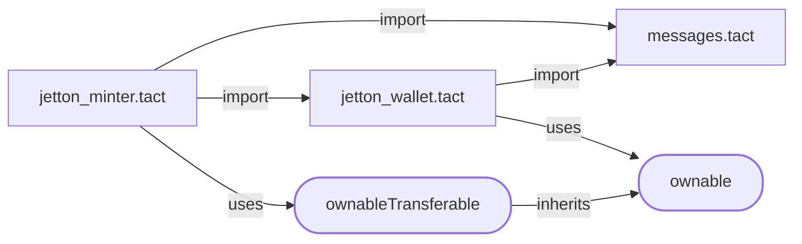

## README.md (https://github.com/tact-lang/tact/blob/main/jetton-main/README.md)
# Jetton (Fungible Token) Implementation in Tact


# **This will definitely be a stable version of Jettons, but not for now. Please, do not use this code in production. It might have some bugs.**

## Overview

This project includes a complete setup for working with Tact-based Jetton smart contracts. It provides:

- A pre-configured Tact compiler.
- Smart contracts written in the Tact language.
- TypeScript + Jest testing environment with `@ton/sandbox`.

## Goals

This implementation is fully compatible with the following TON standards:
- [TEP-64](https://github.com/ton-blockchain/TEPs/blob/master/text/0064-token-data-standard.md),
- [TEP-74](https://github.com/ton-blockchain/TEPs/blob/master/text/0074-jettons-standard.md),
- [TEP-89](https://github.com/ton-blockchain/TEPs/blob/master/text/0089-jetton-wallet-discovery.md).

You can use this implementation as an alternative to the reference Jetton contracts available in the [TON Blockchain repository](https://github.com/ton-blockchain/token-contract).

## Getting Started

### 1. Install Dependencies

Run the following command to install all required dependencies:

```bash
yarn install
```

### 2. Build Contracts

Compile the smart contracts with:

```bash
yarn build
```

### 3. Deploy Contracts

Customize your Jetton by editing the `contract.deploy.ts` file. This file also includes a detailed deployment guide. Deploy the contracts with:

```bash
yarn deploy
```

### 4. Test Contracts

Run tests in the `@ton/sandbox` environment:

```bash
yarn test
```

## Jetton Architecture

If you’re new to Jettons, read the [TON Jettons Processing](https://docs.ton.org/develop/dapps/asset-processing/jettons).

## Project Structure

Smart contracts, their tests and the deployment script are located in the `sources/` directory:

```
sources/
│
│   # Contracts and auxiliary Tact code
├── jetton_minter.tact
├── jetton_wallet.tact
├── messages.tact
│
│   # Tests
├── contract.spec.ts
│
│   # Deployment script
├── contract.deploy.ts
│
│   # Miscellaneous utility things
│   # used for tests and deployments
├── contract.read.ts
└── utils/
```

Note, that tests and the deployment script require the compiled contracts to be present in the `sources/output/` directory.

The configuration for the Tact compiler is in `tact.config.json` in the root of the repository. In most cases you won't need to change this file.

## Smart Contracts Structure

The main smart contract is `jetton_minter.tact`, it imports `messages.tact` and `jetton_wallet.tact`. With the default configuration of `tact.config.json` targeting `jetton_minter.tact`, they're all compiled automatically.

### Inherited traits

Jetton Minter uses only *OwnableTransferable*, which is inherited from the *Ownable* trait. Jetton Wallet only uses the *Ownable* trait. All these traits come from the Tact's [standard libraries](https://docs.tact-lang.org/ref/standard-libraries/).

Schemes of inheritance and imports:



Read more about those traits in the [Tact standard library](https://docs.tact-lang.org/ref/standard-libraries/).

## Best Practices

- For guidance on interacting with Jettons using Tact, read the [Jetton cookbook](https://docs.tact-lang.org/cookbook/jettons/).
- Be cautious of fake messages sent by scammers. Read [security best practices](https://docs.tact-lang.org/book/security-best-practices/) to protect yourself from fraudulent activities.
- Always consult the [official Tact documentation](https://docs.tact-lang.org/) for additional resources and support.

## License

This project is licensed under the MIT License.


## jest.config.js (https://github.com/tact-lang/tact/blob/main/jetton-main/jest.config.js)
module.exports = {
  preset: 'ts-jest',
  testEnvironment: 'node',
  testPathIgnorePatterns: ["/node_modules/", "/dist/"],
  snapshotSerializers: ["@tact-lang/ton-jest/serializers"],
  globalSetup: './jest.setup.js',
  globalTeardown: './jest.teardown.js',
};

## jest.setup.js (https://github.com/tact-lang/tact/blob/main/jetton-main/jest.setup.js)
module.exports = async () => { };


## jest.teardown.js (https://github.com/tact-lang/tact/blob/main/jetton-main/jest.teardown.js)
const path = require('path');

module.exports = async () => { };


## package.json (https://github.com/tact-lang/tact/blob/main/jetton-main/package.json)
{
  "private": true,
  "scripts": {
    "build": "tact --config ./tact.config.json",
    "lint": "yarn misti ./tact.config.json",
    "test": "jest",
    "deploy": "ts-node ./sources/contract.deploy.ts",
    "read": "ts-node ./sources/contract.read.ts"
  },
  "dependencies": {
    "@aws-crypto/sha256-js": "^5.2.0",
    "@nowarp/misti": "~0.5.0",
    "@tact-lang/compiler": "^1.5.0",
    "@tact-lang/deployer": "^0.2.0",
    "@tact-lang/ton-abi": "^0.0.3",
    "@tact-lang/ton-jest": "^0.0.4",
    "@ton/core": "~0.56.3",
    "@ton/crypto": "^3.2.0",
    "@ton/sandbox": "^0.20.0",
    "@ton/test-utils": "^0.4.2",
    "@ton/ton": "^13.9.0",
    "@types/jest": "^29.2.4",
    "@types/node": "^18.11.14",
    "@types/qs": "^6.9.7",
    "base64url": "^3.0.1",
    "dotenv": "^16.4.5",
    "enquirer": "^2.3.6",
    "jest": "^29.3.1",
    "misti": "^0.0.21",
    "open": "^8.4.0",
    "prando": "^6.0.1",
    "prettier": "^2.5.1",
    "qs": "^6.11.0",
    "ts-jest": "^29.0.3",
    "ts-node": "^10.9.1",
    "typescript": "^4.9.4"
  }
}


## tact.config.json (https://github.com/tact-lang/tact/blob/main/jetton-main/tact.config.json)
{
    "projects": [{
        "name": "Jetton",
        "path": "./sources/jetton_minter.tact",
        "output": "./sources/output",
        "mode": "full",
        "options": {
            "external": false,
            "debug": true,
            "masterchain": true,
            "ipfsAbiGetter": false,
            "interfacesGetter": false,
            "experimental": {
                "inline": false
            }
        }
    }]
}


## tsconfig.json (https://github.com/tact-lang/tact/blob/main/jetton-main/tsconfig.json)
{
  "compilerOptions": {
    /* Visit https://aka.ms/tsconfig.json to read more about this file */
    /* Basic Options */
    // "incremental": true,                         /* Enable incremental compilation */
    "target": "esnext", /* Specify ECMAScript target version: 'ES3' (default), 'ES5', 'ES2015', 'ES2016', 'ES2017', 'ES2018', 'ES2019', 'ES2020', 'ES2021', or 'ESNEXT'. */
    "module": "commonjs", /* Specify module code generation: 'none', 'commonjs', 'amd', 'system', 'umd', 'es2015', 'es2020', or 'ESNext'. */
    // "lib": [],                                   /* Specify library files to be included in the compilation. */
    // "allowJs": true,                             /* Allow javascript files to be compiled. */
    // "checkJs": true,                             /* Report errors in .js files. */
    // "jsx": "preserve",                           /* Specify JSX code generation: 'preserve', 'react-native', 'react', 'react-jsx' or 'react-jsxdev'. */
    "declaration": true, /* Generates corresponding '.d.ts' file. */
    // "declarationMap": true,                      /* Generates a sourcemap for each corresponding '.d.ts' file. */
    // "sourceMap": true,                           /* Generates corresponding '.map' file. */
    // "outFile": "./",                             /* Concatenate and emit output to single file. */
    "outDir": "./dist", /* Redirect output structure to the directory. */
    // "rootDir": "./",                             /* Specify the root directory of input files. Use to control the output directory structure with --outDir. */
    // "composite": true,                           /* Enable project compilation */
    // "tsBuildInfoFile": "./",                     /* Specify file to store incremental compilation information */
    // "removeComments": true,                      /* Do not emit comments to output. */
    // "noEmit": false,                              /* Do not emit outputs. */
    // "importHelpers": true,                       /* Import emit helpers from 'tslib'. */
    "downlevelIteration": true, /* Provide full support for iterables in 'for-of', spread, and destructuring when targeting 'ES5' or 'ES3'. */
    // "isolatedModules": true,                     /* Transpile each file as a separate module (similar to 'ts.transpileModule'). */
    /* Strict Type-Checking Options */
    "strict": true, /* Enable all strict type-checking options. */
    // "noImplicitAny": true,                       /* Raise error on expressions and declarations with an implied 'any' type. */
    // "strictNullChecks": true,                    /* Enable strict null checks. */
    // "strictFunctionTypes": true,                 /* Enable strict checking of function types. */
    // "strictBindCallApply": true,                 /* Enable strict 'bind', 'call', and 'apply' methods on functions. */
    // "strictPropertyInitialization": true,        /* Enable strict checking of property initialization in classes. */
    // "noImplicitThis": true,                      /* Raise error on 'this' expressions with an implied 'any' type. */
    // "alwaysStrict": true,                        /* Parse in strict mode and emit "use strict" for each source file. */
    /* Additional Checks */
    // "noUnusedLocals": true,                      /* Report errors on unused locals. */
    // "noUnusedParameters": true,                  /* Report errors on unused parameters. */
    // "noImplicitReturns": true,                   /* Report error when not all code paths in function return a value. */
    // "noFallthroughCasesInSwitch": true,          /* Report errors for fallthrough cases in switch statement. */
    // "noUncheckedIndexedAccess": true,            /* Include 'undefined' in index signature results */
    // "noImplicitOverride": true,                  /* Ensure overriding members in derived classes are marked with an 'override' modifier. */
    // "noPropertyAccessFromIndexSignature": true,  /* Require undeclared properties from index signatures to use element accesses. */
    /* Module Resolution Options */
    // "moduleResolution": "node",                  /* Specify module resolution strategy: 'node' (Node.js) or 'classic' (TypeScript pre-1.6). */
    // "baseUrl": "./",                             /* Base directory to resolve non-absolute module names. */
    // "paths": {},                                 /* A series of entries which re-map imports to lookup locations relative to the 'baseUrl'. */
    // "rootDirs": [],                              /* List of root folders whose combined content represents the structure of the project at runtime. */
    // "typeRoots": [],                             /* List of folders to include type definitions from. */
    "types": ["jest"],                                 /* Type declaration files to be included in compilation. */
    "allowSyntheticDefaultImports": true, /* Allow default imports from modules with no default export. This does not affect code emit, just typechecking. */
    "esModuleInterop": true, /* Enables emit interoperability between CommonJS and ES Modules via creation of namespace objects for all imports. Implies 'allowSyntheticDefaultImports'. */
    // "preserveSymlinks": true,                    /* Do not resolve the real path of symlinks. */
    // "allowUmdGlobalAccess": true,                /* Allow accessing UMD globals from modules. */
    /* Source Map Options */
    // "sourceRoot": "",                            /* Specify the location where debugger should locate TypeScript files instead of source locations. */
    // "mapRoot": "",                               /* Specify the location where debugger should locate map files instead of generated locations. */
    // "inlineSourceMap": true,                     /* Emit a single file with source maps instead of having a separate file. */
    // "inlineSources": true,                       /* Emit the source alongside the sourcemaps within a single file; requires '--inlineSourceMap' or '--sourceMap' to be set. */
    /* Experimental Options */
    // "experimentalDecorators": true,              /* Enables experimental support for ES7 decorators. */
    // "emitDecoratorMetadata": true,               /* Enables experimental support for emitting type metadata for decorators. */
    /* Advanced Options */
    "skipLibCheck": true, /* Skip type checking of declaration files. */
    "forceConsistentCasingInFileNames": true /* Disallow inconsistently-cased references to the same file. */,
    "resolveJsonModule": true
  },
  "include": [
    "sources/**/*"
  ]
}


## ci.yml (https://github.com/tact-lang/tact/blob/main/jetton-main/.github/workflows/ci.yml)
name: CI

on:
  push:
    branches: [ "main" ]
  pull_request:
    branches: [ "main" ]
  workflow_dispatch:

jobs:
  test:
    strategy:
      fail-fast: false
      matrix:
        node-version: [22]
        os: [ubuntu-latest]
    runs-on: ${{ matrix.os }}
    steps:
      - name: Checkout code
        uses: actions/checkout@v2

      - name: Install Soufflé on Ubuntu
        if: matrix.os == 'ubuntu-latest'
        run: |
          sudo wget https://souffle-lang.github.io/ppa/souffle-key.public -O /usr/share/keyrings/souffle-archive-keyring.gpg
          echo "deb [signed-by=/usr/share/keyrings/souffle-archive-keyring.gpg] https://souffle-lang.github.io/ppa/ubuntu/ stable main" | sudo tee /etc/apt/sources.list.d/souffle.list
          sudo apt update
          sudo apt install souffle

      - name: Setup Node.js
        uses: actions/setup-node@v3
        with:
          node-version: ${{ matrix.node-version }}

      - name: Install dependencies
        run: yarn install

      - name: Build
        run: yarn build

      - name: Run Misti
        run: yarn misti --min-severity medium ./tact.config.json

      - name: Run tests
        run: yarn test


## contract.deploy.ts (https://github.com/tact-lang/tact/blob/main/jetton-main/sources/contract.deploy.ts)
//Huge thanks to Howard Peng for the original code of deploy script. https://github.com/howardpen9/jetton-implementation-in-tact

import { beginCell, contractAddress, toNano, TonClient4, WalletContractV4, internal, fromNano } from "@ton/ton";
import { mnemonicToPrivateKey } from "@ton/crypto";
import { buildOnchainMetadata } from "./utils/jetton-helpers";

import { JettonMinter, storeMint } from "./output/Jetton_JettonMinter";

import { printSeparator } from "./utils/print";
import * as dotenv from "dotenv";
dotenv.config();


/*
    (Remember to install dependencies by running "yarn install" in the terminal)
    Here are the instructions to deploy the contract:
    1. Create new walletV4r2 or use existing one.
    2. Enter your mnemonics in .env file.
    3. On line 35 select the network you want to deploy the contract.
    (// - comments out the line, so you can switch between networks)
    (testnet is chosen by default, if you are not familiar with it, read https://tonkeeper.helpscoutdocs.com/article/100-how-switch-to-the-testnet)

    4. On lines 48-52 specify the parameters of the Jetton. (Ticker, description, image, etc.)
    5. On line 65 specify the total supply of the Jetton. It will be automatically converted to nano - jettons.
    Note: All supply will be automatically minted to your wallet.

    5. Run "yarn build" to compile the contract.
    6. Run this script by "yarn deploy"
 */


(async () => {
    //create client for testnet sandboxv4 API - alternative endpoint
    const client4 = new TonClient4({
        endpoint: "https://sandbox-v4.tonhubapi.com",
        //endpoint: "https://mainnet-v4.tonhubapi.com",
    });

    let mnemonics = (process.env.mnemonics || "").toString(); // 🔴 Change to your own, by creating .env file!
    let keyPair = await mnemonicToPrivateKey(mnemonics.split(" "));
    let secretKey = keyPair.secretKey;
    let workchain = 0; //we are working in basechain.
    let deployer_wallet = WalletContractV4.create({ workchain, publicKey: keyPair.publicKey });
    console.log(deployer_wallet.address);

    let deployer_wallet_contract = client4.open(deployer_wallet);

    const jettonParams = {
        name: "TactJetton",
        description: "This is description of Jetton, written in Tact-lang",
        symbol: "TACT",
        image: "https://raw.githubusercontent.com/tact-lang/tact/refs/heads/main/docs/public/logomark-light.svg",
    };

    // Create content Cell
    let content = buildOnchainMetadata(jettonParams);

    // Compute init data for deployment
    // NOTICE: the parameters inside the init functions were the input for the contract address
    // which means any changes will change the smart contract address as well
    let init = await JettonMinter.init(deployer_wallet_contract.address, content);
    let jettonMaster = contractAddress(workchain, init);
    let deployAmount = toNano("0.15");

    let supply = toNano(1000000000); // 🔴 Specify total supply in nano
    let packed_msg = beginCell()
        .store(
            storeMint({
                $$type: "Mint",
                amount: supply,
                receiver: deployer_wallet_contract.address,
            })
        )
        .endCell();

    // send a message on new address contract to deploy it
    let seqno: number = await deployer_wallet_contract.getSeqno();
    console.log("🛠️Preparing new outgoing massage from deployment wallet. \n" + deployer_wallet_contract.address);
    console.log("Seqno: ", seqno + "\n");
    printSeparator();

    // Get deployment wallet balance
    let balance: bigint = await deployer_wallet_contract.getBalance();

    console.log("Current deployment wallet balance = ", fromNano(balance).toString(), "💎TON");
    console.log("Minting:: ", fromNano(supply));
    printSeparator();

    await deployer_wallet_contract.sendTransfer({
        seqno,
        secretKey,
        messages: [
            internal({
                to: jettonMaster,
                value: deployAmount,
                init: {
                    code: init.code,
                    data: init.data,
                },
                body: packed_msg,
            }),
        ],
    });
    console.log("====== Deployment message sent to =======\n", jettonMaster);
})();


## contract.read.ts (https://github.com/tact-lang/tact/blob/main/jetton-main/sources/contract.read.ts)
(async () => {
    console.log("Read script is not yet implemented, but you can always use tonviewer / tonscan to check your contract state.");
    return;
})();


## contract.spec.ts (https://github.com/tact-lang/tact/blob/main/jetton-main/sources/contract.spec.ts)
import { Address, beginCell, Cell, ContractProvider, Sender, toNano, Builder } from '@ton/core';
import {
    Blockchain,
    SandboxContract,
    TreasuryContract,
    internal,
} from '@ton/sandbox';


import {
    ChangeOwner,
    JettonMinter,
    Mint,
    TokenUpdateContent,
    TokenBurn, ProvideWalletAddress, storeTokenTransfer, storeTokenBurn, storeMint
} from "./output/Jetton_JettonMinter";
import { JettonWallet, TokenTransfer } from "./output/Jetton_JettonWallet";

import "@ton/test-utils";
import { getRandomInt, randomAddress } from "./utils/utils";

function jettonContentToCell(content: {type: 0|1, uri:string}) {
    return beginCell()
        .storeUint(content.type, 8)
        .storeStringTail(content.uri) //Snake logic under the hood
        .endCell();
}
JettonMinter.prototype.getTotalSupply = async function (this: JettonMinter, provider: ContractProvider): Promise<bigint> {
    let res = await this.getGetJettonData(provider);
    return res.totalSupply;
};

JettonMinter.prototype.getWalletAddress = async function (this: JettonMinter, provider: ContractProvider, owner: Address) {
    return this.getGetWalletAddress(provider, owner);
};

JettonMinter.prototype.getAdminAddress = async function (this: JettonMinter, provider: ContractProvider) {
    return this.getOwner(provider);
};

JettonMinter.prototype.getContent = async function (this: JettonMinter, provider: ContractProvider) {
    let res = await this.getGetJettonData(provider);
    return res.jettonContent;
};

JettonMinter.prototype.sendMint = async function (
    this: JettonMinter,
    provider: ContractProvider,
    via: Sender,
    to: Address,
    jetton_amount: bigint,
    forward_ton_amount: bigint,
    total_ton_amount: bigint
) {
    if (total_ton_amount <= forward_ton_amount) {
        throw new Error("Total TON amount should be greater than the forward amount");
    }
    const msg: Mint = {
        $$type: "Mint",
        amount: jetton_amount,
        receiver: to,
    };
    return this.send(provider, via, { value: total_ton_amount + toNano("0.015") }, msg);
};

JettonMinter.prototype.sendChangeAdmin = async function (
    this: JettonMinter,
    provider: ContractProvider,
    via: Sender,
    newOwner: Address
) {
    const msg: ChangeOwner = {
        $$type: "ChangeOwner",
        queryId: 0n,
        newOwner: newOwner,
    };
    return this.send(provider, via, { value: toNano("0.05") }, msg);
};

JettonMinter.prototype.sendChangeContent = async function (
    this: JettonMinter,
    provider: ContractProvider,
    via: Sender,
    content: Cell
) {
    const msg: TokenUpdateContent = {
        $$type: "TokenUpdateContent",
        content: content,
    };
    return this.send(provider, via, { value: toNano("0.05") }, msg);
};

JettonMinter.prototype.sendDiscovery = async function (
    this: JettonMinter,
    provider: ContractProvider,
    via: Sender,
    address: Address,
    includeAddress: boolean,
    value: bigint = toNano("0.1")
) {
    const msg: ProvideWalletAddress = {
        $$type: "ProvideWalletAddress",
        query_id: 0n,
        owner_address: address,
        include_address: includeAddress,
    };
    return this.send(provider, via, { value: value }, msg);
};

const min_tons_for_storage: bigint = toNano("0.015");
const gas_consumption: bigint = toNano("0.015");
const fwd_fee: bigint = 721606n;

const Op = {
    token_transfer: 0xf8a7ea5,
    internal_transfer: 0x178d4519,
    transfer_notification: 0x7362d09c,
    token_burn: 0x595f07bc,
    burn_notification: 0x7bdd97de,
    token_excesses: 0xd53276db,
    provide_wallet_address: 0x2c76b973,
    take_wallet_address: 0xd1735400,
    mint: 0xfc708bd2,
}


describe("JettonMinter", () => {
    let blockchain: Blockchain;
    let jettonMinter: SandboxContract<JettonMinter>;
    let jettonWallet: SandboxContract<JettonWallet>;
    let deployer: SandboxContract<TreasuryContract>;

    let jwallet_code = new Cell();
    let minter_code = new Cell();
    let notDeployer: SandboxContract<TreasuryContract>;

    let userWallet: any;
    let defaultContent: Cell;
    beforeAll(async () => {
        // Create content Cell

        blockchain = await Blockchain.create();
        deployer = await blockchain.treasury("deployer");
        notDeployer = await blockchain.treasury('notDeployer');

        defaultContent = beginCell().endCell();
        let msg: TokenUpdateContent = {
            $$type: "TokenUpdateContent",
            content: defaultContent,
        }
        

        jettonMinter = blockchain.openContract(await JettonMinter.fromInit(deployer.address, defaultContent));

        //We send Update content to deploy the contract, because it is not automatically deployed after blockchain.openContract
        //And to deploy it we should send any message. But update content message with same content does not affect anything. That is why I chose it.
        const deployResult = await jettonMinter.send(deployer.getSender(), {value: toNano("0.1")}, msg);

        expect(deployResult.transactions).toHaveTransaction({
            from: deployer.address,
            to: jettonMinter.address,
            deploy: true,
            success: true,
        });
        minter_code = jettonMinter.init?.code!!;

        //const playerWallet = await jettonMinter.getGetWalletAddress(deployer.address);
        jettonWallet = blockchain.openContract(await JettonWallet.fromInit(deployer.address, jettonMinter.address));
        jwallet_code = jettonWallet.init?.code!!;

        userWallet = async (address: Address)=> {
            const newUserWallet = blockchain.openContract(
                JettonWallet.fromAddress(
                    await jettonMinter.getGetWalletAddress(address)
                )
            );
            (newUserWallet as any).getProvider = async (provider: ContractProvider) => {
                return provider;
            }

            const getJettonBalance = async(): Promise<bigint> => {
                let provider = await (newUserWallet as any).getProvider();
                let state = await provider.getState();
                if (state.state.type !== 'active') {
                    return 0n;
                }
                return (await newUserWallet.getGetWalletData()).balance;
            };

            const sendTransfer = async (
                via: Sender,
                value: bigint,
                jetton_amount: bigint,
                to: Address,
                responseAddress: Address,
                customPayload: Cell | null,
                forward_ton_amount: bigint,
                forwardPayload: Cell | null
            ) => {
                const parsedForwardPayload = forwardPayload != null ? forwardPayload.beginParse() : new Builder().storeUint(0, 1).endCell().beginParse(); //Either bit equals 0
                let msg: TokenTransfer = {
                    $$type: "TokenTransfer",
                    query_id: 0n,
                    amount: jetton_amount,
                    destination: to,
                    response_destination: responseAddress,
                    custom_payload: customPayload,
                    forward_ton_amount: forward_ton_amount,
                    forward_payload: parsedForwardPayload,
                };

                return await newUserWallet.send(via, { value }, msg);
            };

            const sendBurn = async (
                via: Sender,
                value: bigint,
                jetton_amount: bigint,
                responseAddress: Address,
                customPayload: Cell | null
            ) => {
                let msg: TokenBurn = {
                    $$type: "TokenBurn",
                    query_id: 0n,
                    amount: jetton_amount,
                    response_destination: responseAddress,
                    custom_payload: customPayload,
                };

                return await newUserWallet.send(via, { value }, msg);
            };

            return {
                ...newUserWallet,
                getJettonBalance,
                sendTransfer,
                sendBurn,
            };
        }
    });

    // implementation detail
    it('should deploy', async () => {
        expect(jettonMinter).toBeDefined();
        expect(jettonWallet).toBeDefined();
    });
    // implementation detail
    it('minter admin should be able to mint jettons', async () => {
        // can mint from deployer
        let initialTotalSupply = await jettonMinter.getTotalSupply();
        const deployerJettonWallet = await userWallet(deployer.address);
        let initialJettonBalance = toNano('1000.23');
        const mintResult = await jettonMinter.sendMint(deployer.getSender(), deployer.address, initialJettonBalance, toNano('0.05'), toNano('1'));

        expect(mintResult.transactions).toHaveTransaction({
            from: jettonMinter.address,
            to: deployerJettonWallet.address,
            deploy: true,
        });
        //Here was the check, that excesses are send to JettonMinter.
        //This is an implementation-defined behavior
        //In my implementation, excesses are sent to the deployer
        expect(mintResult.transactions).toHaveTransaction({ // excesses
            from: deployerJettonWallet.address,
            to: deployer.address
        });


        expect(await deployerJettonWallet.getJettonBalance()).toEqual(initialJettonBalance);
        expect(await jettonMinter.getTotalSupply()).toEqual(initialTotalSupply + initialJettonBalance);
        initialTotalSupply += initialJettonBalance;
        // can mint from deployer again
        let additionalJettonBalance = toNano('2.31');
        await jettonMinter.sendMint(deployer.getSender(), deployer.address, additionalJettonBalance, toNano('0.05'), toNano('1'));
        expect(await deployerJettonWallet.getJettonBalance()).toEqual(initialJettonBalance + additionalJettonBalance);
        expect(await jettonMinter.getTotalSupply()).toEqual(initialTotalSupply + additionalJettonBalance);
        initialTotalSupply += additionalJettonBalance;
        // can mint to other address
        let otherJettonBalance = toNano('3.12');
        await jettonMinter.sendMint(deployer.getSender(), notDeployer.address, otherJettonBalance, toNano('0.05'), toNano('1'));
        const notDeployerJettonWallet = await userWallet(notDeployer.address);
        expect(await notDeployerJettonWallet.getJettonBalance()).toEqual(otherJettonBalance);
        expect(await jettonMinter.getTotalSupply()).toEqual(initialTotalSupply + otherJettonBalance);
    });

    // implementation detail
    it('not a minter admin should not be able to mint jettons', async () => {
        let initialTotalSupply = await jettonMinter.getTotalSupply();
        const deployerJettonWallet = await userWallet(deployer.address);
        let initialJettonBalance = await deployerJettonWallet.getJettonBalance();
        const unAuthMintResult = await jettonMinter.sendMint(notDeployer.getSender(), deployer.address, toNano('777'), toNano('0.05'), toNano('1'));

        expect(unAuthMintResult.transactions).toHaveTransaction({
            from: notDeployer.address,
            to: jettonMinter.address,
            aborted: true,
            success: false,
        });
        expect(await deployerJettonWallet.getJettonBalance()).toEqual(initialJettonBalance);
        expect(await jettonMinter.getTotalSupply()).toEqual(initialTotalSupply);
    });

    // Implementation detail
    it('minter admin can change admin', async () => {
        const adminBefore = await jettonMinter.getAdminAddress();
        expect(adminBefore).toEqualAddress(deployer.address);
        let res = await jettonMinter.sendChangeAdmin(deployer.getSender(), notDeployer.address);
        expect(res.transactions).toHaveTransaction({
            from: deployer.address,
            on: jettonMinter.address,
            success: true
        });

        const adminAfter = await jettonMinter.getAdminAddress();
        expect(adminAfter).toEqualAddress(notDeployer.address);
        await jettonMinter.sendChangeAdmin(notDeployer.getSender(), deployer.address);
        expect((await jettonMinter.getAdminAddress()).equals(deployer.address)).toBe(true);
    });
    it('not a minter admin can not change admin', async () => {
        const adminBefore = await jettonMinter.getAdminAddress();
        expect(adminBefore).toEqualAddress(deployer.address);
        let changeAdmin = await jettonMinter.sendChangeAdmin(notDeployer.getSender(), notDeployer.address);
        expect((await jettonMinter.getAdminAddress()).equals(deployer.address)).toBe(true);
        expect(changeAdmin.transactions).toHaveTransaction({
            from: notDeployer.address,
            on: jettonMinter.address,
            aborted: true,
            success: false,
        });
    });

    it('minter admin can change content', async () => {
        let newContent = jettonContentToCell({type: 1, uri: "https://totally_new_jetton.org/content.json"})
        expect((await jettonMinter.getContent()).equals(defaultContent)).toBe(true);
        await jettonMinter.sendChangeContent(deployer.getSender(), newContent);
        expect((await jettonMinter.getContent()).equals(newContent)).toBe(true);
        await jettonMinter.sendChangeContent(deployer.getSender(), defaultContent);
        expect((await jettonMinter.getContent()).equals(defaultContent)).toBe(true);
    });
    it('wallet owner should be able to send jettons', async () => {
        const deployerJettonWallet = await userWallet(deployer.address);
        let initialJettonBalance = await deployerJettonWallet.getJettonBalance();
        let initialTotalSupply = await jettonMinter.getTotalSupply();
        const notDeployerJettonWallet = await userWallet(notDeployer.address);
        let initialJettonBalance2 = await notDeployerJettonWallet.getJettonBalance();
        let sentAmount = toNano('0.5');
        let forwardAmount = toNano('0.05');
        const sendResult = await deployerJettonWallet.sendTransfer
        (deployer.getSender(), toNano('0.1'), //tons
            sentAmount, notDeployer.address,
            deployer.address, null, forwardAmount, null);
        expect(sendResult.transactions).toHaveTransaction({ //excesses
            from: notDeployerJettonWallet.address,
            to: deployer.address,
        });
        expect(sendResult.transactions).toHaveTransaction({ //notification
            from: notDeployerJettonWallet.address,
            to: notDeployer.address,
            value: forwardAmount
        });
        expect(await deployerJettonWallet.getJettonBalance()).toEqual(initialJettonBalance - sentAmount);
        expect(await notDeployerJettonWallet.getJettonBalance()).toEqual(initialJettonBalance2 + sentAmount);
        expect(await jettonMinter.getTotalSupply()).toEqual(initialTotalSupply);
    });


    it('not wallet owner should not be able to send jettons', async () => {
        const deployerJettonWallet = await userWallet(deployer.address);
        let initialJettonBalance = await deployerJettonWallet.getJettonBalance();
        let initialTotalSupply = await jettonMinter.getTotalSupply();
        const notDeployerJettonWallet = await userWallet(notDeployer.address);
        let initialJettonBalance2 = await notDeployerJettonWallet.getJettonBalance();
        let sentAmount = toNano('0.5');
        const sendResult = await deployerJettonWallet.sendTransfer(notDeployer.getSender(), toNano('0.1'), //tons
            sentAmount, notDeployer.address,
            deployer.address, null, toNano('0.05'), null);
        expect(sendResult.transactions).toHaveTransaction({
            from: notDeployer.address,
            to: deployerJettonWallet.address,
            aborted: true,
            success: false,
        });
        expect(await deployerJettonWallet.getJettonBalance()).toEqual(initialJettonBalance);
        expect(await notDeployerJettonWallet.getJettonBalance()).toEqual(initialJettonBalance2);
        expect(await jettonMinter.getTotalSupply()).toEqual(initialTotalSupply);
    });

    it('impossible to send too much jettons', async () => {
        const deployerJettonWallet = await userWallet(deployer.address);
        let initialJettonBalance = await deployerJettonWallet.getJettonBalance();
        const notDeployerJettonWallet = await userWallet(notDeployer.address);
        let initialJettonBalance2 = await notDeployerJettonWallet.getJettonBalance();
        let sentAmount = initialJettonBalance + 1n;
        let forwardAmount = toNano('0.05');
        const sendResult = await deployerJettonWallet.sendTransfer(deployer.getSender(), toNano('0.1'), //tons
            sentAmount, notDeployer.address,
            deployer.address, null, forwardAmount, null);
        expect(sendResult.transactions).toHaveTransaction({
            from: deployer.address,
            to: deployerJettonWallet.address,
            aborted: true,
            success: false,
        });
        expect(await deployerJettonWallet.getJettonBalance()).toEqual(initialJettonBalance);
        expect(await notDeployerJettonWallet.getJettonBalance()).toEqual(initialJettonBalance2);
    });

    it('correctly sends forward_payload in place', async () => {
        const deployerJettonWallet = await userWallet(deployer.address);
        let initialJettonBalance = await deployerJettonWallet.getJettonBalance();
        const notDeployerJettonWallet = await userWallet(notDeployer.address);
        let initialJettonBalance2 = await notDeployerJettonWallet.getJettonBalance();
        let sentAmount = toNano('0.5');
        let forwardAmount = toNano('0.05');
        let forwardPayload = beginCell().storeUint(0x1234567890abcdefn, 128).endCell();
        //This block checks forward_payload in place (Either bit equals 0)
        const sendResult = await deployerJettonWallet.sendTransfer(deployer.getSender(), toNano('0.1'), //tons
            sentAmount, notDeployer.address,
            deployer.address, null, forwardAmount, forwardPayload);
        expect(sendResult.transactions).toHaveTransaction({ //excesses
            from: notDeployerJettonWallet.address,
            to: deployer.address,
        });
        /*
        transfer_notification#7362d09c query_id:uint64 amount:(VarUInteger 16)
                                      sender:MsgAddress forward_payload:(Either Cell ^Cell)
                                      = InternalMsgBody;
        */
        expect(sendResult.transactions).toHaveTransaction({ //notification
            from: notDeployerJettonWallet.address,
            to: notDeployer.address,
            value: forwardAmount,
            body: beginCell()
                .storeUint(Op.transfer_notification, 32)
                .storeUint(0, 64) //default queryId
                .storeCoins(sentAmount)
                .storeAddress(deployer.address)
                .storeSlice(forwardPayload.beginParse()) //Doing this because forward_payload is already Cell with 1 bit 1 and one ref.
                .endCell()
        });
        expect(await deployerJettonWallet.getJettonBalance()).toEqual(initialJettonBalance - sentAmount);
        expect(await notDeployerJettonWallet.getJettonBalance()).toEqual(initialJettonBalance2 + sentAmount);
    });


    //There was no such test in official implementation
    it('correctly sends forward_payload in ref', async () => {
        const deployerJettonWallet = await userWallet(deployer.address);
        let initialJettonBalance = await deployerJettonWallet.getJettonBalance();
        const notDeployerJettonWallet = await userWallet(notDeployer.address);
        let initialJettonBalance2 = await notDeployerJettonWallet.getJettonBalance();
        let sentAmount = toNano('0.5');
        let forwardAmount = toNano('0.05');
        //This block checks forward_payload in separate ref (Either bit equals 1)
        let forwardPayload = beginCell().storeUint(1, 1).storeRef(beginCell().storeUint(0x1234567890abcdefn, 128).endCell()).endCell();

        const sendResult = await deployerJettonWallet.sendTransfer(deployer.getSender(), toNano('0.1'), //tons
            sentAmount, notDeployer.address,
            deployer.address, null, forwardAmount, forwardPayload);
        expect(sendResult.transactions).toHaveTransaction({ //excesses
            from: notDeployerJettonWallet.address,
            to: deployer.address,
        });
        /*
        transfer_notification#7362d09c query_id:uint64 amount:(VarUInteger 16)
                                      sender:MsgAddress forward_payload:(Either Cell ^Cell)
                                      = InternalMsgBody;
        */
        expect(sendResult.transactions).toHaveTransaction({ //notification
            from: notDeployerJettonWallet.address,
            to: notDeployer.address,
            value: forwardAmount,
            body: beginCell()
                .storeUint(Op.transfer_notification, 32)
                .storeUint(0, 64) //default queryId
                .storeCoins(sentAmount)
                .storeAddress(deployer.address)
                .storeSlice(forwardPayload.beginParse()) //Doing this because forward_payload is already Cell with 1 bit 1 and one ref.
                .endCell()
        });
        expect(await deployerJettonWallet.getJettonBalance()).toEqual(initialJettonBalance - sentAmount);
        expect(await notDeployerJettonWallet.getJettonBalance()).toEqual(initialJettonBalance2 + sentAmount);
    });

    it('no forward_ton_amount - no forward', async () => {
        const deployerJettonWallet = await userWallet(deployer.address);
        let initialJettonBalance = await deployerJettonWallet.getJettonBalance();
        const notDeployerJettonWallet = await userWallet(notDeployer.address);
        let initialJettonBalance2 = await notDeployerJettonWallet.getJettonBalance();
        let sentAmount = toNano('0.5');
        let forwardAmount = 0n;
        let forwardPayload = beginCell().storeUint(0x1234567890abcdefn, 128).endCell();
        const sendResult = await deployerJettonWallet.sendTransfer(deployer.getSender(), toNano('0.1'), //tons
            sentAmount, notDeployer.address,
            deployer.address, null, forwardAmount, forwardPayload);
        expect(sendResult.transactions).toHaveTransaction({ //excesses
            from: notDeployerJettonWallet.address,
            to: deployer.address,
        });

        expect(sendResult.transactions).not.toHaveTransaction({ //no notification
            from: notDeployerJettonWallet.address,
            to: notDeployer.address
        });
        expect(await deployerJettonWallet.getJettonBalance()).toEqual(initialJettonBalance - sentAmount);
        expect(await notDeployerJettonWallet.getJettonBalance()).toEqual(initialJettonBalance2 + sentAmount);
    });

    it('check revert on not enough tons for forward', async () => {
        const deployerJettonWallet = await userWallet(deployer.address);
        let initialJettonBalance = await deployerJettonWallet.getJettonBalance();
        await deployer.send({value:toNano('1'), bounce:false, to: deployerJettonWallet.address});
        let sentAmount = toNano('0.1');
        let forwardAmount = toNano('0.3');
        let forwardPayload = beginCell().storeUint(0x1234567890abcdefn, 128).endCell();
        const sendResult = await deployerJettonWallet.sendTransfer(deployer.getSender(), forwardAmount, // not enough tons, no tons for gas
            sentAmount, notDeployer.address,
            deployer.address, null, forwardAmount, forwardPayload);
        expect(sendResult.transactions).toHaveTransaction({
            from: deployer.address,
            on: deployerJettonWallet.address,
            aborted: true,
            success: false,
        });
        // Make sure value bounced
        expect(sendResult.transactions).toHaveTransaction({
            from: deployerJettonWallet.address,
            on: deployer.address,
            inMessageBounced: true,
            success: true
        });

        expect(await deployerJettonWallet.getJettonBalance()).toEqual(initialJettonBalance);
    });
    describe('Bounces', () => {
        // This code is borrowed from the stablecoin implementation.
        // The behavior is implementation-defined.
        // I'm still not sure if the code handling these bounces is really necessary,
        // but I could be wrong. Refer to this issue for details: https://github.com/tact-lang/jetton/issues/10
        it('minter should restore supply on internal_transfer bounce', async () => {
            const deployerJettonWallet    = await userWallet(deployer.address);
            const mintAmount = BigInt(getRandomInt(1000, 2000));
            const mintMsg = beginCell().store(storeMint({$$type: "Mint", amount: mintAmount, receiver: deployer.address})).endCell();

            const supplyBefore = await jettonMinter.getTotalSupply();
            const minterSmc    = await blockchain.getContract(jettonMinter.address);

            // Sending message but only processing first step of tx chain
            let res = await minterSmc.receiveMessage(internal({
                from: deployer.address,
                to: jettonMinter.address,
                body: mintMsg,
                value: toNano('1')
            }));

            expect(res.outMessagesCount).toEqual(1);
            const outMsgSc = res.outMessages.get(0)!.body.beginParse();
            expect(outMsgSc.preloadUint(32)).toEqual(Op.internal_transfer);

            expect(await jettonMinter.getTotalSupply()).toEqual(supplyBefore + mintAmount);

            await minterSmc.receiveMessage(internal({
                from: deployerJettonWallet.address,
                to: jettonMinter.address,
                bounced: true,
                body: beginCell().storeUint(0xFFFFFFFF, 32).storeSlice(outMsgSc).endCell(),
                value: toNano('0.95')
            }));

            // Supply should change back
            expect(await jettonMinter.getTotalSupply()).toEqual(supplyBefore);
        });
        it('wallet should restore balance on internal_transfer bounce', async () => {
            const initRes = await jettonMinter.sendMint(deployer.getSender(), deployer.address, 201n, 0n, toNano(1));
            const deployerJettonWallet    = await userWallet(deployer.address);
            expect(initRes.transactions).toHaveTransaction({
                from: jettonMinter.address,
                to: deployerJettonWallet.address,
                success: true
            })

            const notDeployerJettonWallet = await userWallet(notDeployer.address);
            const balanceBefore           = await deployerJettonWallet.getJettonBalance();
            const txAmount = BigInt(getRandomInt(100, 200));
            const transferMsg = beginCell().store(storeTokenTransfer({$$type: "TokenTransfer",
                query_id: 0n,
                amount: txAmount,
                response_destination: deployer.address,
                destination: notDeployer.address,
                custom_payload: null,
                forward_ton_amount: 0n,
                forward_payload: beginCell().endCell().beginParse()
            })).endCell()

            const walletSmc = await blockchain.getContract(deployerJettonWallet.address);

            const res = await walletSmc.receiveMessage(internal({
                from: deployer.address,
                to: deployerJettonWallet.address,
                body: transferMsg,
                value: toNano('1')
            }));
            expect(res.outMessagesCount).toEqual(1);

            const outMsgSc = res.outMessages.get(0)!.body.beginParse();
            expect(outMsgSc.preloadUint(32)).toEqual(Op.internal_transfer);

            expect(await deployerJettonWallet.getJettonBalance()).toEqual(balanceBefore - txAmount);

            await walletSmc.receiveMessage(internal({
                from: notDeployerJettonWallet.address,
                to: walletSmc.address,
                bounced: true,
                body: beginCell().storeUint(0xFFFFFFFF, 32).storeSlice(outMsgSc).endCell(),
                value: toNano('0.95')
            }));

            // Balance should roll back
            expect(await deployerJettonWallet.getJettonBalance()).toEqual(balanceBefore);
        });
        it('wallet should restore balance on burn_notification bounce', async () => {
            // Mint some jettons
            await jettonMinter.sendMint(deployer.getSender(), deployer.address, 201n, 0n, toNano(1));
            const deployerJettonWallet = await userWallet(deployer.address);
            const balanceBefore        = await deployerJettonWallet.getJettonBalance();
            const burnAmount = BigInt(getRandomInt(100, 200));

            const burnMsg = beginCell().store(storeTokenBurn({amount: burnAmount, $$type: "TokenBurn", query_id: 0n, response_destination: deployer.address, custom_payload: null})).endCell()

            const walletSmc = await blockchain.getContract(deployerJettonWallet.address);

            const res = await walletSmc.receiveMessage(internal({
                from: deployer.address,
                to: deployerJettonWallet.address,
                body: burnMsg,
                value: toNano('1')
            }));

            expect(res.outMessagesCount).toEqual(1);

            const outMsgSc = res.outMessages.get(0)!.body.beginParse();
            expect(outMsgSc.preloadUint(32)).toEqual(Op.burn_notification);

            expect(await deployerJettonWallet.getJettonBalance()).toEqual(balanceBefore - burnAmount);

            await walletSmc.receiveMessage(internal({
                from: jettonMinter.address,
                to: walletSmc.address,
                bounced: true,
                body: beginCell().storeUint(0xFFFFFFFF, 32).storeSlice(outMsgSc).endCell(),
                value: toNano('0.95')
            }));

            // Balance should roll back
            expect(await deployerJettonWallet.getJettonBalance()).toEqual(balanceBefore);
        });
    });
    // implementation detail
    it('works with minimal ton amount', async () => {
        const deployerJettonWallet = await userWallet(deployer.address);
        let initialJettonBalance = await deployerJettonWallet.getJettonBalance();
        const someAddress = Address.parse("EQD__________________________________________0vo");
        const someJettonWallet = await userWallet(someAddress);
        let initialJettonBalance2 = await someJettonWallet.getJettonBalance();
        await deployer.send({value:toNano('1'), bounce:false, to: deployerJettonWallet.address});
        let forwardAmount = toNano('0.3');
        /*
                     forward_ton_amount +
                     fwd_count * fwd_fee +
                     (2 * gas_consumption + min_tons_for_storage));
        */
        let minimalFee = 2n* fwd_fee + 2n*gas_consumption + min_tons_for_storage;
        let sentAmount = forwardAmount + minimalFee; // not enough, need >

        let forwardPayload = null;
        (await blockchain.getContract(deployerJettonWallet.address)).balance;
        (await blockchain.getContract(someJettonWallet.address)).balance;
        let sendResult = await deployerJettonWallet.sendTransfer(deployer.getSender(), sentAmount,
            sentAmount, someAddress,
            deployer.address, null, forwardAmount, forwardPayload);

        expect(sendResult.transactions).toHaveTransaction({
            from: deployer.address,
            to: deployerJettonWallet.address,
            aborted: true,
            success: false,
        });
        sentAmount += 1n; // now enough
        sendResult = await deployerJettonWallet.sendTransfer(deployer.getSender(), sentAmount,
            sentAmount, someAddress,
            deployer.address, null, forwardAmount, forwardPayload);
        expect(sendResult.transactions).not.toHaveTransaction({ //no excesses
            from: someJettonWallet.address,
            to: deployer.address,
        });
        /*
        transfer_notification#7362d09c query_id:uint64 amount:(VarUInteger 16)
                                      sender:MsgAddress forward_payload:(Either Cell ^Cell)
                                      = InternalMsgBody;
        */
        expect(sendResult.transactions).toHaveTransaction({ //notification
            from: someJettonWallet.address,
            to: someAddress,
            value: forwardAmount,
            body: beginCell().storeUint(Op.transfer_notification, 32).storeUint(0, 64) //default queryId
                .storeCoins(sentAmount)
                .storeAddress(deployer.address)
                .storeUint(0, 1)
                .endCell()
        });
        expect(await deployerJettonWallet.getJettonBalance()).toEqual(initialJettonBalance - sentAmount);
        expect(await someJettonWallet.getJettonBalance()).toEqual(initialJettonBalance2 + sentAmount);

        (await blockchain.getContract(deployerJettonWallet.address)).balance;
        expect((await blockchain.getContract(someJettonWallet.address)).balance).toBeGreaterThan(min_tons_for_storage);
    });

    // implementation detail
    it('wallet does not accept internal_transfer not from wallet', async () => {
        const deployerJettonWallet = await userWallet(deployer.address);
        let initialJettonBalance = await deployerJettonWallet.getJettonBalance();
        /*
          internal_transfer  query_id:uint64 amount:(VarUInteger 16) from:MsgAddress
                             response_address:MsgAddress
                             forward_ton_amount:(VarUInteger 16)
                             forward_payload:(Either Cell ^Cell)
                             = InternalMsgBody;
        */
        let internalTransfer = beginCell().storeUint(0x178d4519, 32).storeUint(0, 64) //default queryId
            .storeCoins(toNano('0.01'))
            .storeAddress(deployer.address)
            .storeAddress(deployer.address)
            .storeCoins(toNano('0.05'))
            .storeUint(0, 1)
            .endCell();
        const sendResult = await blockchain.sendMessage(internal({
            from: notDeployer.address,
            to: deployerJettonWallet.address,
            body: internalTransfer,
            value:toNano('0.3')
        }));
        expect(sendResult.transactions).toHaveTransaction({
            from: notDeployer.address,
            to: deployerJettonWallet.address,
            aborted: true,
            success: false,
        });
        expect(await deployerJettonWallet.getJettonBalance()).toEqual(initialJettonBalance);
    });

    it('wallet owner should be able to burn jettons', async () => {
        const deployerJettonWallet = await userWallet(deployer.address);
        let initialJettonBalance = await deployerJettonWallet.getJettonBalance();
        let initialTotalSupply = await jettonMinter.getTotalSupply();
        let burnAmount = toNano('0.01');
        const sendResult = await deployerJettonWallet.sendBurn(deployer.getSender(), toNano('0.1'), // ton amount
            burnAmount, deployer.address, null); // amount, response address, custom payload
        expect(sendResult.transactions).toHaveTransaction({ //burn notification
            from: deployerJettonWallet.address,
            to: jettonMinter.address
        });
        expect(sendResult.transactions).toHaveTransaction({ //excesses
            from: jettonMinter.address,
            to: deployer.address
        });
        expect(await deployerJettonWallet.getJettonBalance()).toEqual(initialJettonBalance - burnAmount);
        expect(await jettonMinter.getTotalSupply()).toEqual(initialTotalSupply - burnAmount);

    });

    it('not wallet owner should not be able to burn jettons', async () => {
        const deployerJettonWallet = await userWallet(deployer.address);
        let initialJettonBalance = await deployerJettonWallet.getJettonBalance();
        let initialTotalSupply = await jettonMinter.getTotalSupply();
        let burnAmount = toNano('0.01');
        const sendResult = await deployerJettonWallet.sendBurn(notDeployer.getSender(), toNano('0.1'), // ton amount
            burnAmount, deployer.address, null); // amount, response address, custom payload
        expect(sendResult.transactions).toHaveTransaction({
            from: notDeployer.address,
            to: deployerJettonWallet.address,
            aborted: true,
            success: false,
        });
        expect(await deployerJettonWallet.getJettonBalance()).toEqual(initialJettonBalance);
        expect(await jettonMinter.getTotalSupply()).toEqual(initialTotalSupply);
    });

    it('wallet owner can not burn more jettons than it has', async () => {
        const deployerJettonWallet = await userWallet(deployer.address);
        let initialJettonBalance = await deployerJettonWallet.getJettonBalance();
        let initialTotalSupply = await jettonMinter.getTotalSupply();
        let burnAmount = initialJettonBalance + 1n;
        const sendResult = await deployerJettonWallet.sendBurn(deployer.getSender(), toNano('0.1'), // ton amount
            burnAmount, deployer.address, null); // amount, response address, custom payload
        expect(sendResult.transactions).toHaveTransaction({
            from: deployer.address,
            to: deployerJettonWallet.address,
            aborted: true,
            success: false,
        });
        expect(await deployerJettonWallet.getJettonBalance()).toEqual(initialJettonBalance);
        expect(await jettonMinter.getTotalSupply()).toEqual(initialTotalSupply);
    });

    it('minimal burn message fee', async () => {
        const deployerJettonWallet = await userWallet(deployer.address);
        let initialJettonBalance   = await deployerJettonWallet.getJettonBalance();
        let initialTotalSupply     = await jettonMinter.getTotalSupply();
        let burnAmount   = toNano('0.01');
        //let minimalFee   = fwd_fee + 2n*gas_consumption + min_tons_for_storage;
        //let minimalFee = toNano("0.006");
        let L = toNano(0.00000001);
        let R = toNano(0.1);
        //change false to true if you want to find minimal fee
        //However, before doing it, remove gas-checks from the smart-contract code
        //implementing binary search
        while(R - L > 1 && false) {
            let minimalFee = (L + R) / 2n;
            try {
                const sendLow    = await deployerJettonWallet.sendBurn(deployer.getSender(), minimalFee, // ton amount
                    burnAmount, deployer.address, null); // amount, response address, custom payload

                expect(sendLow.transactions).toHaveTransaction({
                    from: deployerJettonWallet.address,
                    to: jettonMinter.address,
                    exitCode: 0
                });
                R = minimalFee;
            }
            catch {
                L = minimalFee;
            }
        }
        console.log(L);
        let minimalFee = 11217199n;
        //It is the number you can get in console.log(L) if setting "false" to "true" in while loop above

        const sendLow    = await deployerJettonWallet.sendBurn(deployer.getSender(), minimalFee, // ton amount
            burnAmount, deployer.address, null); // amount, response address, custom payload
        //Here was tests, that checks that there is enough ton to jetton wallet to send a message.
        //However, I check that it is enough ton to process a message from jetton wallet to jetton minter
        expect(sendLow.transactions).not.toHaveTransaction({
            from: deployerJettonWallet.address,
            to: jettonMinter.address,
            exitCode: 0,
        });
        const sendEnough = await deployerJettonWallet.sendBurn(deployer.getSender(), minimalFee + 1n,
            burnAmount, deployer.address, null);

        expect(sendEnough.transactions).toHaveTransaction({
            from: deployerJettonWallet.address,
            to: jettonMinter.address,
            exitCode: 0,
        });
        expect(await deployerJettonWallet.getJettonBalance()).toEqual(initialJettonBalance - burnAmount);
        expect(await jettonMinter.getTotalSupply()).toEqual(initialTotalSupply - burnAmount);

    });

    it('minter should only accept burn messages from jetton wallets', async () => {
        const deployerJettonWallet = await userWallet(deployer.address);
        const burnAmount = toNano('1');
        const burnNotification = (amount: bigint, addr: Address) => {
            return beginCell()
                .storeUint(Op.burn_notification, 32)
                .storeUint(0, 64)
                .storeCoins(amount)
                .storeAddress(addr)
                .storeAddress(deployer.address)
                .endCell();
        }

        let res = await blockchain.sendMessage(internal({
            from: deployerJettonWallet.address,
            to: jettonMinter.address,
            body: burnNotification(burnAmount, randomAddress(0)),
            value: toNano('0.1')
        }));

        expect(res.transactions).toHaveTransaction({
            from: deployerJettonWallet.address,
            to: jettonMinter.address,
            aborted: true,
            success: false,
        });

        res = await blockchain.sendMessage(internal({
            from: deployerJettonWallet.address,
            to: jettonMinter.address,
            body: burnNotification(burnAmount, deployer.address),
            value: toNano('0.1')
        }));

        expect(res.transactions).toHaveTransaction({
            from: deployerJettonWallet.address,
            to: jettonMinter.address,
            success: true
        });
    });

    // TEP-89
    it('report correct discovery address', async () => {
        let discoveryResult = await jettonMinter.sendDiscovery(deployer.getSender(), deployer.address, true);
        /*
          take_wallet_address#d1735400 query_id:uint64 wallet_address:MsgAddress owner_address:(Maybe ^MsgAddress) = InternalMsgBody;
        */
        const deployerJettonWallet = await userWallet(deployer.address);
        expect(discoveryResult.transactions).toHaveTransaction({
            from: jettonMinter.address,
            to: deployer.address,
            body: beginCell().storeUint(Op.take_wallet_address, 32).storeUint(0, 64)
                .storeAddress(deployerJettonWallet.address)
                .storeUint(1, 1)
                .storeRef(beginCell().storeAddress(deployer.address).endCell())
                .endCell()
        });

        discoveryResult = await jettonMinter.sendDiscovery(deployer.getSender(), notDeployer.address, true);
        const notDeployerJettonWallet = await userWallet(notDeployer.address);
        expect(discoveryResult.transactions).toHaveTransaction({
            from: jettonMinter.address,
            to: deployer.address,
            body: beginCell().storeUint(Op.take_wallet_address, 32)
                .storeUint(0, 64)
                .storeAddress(notDeployerJettonWallet.address)
                .storeUint(1, 1)
                .storeRef(beginCell().storeAddress(notDeployer.address).endCell())
                .endCell()
        });

        // do not include owner address
        discoveryResult = await jettonMinter.sendDiscovery(deployer.getSender(), notDeployer.address, false);
        expect(discoveryResult.transactions).toHaveTransaction({
            from: jettonMinter.address,
            to: deployer.address,
            body: beginCell().storeUint(Op.take_wallet_address, 32).storeUint(0, 64)
                .storeAddress(notDeployerJettonWallet.address)
                .storeUint(0, 1)
                .endCell()
        });

    });

    it('Minimal discovery fee', async () => {
        // 5000 gas-units + msg_forward_prices.lump_price + msg_forward_prices.cell_price = 0.0061
        //const fwdFee     = 1464012n;
        //const minimalFee = fwdFee + 10000000n; // toNano('0.0061');

        //Added binary search to find minimal fee
        let L = toNano(0.00000001);
        let R = toNano(0.1);
        //Binary search here does not affect on anything except time of test
        //So if you want to skip it, just replace while(R - L > 1) with while(false) or while(R - L > 1 && false)
        while(R - L > 1) {
            let minimalFee = (L + R) / 2n;
            try {
                const discoveryResult = await jettonMinter.sendDiscovery(deployer.getSender(), notDeployer.address, false, minimalFee);
                expect(discoveryResult.transactions).toHaveTransaction({
                    from: deployer.address,
                    to: jettonMinter.address,
                    success: true
                });
                R = minimalFee;
            }
            catch {
                L = minimalFee;
            }
        }
        console.log(L);
        const minimalFee = L;
        let discoveryResult = await jettonMinter.sendDiscovery(deployer.getSender(),
            notDeployer.address,
            false,
            minimalFee);
        expect(discoveryResult.transactions).toHaveTransaction({
            from: deployer.address,
            to: jettonMinter.address,
            aborted: true,
            success: false,
        });
        /*
         * Might be helpfull to have logical OR in expect lookup
         * Because here is what is stated in standard:
         * and either throw an exception if amount of incoming value is not enough to calculate wallet address
         * or response with message (sent with mode 64)
         * https://github.com/ton-blockchain/TEPs/blob/master/text/0089-jetton-wallet-discovery.md
         * At least something like
         * expect(discoveryResult.hasTransaction({such and such}) ||
         * discoveryResult.hasTransaction({yada yada})).toBeTruethy()
         */
        discoveryResult = await jettonMinter.sendDiscovery(deployer.getSender(),
            notDeployer.address,
            false,
            minimalFee + 1n);

        expect(discoveryResult.transactions).toHaveTransaction({
            from: deployer.address,
            to: jettonMinter.address,
            success: true
        });

    });

    it('Correctly handles not valid address in discovery', async () =>{
        const badAddr       = randomAddress(-1);
        let discoveryResult = await jettonMinter.sendDiscovery(deployer.getSender(),
            badAddr,
            false);

        expect(discoveryResult.transactions).toHaveTransaction({
            from: jettonMinter.address,
            to: deployer.address,
            body: beginCell().storeUint(Op.take_wallet_address, 32).storeUint(0, 64)
                .storeUint(0, 2) // addr_none
                .storeUint(0, 1)
                .endCell()

        });

        // Include address should still be available

        discoveryResult = await jettonMinter.sendDiscovery(deployer.getSender(),
            badAddr,
            true); // Include addr

        expect(discoveryResult.transactions).toHaveTransaction({
            from: jettonMinter.address,
            to: deployer.address,
            body: beginCell().storeUint(Op.take_wallet_address, 32).storeUint(0, 64)
                .storeUint(0, 2) // addr_none
                .storeUint(1, 1)
                .storeRef(beginCell().storeAddress(badAddr).endCell())
                .endCell()

        });
    });

    // This test consume a lot of time: 18 sec
    // and is needed only for measuring ton accruing
    /*it('jettonWallet can process 250 transfer', async () => {
        const deployerJettonWallet = await userWallet(deployer.address);
        let initialJettonBalance = await deployerJettonWallet.getJettonBalance();
        const notDeployerJettonWallet = await userWallet(notDeployer.address);
        let initialJettonBalance2 = await notDeployerJettonWallet.getJettonBalance();
        let sentAmount = 1n, count = 250n;
        let forwardAmount = toNano('0.05');
        let sendResult: any;
        let payload = beginCell()
                          .storeUint(0x12345678, 32).storeUint(0x87654321, 32)
                          .storeRef(beginCell().storeUint(0x12345678, 32).storeUint(0x87654321, 108).endCell())
                          .storeRef(beginCell().storeUint(0x12345671, 32).storeUint(0x87654321, 240).endCell())
                          .storeRef(beginCell().storeUint(0x12345672, 32).storeUint(0x87654321, 77)
                                               .storeRef(beginCell().endCell())
                                               .storeRef(beginCell().storeUint(0x1245671, 91).storeUint(0x87654321, 32).endCell())
                                               .storeRef(beginCell().storeUint(0x2245671, 180).storeUint(0x87654321, 32).endCell())
                                               .storeRef(beginCell().storeUint(0x8245671, 255).storeUint(0x87654321, 32).endCell())
                                    .endCell())
                      .endCell();
        let initialBalance =(await blockchain.getContract(deployerJettonWallet.address)).balance;
        let initialBalance2 = (await blockchain.getContract(notDeployerJettonWallet.address)).balance;
        for(let i = 0; i < count; i++) {
            sendResult = await deployerJettonWallet.sendTransferMessage(deployer.getSender(), toNano('0.1'), //tons
                   sentAmount, notDeployer.address,
                   deployer.address, null, forwardAmount, payload);
        }
        // last chain was successful
        expect(sendResult.transactions).toHaveTransaction({ //excesses
            from: notDeployerJettonWallet.address,
            to: deployer.address,
        });
        expect(sendResult.transactions).toHaveTransaction({ //notification
            from: notDeployerJettonWallet.address,
            to: notDeployer.address,
            value: forwardAmount
        });

        expect(await deployerJettonWallet.getJettonBalance()).toEqual(initialJettonBalance - sentAmount*count);
        expect(await notDeployerJettonWallet.getJettonBalance()).toEqual(initialJettonBalance2 + sentAmount*count);

        let finalBalance =(await blockchain.getContract(deployerJettonWallet.address)).balance;
        let finalBalance2 = (await blockchain.getContract(notDeployerJettonWallet.address)).balance;

        // if it is not true, it's ok but gas_consumption constant is too high
        // and excesses of TONs will be accrued on wallet
        expect(finalBalance).toBeLessThan(initialBalance + toNano('0.001'));
        expect(finalBalance2).toBeLessThan(initialBalance2 + toNano('0.001'));
        expect(finalBalance).toBeGreaterThan(initialBalance - toNano('0.001'));
        expect(finalBalance2).toBeGreaterThan(initialBalance2 - toNano('0.001'));

    });
    */
    // implementation detail
    it('can not send to masterchain', async () => {
        const deployerJettonWallet = await userWallet(deployer.address);
        let sentAmount = toNano('0.5');
        let forwardAmount = toNano('0.05');
        const sendResult = await deployerJettonWallet.sendTransfer(deployer.getSender(), toNano('0.1'), //tons
            sentAmount, Address.parse("Ef8AAAAAAAAAAAAAAAAAAAAAAAAAAAAAAAAAAAAAAAAAADAU"),
            deployer.address, null, forwardAmount, null);
        expect(sendResult.transactions).toHaveTransaction({ //excesses
            from: deployer.address,
            to: deployerJettonWallet.address,
            aborted: true,
            success: false,
        });
    });

    // Current wallet version doesn't support those operations
    // implementation detail
    it.skip('owner can withdraw excesses', async () => {
        const deployerJettonWallet = await userWallet(deployer.address);
        await deployer.send({value:toNano('1'), bounce:false, to: deployerJettonWallet.address});
        let initialBalance = (await blockchain.getContract(deployer.address)).balance;
        const withdrawResult = await deployerJettonWallet.sendWithdrawTons(deployer.getSender());
        expect(withdrawResult.transactions).toHaveTransaction({ //excesses
            from: deployerJettonWallet.address,
            to: deployer.address
        });
        let finalBalance = (await blockchain.getContract(deployer.address)).balance;
        let finalWalletBalance = (await blockchain.getContract(deployerJettonWallet.address)).balance;
        expect(finalWalletBalance).toEqual(min_tons_for_storage);
        expect(finalBalance - initialBalance).toBeGreaterThan(toNano('0.99'));
    });
    // implementation detail
    it.skip('not owner can not withdraw excesses', async () => {
        const deployerJettonWallet = await userWallet(deployer.address);
        await deployer.send({value:toNano('1'), bounce:false, to: deployerJettonWallet.address});
        let initialBalance = (await blockchain.getContract(deployer.address)).balance;
        const withdrawResult = await deployerJettonWallet.sendWithdrawTons(notDeployer.getSender());
        expect(withdrawResult.transactions).not.toHaveTransaction({ //excesses
            from: deployerJettonWallet.address,
            to: deployer.address
        });
        let finalBalance = (await blockchain.getContract(deployer.address)).balance;
        let finalWalletBalance = (await blockchain.getContract(deployerJettonWallet.address)).balance;
        expect(finalWalletBalance).toBeGreaterThan(toNano('1'));
        expect(finalBalance - initialBalance).toBeLessThan(toNano('0.1'));
    });
    // implementation detail
    it.skip('owner can withdraw jettons owned by JettonWallet', async () => {
        const deployerJettonWallet = await userWallet(deployer.address);
        let sentAmount = toNano('0.5');
        let forwardAmount = toNano('0.05');
        await deployerJettonWallet.sendTransfer(deployer.getSender(), toNano('0.1'), //tons
            sentAmount, deployerJettonWallet.address,
            deployer.address, null, forwardAmount, null);
        const childJettonWallet = await userWallet(deployerJettonWallet.address);
        let initialJettonBalance = await deployerJettonWallet.getJettonBalance();
        let initialChildJettonBalance = await childJettonWallet.getJettonBalance();
        expect(initialChildJettonBalance).toEqual(toNano('0.5'));
        await deployerJettonWallet.sendWithdrawJettons(deployer.getSender(), childJettonWallet.address, toNano('0.4'));
        expect(await deployerJettonWallet.getJettonBalance() - initialJettonBalance).toEqual(toNano('0.4'));
        expect(await childJettonWallet.getJettonBalance()).toEqual(toNano('0.1'));
        //withdraw the rest
        await deployerJettonWallet.sendWithdrawJettons(deployer.getSender(), childJettonWallet.address, toNano('0.1'));
    });
    // implementation detail
    it.skip('not owner can not withdraw jettons owned by JettonWallet', async () => {
        const deployerJettonWallet = await userWallet(deployer.address);
        let sentAmount = toNano('0.5');
        let forwardAmount = toNano('0.05');
        await deployerJettonWallet.sendTransfer(deployer.getSender(), toNano('0.1'), //tons
            sentAmount, deployerJettonWallet.address,
            deployer.address, null, forwardAmount, null);
        const childJettonWallet = await userWallet(deployerJettonWallet.address);
        let initialJettonBalance = await deployerJettonWallet.getJettonBalance();
        let initialChildJettonBalance = await childJettonWallet.getJettonBalance();
        expect(initialChildJettonBalance).toEqual(toNano('0.5'));
        await deployerJettonWallet.sendWithdrawJettons(notDeployer.getSender(), childJettonWallet.address, toNano('0.4'));
        expect(await deployerJettonWallet.getJettonBalance() - initialJettonBalance).toEqual(toNano('0.0'));
        expect(await childJettonWallet.getJettonBalance()).toEqual(toNano('0.5'));
    });
});


## jetton_minter.tact (https://github.com/tact-lang/tact/blob/main/jetton-main/sources/jetton_minter.tact)
import "@stdlib/ownable";
import "@stdlib/deploy";
import "./jetton_wallet";
import "./messages";

asm fun emptyAddress(): Address { b{00} PUSHSLICE }

struct JettonMasterState {
    totalSupply: Int as coins;
    mintable: Bool;
    adminAddress: Address;
    jettonContent: Cell;
    jettonWalletCode: Cell;
}

contract JettonMinter with OwnableTransferable {
    totalSupply: Int as coins;
    mintable: Bool;
    owner: Address;
    jettonContent: Cell;
    jettonWalletCode: Cell;

    init(owner: Address, jettonContent: Cell) {
        self.totalSupply = 0;
        self.mintable = true;
        self.owner = owner;
        self.jettonContent = jettonContent;
        self.jettonWalletCode = initOf JettonWallet(self.owner, myAddress()).code;
    }

    receive(msg: TokenBurnNotification) {
        //Check that the message is from msg.sender's jetton_wallet
        require(sender() == self.getJettonWalletByOwner(msg.sender), "Not wallet owner");

        self.totalSupply -= msg.amount;
        send(SendParameters{
            to: msg.response_destination,
            value: 0,
            bounce: false,
            mode: SendRemainingValue | SendIgnoreErrors, //ignore errors, because supply already been updated
            body: TokenExcesses{
                query_id: msg.query_id
            }.toCell()
        });
    }

    receive(msg: TokenUpdateContent){
        self.requireOwner(); // Allow changing content only by owner
        self.jettonContent = msg.content; // Update content
    }

    // https://github.com/ton-blockchain/TEPs/blob/master/text/0089-jetton-wallet-discovery.md
    receive(msg: ProvideWalletAddress) {
        require(context().value >= ton("0.006625199"), "Insufficient gas");
        let includedAddress: Address? = null;
        let workchain: Int = parseStdAddress(msg.owner_address.asSlice()).workchain;
        //Note, that emptyAddress != null, it is different values.
        //We do like that according to TEP above
        let targetJettonWallet: Address = emptyAddress();

        //Here was no such check in Howard's code
        if(workchain == 0) {
            //Only in this case (address is from basechain) we can calculate the address
            targetJettonWallet = contractAddress(initOf JettonWallet(msg.owner_address, myAddress()));
        }
        if (msg.include_address) {
            includedAddress = msg.owner_address;
        }
        send(SendParameters{
            to: sender(),
            value: 0,
            mode: SendRemainingValue,
            body: self.takeWalletBody(targetJettonWallet, includedAddress, msg.query_id)
        });
    }
    receive(msg: Mint) {
        self.requireOwner(); // Allow minting only by owner
        require(self.mintable, "Not mintable");
        //Maybe we should check that msg.value is enough to cover the gas fees
        //Or, maybe we should do self.totalSupply -= msg.amount if bounced.
        //But there is no any check in Howard's code and in official funC code,
        self.totalSupply += msg.amount; // Update total supply

        let winit: StateInit = self.getJettonWalletInit(msg.receiver);

        send(SendParameters{
            to: contractAddress(winit),
            value: 0,
            bounce: true,
            mode: SendRemainingValue,
            body: TokenTransferInternal{
                query_id: 0,
                amount: msg.amount,
                from: myAddress(),
                response_destination: self.owner, // Owner is minting, so send excess to owner
                forward_ton_amount: 1, // 1 nanoton is enough to send a notification
                forward_payload: emptySlice()
            }.toCell(),
        code: winit.code,
        data: winit.data
        });
    }

    bounced(msg: bounced<TokenTransferInternal>){
        self.totalSupply -= msg.amount;
    }
    inline fun takeWalletBody(targetJettonWallet: Address, includedAddress: Address?, query_id: Int): Cell {
        let body: Builder = beginCell()
        .storeUint(0xd1735400, 32)
        .storeUint(query_id, 64)
        .storeSlice(targetJettonWallet.asSlice());
        if (includedAddress != null) {
            let includedAddressCell: Cell = beginCell().storeSlice(includedAddress!!.asSlice()).endCell();
            body = body.storeBit(true); // Maybe bit
            body = body.storeRef(includedAddressCell);
        } else {
            body = body.storeBit(false); // Maybe bit
        }
        return body.endCell();
    }

    inline fun getJettonWalletByOwner(jetton_wallet_owner: Address): Address {
        let jwInit: StateInit = self.getJettonWalletInit(jetton_wallet_owner);
        return contractAddress(jwInit);
    }

    inline fun getJettonWalletInit(address: Address): StateInit {
        return initOf JettonWallet(address, myAddress());
    }

    get fun get_jetton_data(): JettonMasterState {
        return JettonMasterState {
            totalSupply: self.totalSupply,
            mintable: self.mintable,
            adminAddress: self.owner,
            jettonContent: self.jettonContent,
            jettonWalletCode: self.jettonWalletCode
        }
    }
    get fun get_wallet_address(ownerAddress: Address): Address {
        return self.getJettonWalletByOwner(ownerAddress);
    }
}

## jetton_wallet.tact (https://github.com/tact-lang/tact/blob/main/jetton-main/sources/jetton_wallet.tact)
asm fun myCode(): Cell { MYCODE }

contract JettonWallet with Ownable {
    balance: Int as coins;
    owner: Address;
    master: Address;
    const minTonsForStorage: Int = ton("0.015"); // 0.01 TON in original funC implementation. Increased as we have approx. x2 code size
    const gasConsumption: Int = ton("0.015"); // 0.015 TON in original funC implementation. 0.13 TON is Howard's constant
    // According to tests, 23k gas is maximum gas consuption in transfer. 23k gas is 0.0092 TON
    // More precisely, max gas I could get is 22725
    init(owner: Address, master: Address) {
        self.balance = 0;
        self.owner = owner;
        self.master = master;
    }


    receive(msg: TokenTransfer) {
        self.requireOwner();

        let totalFees: Int = (2 * context().readForwardFee() + 2 * self.gasConsumption) + self.minTonsForStorage + msg.forward_ton_amount;

        //Context() returns Structure with info about incoming message
        require(context().value > totalFees, "Unsufficient amount of TON attached");

        self.balance -= msg.amount;

        //coins type is unsigned type, so
        //self.balance is unsigned when storing and loading (msg.amount is unsigned too),
        //however when doing calculations it's value may be negative, so the check is correct
        require(self.balance >= 0, "Invalid balance");


        //We shouldn't send transfers to masterchain due to higher gas price
        require(parseStdAddress(msg.destination.asSlice()).workchain == 0, "Invalid workchain of destination address");

        let init: StateInit = initOf JettonWallet(msg.destination, self.master);
        let wallet_address: Address = contractAddress(init);

        send(SendParameters{
            to: wallet_address,
            value: 0,
            mode: SendRemainingValue,
            bounce: true,
            body: TokenTransferInternal {
            query_id: msg.query_id,
                amount: msg.amount,
                from: self.owner,
                response_destination: msg.response_destination,
                forward_ton_amount: msg.forward_ton_amount,
                forward_payload: msg.forward_payload
            }.toCell(),
            code: init.code,
            data: init.data
        });
    }

    receive(msg: TokenTransferInternal) {
        // This message should come only from master, or from other JettonWallet
        if (sender() != self.master) {
            let init: StateInit = initOf JettonWallet(msg.from, self.master);
            require(contractAddress(init) == sender(), "Sender is not another JettonWallet or JettonMaster");
        }
        // Update balance
        self.balance += msg.amount;

        //Commented require() here because self.balance and msg.amount are coins, so they are unsigned
        //require(self.balance >= 0, "Invalid balance");
        // Get value for gas

        let ctx: Context = context(); //Context of current message
        let msgValue: Int = ctx.value;
        let tonBalanceBeforeMsg = myBalance() - msgValue;
        let storageFee = self.minTonsForStorage - min(tonBalanceBeforeMsg, self.minTonsForStorage);
        msgValue -= (storageFee + self.gasConsumption);

        let fwd_fee: Int = ctx.readForwardFee();


        if (msg.forward_ton_amount > 0) {
            msgValue = ((msgValue - msg.forward_ton_amount) - fwd_fee);
            send(SendParameters{
                to: self.owner,
                value: msg.forward_ton_amount,
                mode: SendPayGasSeparately,
                bounce: false,
                body: TokenNotification{ // 0x7362d09c -- Remind the new Owner
                    query_id: msg.query_id,
                    amount: msg.amount,
                    from: msg.from,
                    forward_payload: msg.forward_payload
            }.toCell()
            });
        }
        // 0xd53276db -- Cashback to the original Sender
        if (msg.response_destination != null && msgValue > 0) {
            send(SendParameters{
                to: msg.response_destination!!,
                value: msgValue,
                mode: SendIgnoreErrors, // Jetton transfer is already succeeded, Here was only PayGasSeparately in Howard's code
                //In official funC implementation it is SendIgnoreErrors
                bounce: false,
                body: TokenExcesses{
                    query_id: msg.query_id
                }.toCell()
            });
        }
    }

    receive(msg: TokenBurn){
        self.requireOwner();

        let ctx: Context = context();
        self.balance -= msg.amount; // Update balance
        require(self.balance >= 0, "Invalid balance after burn");

        // This is minimal possible amount of TONs for attached. But still, maybe we should icrease it?
        require(ctx.value > ton("0.011217199"), "Too little TONs for gas attached");

        //let fwd_fee: Int = ctx.readForwardFee(); // Gas checks
        //require(ctx.value > ((fwd_fee + 2 * self.gasConsumption) + self.minTonsForStorage), "Invalid value - Burn");
        // Burn tokens
        send(SendParameters{
            to: self.master,
            value: 0,
            mode: SendRemainingValue,
            bounce: true,
            body: TokenBurnNotification{
                query_id: msg.query_id,
                amount: msg.amount,
                sender: self.owner,
                response_destination: msg.response_destination
                }.toCell()
        }
        );
    }

    bounced(msg: bounced<TokenTransferInternal>){
        self.balance += msg.amount;
    }

    bounced(msg: bounced<TokenBurnNotification>){
        self.balance += msg.amount;
    }

    get fun get_wallet_data(): JettonWalletData {
        return JettonWalletData{
        balance: self.balance,
        owner: self.owner,
        master: self.master,
        code: myCode() //may be raplaced by "initOf JettonDefaultWallet(self.owner, self.master).code"
        };
    }
}

## messages.tact (https://github.com/tact-lang/tact/blob/main/jetton-main/sources/messages.tact)
struct JettonData {
    total_supply: Int;
    mintable: Bool;
    owner: Address;
    content: Cell;
    wallet_code: Cell;
}

struct JettonWalletData {
    balance: Int;
    owner: Address;
    master: Address;
    code: Cell;
}

struct MaybeAddress {
    address: Address?;
}

message TokenUpdateContent {
    content: Cell;
}

message(0xf8a7ea5) TokenTransfer {
    query_id: Int as uint64;
    amount: Int as coins;
    destination: Address;
    response_destination: Address?;
    custom_payload: Cell?;
    forward_ton_amount: Int as coins;
    forward_payload: Slice as remaining;
}

message(0x178d4519) TokenTransferInternal {
    query_id: Int as uint64;
    amount: Int as coins;
    from: Address;
    response_destination: Address?;
    forward_ton_amount: Int as coins;
    forward_payload: Slice as remaining;
}

message(0x7362d09c) TokenNotification {
    query_id: Int as uint64;
    amount: Int as coins;
    from: Address;
    forward_payload: Slice as remaining;
}

message(0x595f07bc) TokenBurn {
    query_id: Int as uint64;
    amount: Int as coins;
    response_destination: Address;
    custom_payload: Cell?;
}

message(0x7bdd97de) TokenBurnNotification {
    query_id: Int as uint64;
    amount: Int as coins;
    sender: Address;
    response_destination: Address;
}

message(0xd53276db) TokenExcesses {
    query_id: Int as uint64;
}

message(0x2c76b973) ProvideWalletAddress {
    query_id: Int as uint64;
    owner_address: Address;
    include_address: Bool;
}

message(0xd1735400) TakeWalletAddress {
    query_id: Int as uint64;
    wallet_address: Address;
    owner_address: Cell?; //It is Maybe ^Address, just encoded it like this
}

message(0xfc708bd2) Mint {
    amount: Int;
    receiver: Address;
}

## JettonMinterExtension.d.ts (https://github.com/tact-lang/tact/blob/main/jetton-main/sources/utils/JettonMinterExtension.d.ts)
import { Address, Cell, ContractProvider, Sender } from '@ton/core';

declare module '../output/Jetton_JettonMinter' {
    interface JettonMinter {
        getTotalSupply(provider: ContractProvider): Promise<bigint>;
        getWalletAddress(provider: ContractProvider, owner: Address): Promise<Address>;
        getAdminAddress(provider: ContractProvider): Promise<Address>;
        getContent(provider: ContractProvider): Promise<any>;
        sendMint(provider: ContractProvider, via: Sender, to: Address, jetton_amount: bigint, forward_ton_amount: bigint, total_ton_amount: bigint): Promise<void>;
        sendChangeAdmin(provider: ContractProvider, via: Sender, newOwner: Address): Promise<void>;
        sendChangeContent(provider: ContractProvider, via: Sender, content: Cell): Promise<void>;
        sendDiscovery(provider: ContractProvider, via: Sender, address: Address, includeAddress: boolean, value?: bigint): Promise<void>;
    }
}


## error.ts (https://github.com/tact-lang/tact/blob/main/jetton-main/sources/utils/error.ts)
import { ABIError } from "@ton/core";
import { Maybe } from "@ton/core/dist/utils/maybe";

export function findErrorCodeByMessage(errors: Maybe<{
    [key: number]: ABIError;
}> | undefined, errorMessage: string) {
    if(!errors) return null;
    for (const [code, error] of Object.entries(errors)) {
        if (error.message === errorMessage) {
            return parseInt(code, 10);
        }
    }
    return null;
}

## jetton-helpers.ts (https://github.com/tact-lang/tact/blob/main/jetton-main/sources/utils/jetton-helpers.ts)
import { Sha256 } from "@aws-crypto/sha256-js";
import { Dictionary, beginCell, Cell } from "@ton/core";

const ONCHAIN_CONTENT_PREFIX = 0x00;
const SNAKE_PREFIX = 0x00;
const CELL_MAX_SIZE_BYTES = Math.floor((1023 - 8) / 8);

const sha256 = (str: string) => {
    const sha = new Sha256();
    sha.update(str);
    return Buffer.from(sha.digestSync());
};

const toKey = (key: string) => {
    return BigInt(`0x${sha256(key).toString("hex")}`);
};

export function buildOnchainMetadata(data: { name: string; description: string; image: string }): Cell {
    let dict = Dictionary.empty(Dictionary.Keys.BigUint(256), Dictionary.Values.Cell());

    // Store the on-chain metadata in the dictionary
    Object.entries(data).forEach(([key, value]) => {
        dict.set(toKey(key), makeSnakeCell(Buffer.from(value, "utf8")));
    });

    return beginCell().storeInt(ONCHAIN_CONTENT_PREFIX, 8).storeDict(dict).endCell();
}

export function makeSnakeCell(data: Buffer) {
    // Create a cell that package the data
    let chunks = bufferToChunks(data, CELL_MAX_SIZE_BYTES);

    const b = chunks.reduceRight((curCell, chunk, index) => {
        if (index === 0) {
            curCell.storeInt(SNAKE_PREFIX, 8);
        }
        curCell.storeBuffer(chunk);
        if (index > 0) {
            const cell = curCell.endCell();
            return beginCell().storeRef(cell);
        } else {
            return curCell;
        }
    }, beginCell());
    return b.endCell();
}

function bufferToChunks(buff: Buffer, chunkSize: number) {
    let chunks: Buffer[] = [];
    while (buff.byteLength > 0) {
        chunks.push(buff.slice(0, chunkSize));
        buff = buff.slice(chunkSize);
    }
    return chunks;
}


## print.ts (https://github.com/tact-lang/tact/blob/main/jetton-main/sources/utils/print.ts)
import { Address, beginCell, Cell, contractAddress, storeStateInit } from "@ton/ton";
import qs from "qs";
import base64url from "base64url";

export function printSeparator() {
    console.log("========================================================================================");
}

export function printHeader(name: string) {
    printSeparator();
    console.log("Contract: " + name);
    printSeparator();
}

export function printAddress(address: Address, testnet: boolean = true) {
    console.log("Address: " + address.toString({ testOnly: testnet }));
    console.log(
        "Explorer: " +
        "https://" +
        (testnet ? "testnet." : "") +
        "tonapi.io/account/" +
        address.toString({ testOnly: testnet })
    );
    printSeparator();
}

export function printDeploy(
    init: { code: Cell; data: Cell },
    value: bigint,
    command: Cell | string,
    testnet: boolean = true
) {
    // Resolve target address
    let to = contractAddress(0, init);

    // Resovle init
    let initStr = base64url(beginCell().store(storeStateInit(init)).endCell().toBoc({ idx: false }));

    let link: string;
    if (typeof command === "string") {
        link =
            `https://${testnet ? "test." : ""}tonhub.com/transfer/` +
            to.toString({ testOnly: testnet }) +
            "?" +
            qs.stringify({
                text: command,
                amount: value.toString(10),
                init: initStr,
            });
    } else {
        link =
            `https://${testnet ? "test." : ""}tonhub.com/transfer/` +
            to.toString({ testOnly: testnet }) +
            "?" +
            qs.stringify({
                text: "Deploy contract",
                amount: value.toString(10),
                init: initStr,
                bin: base64url(command.toBoc({ idx: false })),
            });
    }
    console.log("Deploy: " + link);
    printSeparator();
}


## utils.ts (https://github.com/tact-lang/tact/blob/main/jetton-main/sources/utils/utils.ts)
import { Address, toNano, Cell} from "@ton/core";

export const randomAddress = (wc: number = 0) => {
    const buf = Buffer.alloc(32);
    for (let i = 0; i < buf.length; i++) {
        buf[i] = Math.floor(Math.random() * 256);
    }
    return new Address(wc, buf);
};

export const differentAddress = (old: Address) => {
    let newAddr: Address;
    do {
        newAddr = randomAddress(old.workChain);
    } while(newAddr.equals(old));

    return newAddr;
}

const getRandom = (min:number, max:number) => {
    return Math.random() * (max - min) + min;
}

export const getRandomInt = (min: number, max: number) => {
    return Math.round(getRandom(min, max));
}

export const getRandomTon = (min:number, max:number): bigint => {
    return toNano(getRandom(min, max).toFixed(9));
}

export type InternalTransfer = {
    from: Address | null,
    response: Address | null,
    amount: bigint,
    forwardAmount: bigint,
    payload: Cell | null
};
export type JettonTransfer = {
    to: Address,
    response_address: Address | null,
    amount: bigint,
    custom_payload: Cell | null,
    forward_amount: bigint,
    forward_payload: Cell | null
}

export const parseTransfer = (body: Cell) => {
    const ts = body.beginParse().skip(64 + 32);
    return {
        amount: ts.loadCoins(),
        to: ts.loadAddress(),
        response_address: ts.loadAddressAny(),
        custom_payload: ts.loadMaybeRef(),
        forward_amount: ts.loadCoins(),
        forward_payload: ts.loadMaybeRef()
    }
}
export const parseInternalTransfer = (body: Cell) => {

    const ts = body.beginParse().skip(64 + 32);

    return {
        amount: ts.loadCoins(),
        from: ts.loadAddressAny(),
        response: ts.loadAddressAny(),
        forwardAmount: ts.loadCoins(),
        payload: ts.loadMaybeRef()
    };
};
type JettonTransferNotification = {
    amount: bigint,
    from: Address | null,
    payload: Cell | null
}
export const parseTransferNotification = (body: Cell) => {
    const bs = body.beginParse().skip(64 + 32);
    return {
        amount: bs.loadCoins(),
        from: bs.loadAddressAny(),
        payload: bs.loadMaybeRef()
    }
}

type JettonBurnNotification = {
    amount: bigint,
    from: Address,
    response_address: Address | null,
}
export const parseBurnNotification = (body: Cell) => {
    const ds  = body.beginParse().skip(64 + 32);
    const res = {
        amount: ds.loadCoins(),
        from: ds.loadAddress(),
        response_address: ds.loadAddressAny(),
    };

    return res;
}

const testPartial = (cmp: any, match: any) => {
    for (let key in match) {
        if(!(key in cmp)) {
            throw Error(`Unknown key ${key} in ${cmp}`);
        }

        if(match[key] instanceof Address) {
            if(!(cmp[key] instanceof Address)) {
                return false
            }
            if(!(match[key] as Address).equals(cmp[key])) {
                return false
            }
        }
        else if(match[key] instanceof Cell) {
            if(!(cmp[key] instanceof Cell)) {
                return false;
            }
            if(!(match[key] as Cell).equals(cmp[key])) {
                return false;
            }
        }
        else if(match[key] !== cmp[key]){
            return false;
        }
    }
    return true;
}
export const testJettonBurnNotification = (body: Cell, match: Partial<JettonBurnNotification>) => {
    const res= parseBurnNotification(body);
    return testPartial(res, match);
}

export const testJettonTransfer = (body: Cell, match: Partial<JettonTransfer>) => {
    const res = parseTransfer(body);
    return testPartial(res, match);
}
export const testJettonInternalTransfer = (body: Cell, match: Partial<InternalTransfer>) => {
    const res = parseInternalTransfer(body);
    return testPartial(res, match);
};
export const testJettonNotification = (body: Cell, match: Partial<JettonTransferNotification>) => {
    const res = parseTransferNotification(body);
    return testPartial(res, match);
}
